# Artifact Gallery (Legacy)

The primary public museum experience for the observatory is the new **Observatory Gallery**:

- [Home](../Observatory_Gallery/index.md)
- [Canonical Fixtures](../Observatory_Gallery/canonical_fixtures.md)
- [Curvature Benchmark](../Observatory_Gallery/curvature_benchmark.md)
- [Closure Diagnostics](../Observatory_Gallery/closure_diagnostics.md)
- [Research Fixtures](../Observatory_Gallery/research_fixtures.md)
- [Experimental Archive](../Observatory_Gallery/experimental_archive.md)

This page is retained as the technical index into `misterylabs_artifacts/` and the raw `output/` folders. Promoted artifacts are curated outputs from `output/` — the raw experiment lab bench — copied into `misterylabs_artifacts/` for web use. Each artifact is small enough for Git (under 2 MB), backed by an experiment README, and tied to a specific research finding.

The full manifest is at `misterylabs_artifacts/manifest.json`.

---

## Tier 1 — Homepage Candidates

Visual references immediately suitable for public presentation.

---

### Wormhole Dual Reality — Six Steps

<figure markdown>
  
  <figcaption>Six-panel storytelling sequence: bare curved render → reference reality inset → curvature heat map → portal glyph annotations → collision radar → full interpretive stack.</figcaption>
</figure>

**Source:** `output/wormhole_DR_Story/latest/`  
**Atlas chapter:** [Chapter 1 — Dual Reality](chapters/chapter_01.md)  
**Card:** `misterylabs_artifacts/cards/wormhole-dual-reality-story.md`

---

### Wormhole Structure Observatory

<figure markdown>
  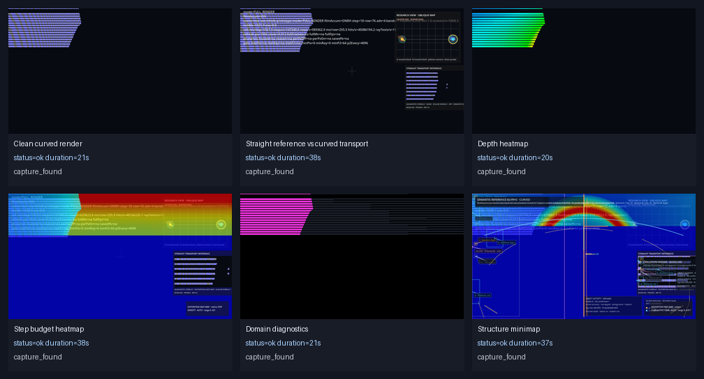
  <figcaption>Six diagnostic modes on one scene: clean curved, straight vs. curved, depth heatmap, step budget heatmap, domain diagnostics, structure minimap.</figcaption>
</figure>

**Source:** `output/wormhole_structure_observatory/20260514T045629Z/`  
**Related:** [Wormhole Dual-Reality Workflow](../Research/wormhole_dual_reality_transport_workflow.md)  
**Card:** `misterylabs_artifacts/cards/wormhole-structure-observatory.md`

<figure markdown>
  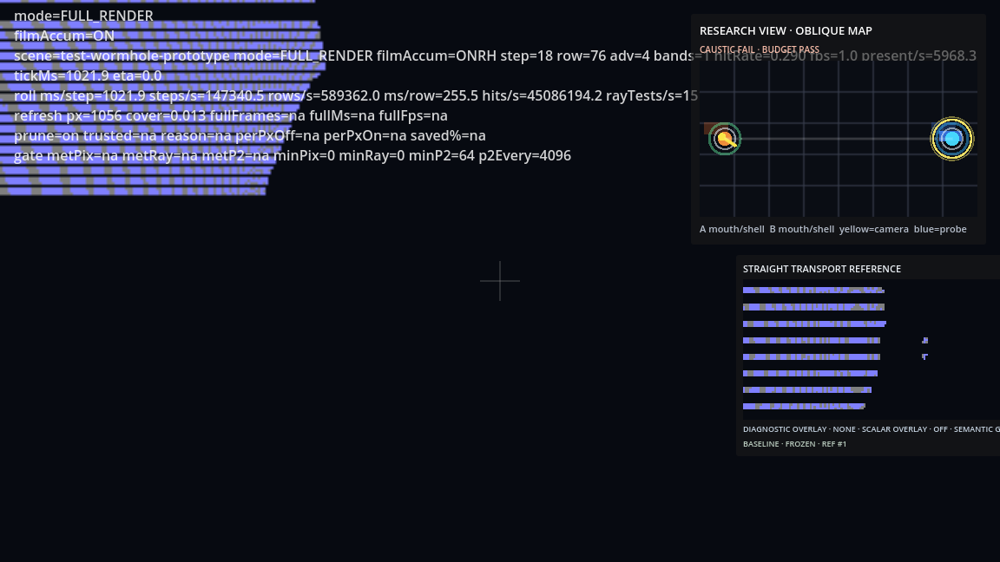
  <figcaption>Straight-path reference (left) vs. curved GRIN transport (right) for the same scene — the most direct side-by-side comparison of transport models.</figcaption>
</figure>

---

### Atomic Orbital GRIN Observatory

<figure markdown>
  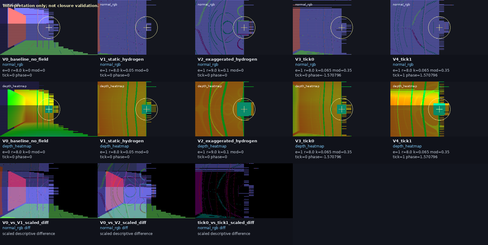
  <figcaption>Five panels: no-field baseline → static hydrogen GRIN lensing → exaggerated hydrogen → temporally modulated tick 0 → tick 1. 2–11% of pixels shift between ticks.</figcaption>
</figure>

**Source:** `output/atomic_orbital_visual_observatory/20260513T012903Z/`  
**Card:** `misterylabs_artifacts/cards/atomic-orbital-observatory.md`  
**Research:** [Atomic Visual Observatory Fixture](../Research/atomic_orbital_visual_observatory_fixture.md)

---

### Overspace First Milestone

<figure markdown>
  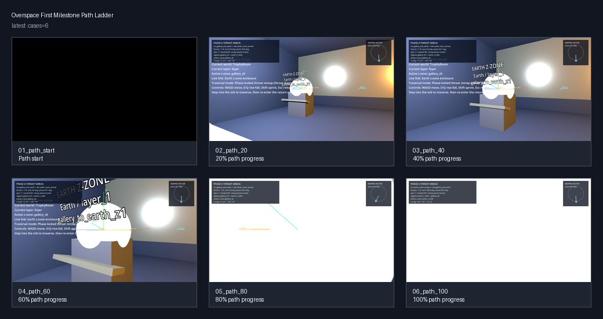
  <figcaption>Five path-progress frames (0–80%) of an auto-path camera approaching a gallery orb through overspace. The first complete non-Euclidean scene render.</figcaption>
</figure>

**Source:** `output/overspace_first_milestone/latest/`  
**Card:** `misterylabs_artifacts/cards/overspace-first-milestone.md`

---

### Observer Disagreement Hero — 23.8% of the Frame Classifies Differently

<figure markdown>
  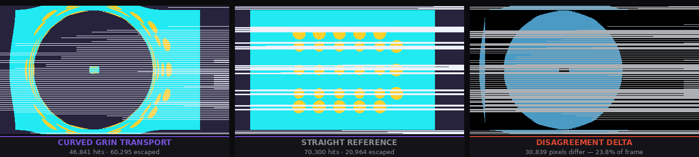
  <figcaption><strong>Same observer, two transport models.</strong> Curved GRIN (left): 46,841 hits. Straight reference (center): 70,300 hits. Disagreement delta (right): 30,839 pixels differ. Blue = hits→escapes (27,619). Cyan = escapes→hits (3,220). Ratio 8.6:1 — GRIN is defocusing.</figcaption>
</figure>

**Source:** `output/observer_disagreement/offaxis_observe_delta/`  
**Atlas chapter:** [Chapter 2 — Observer Disagreement](chapters/chapter_02.md)  
**Hero card:** `misterylabs_artifacts/cards/observer-disagreement-hero.md`  
**Dataset:** `misterylabs_artifacts/datasets/observer-disagreement.json`

---

### Hermetic Closure Hero — Same Scene, Two Budgets, Opposite Truth

<figure markdown>
  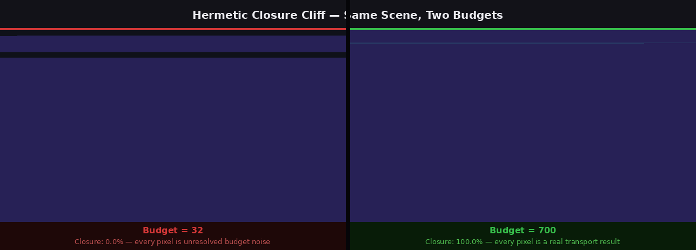
  <figcaption><strong>Left: budget=32 — 0.0% closure, every pixel noise. Right: budget=700 — 100.0% closure, every pixel real.</strong> The renders look identical. The color-coded labels are the proof. New hero render at 640×360, June 2026.</figcaption>
</figure>

<figure markdown>
  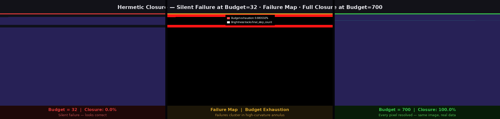
  <figcaption>3-panel extended: silent failure · budget exhaustion map · full closure. Middle panel shows failures clustering in the high-curvature annulus — the same zone Chapter 1 identified as optically expensive.</figcaption>
</figure>

**Source:** `output/hermetic_hit_closure/20260604T023019Z/`  
**Atlas chapter:** [Chapter 3 — Hermetic Closure](chapters/chapter_03.md)  
**Hero card:** `misterylabs_artifacts/cards/hermetic-closure-hero.md`

---

## Tier 2 — Research Atlas

Validation candidates and analysis outputs for the research atlas pages.

---

### DOE Scheduler Resonance

<figure markdown>
  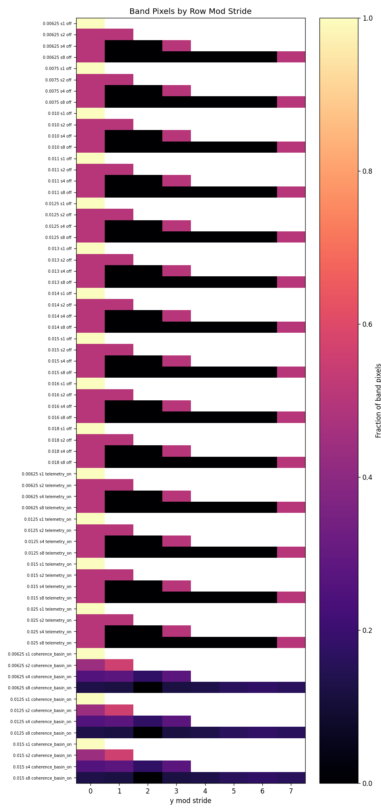
  <figcaption>Band-by-row-mod-stride heatmap. Stride=1: 20–33% band coverage. Stride=4: 0.2–0.6%. The collapse is deterministic — controlled by traversal cadence, not physics precision.</figcaption>
</figure>

**Source:** `output/doe_scheduler_resonance/20260503T002804Z/`  
**Atlas chapter:** [Chapter 5 — Cathedral Probe](chapters/chapter_05.md)  
**Dataset:** `misterylabs_artifacts/datasets/doe-scheduler-resonance.csv` (68 cells)  
**Card:** `misterylabs_artifacts/cards/doe-scheduler-resonance.md`

---

### Coherence Basin Beauty — First 960×540 Instability Map

<figure markdown>
  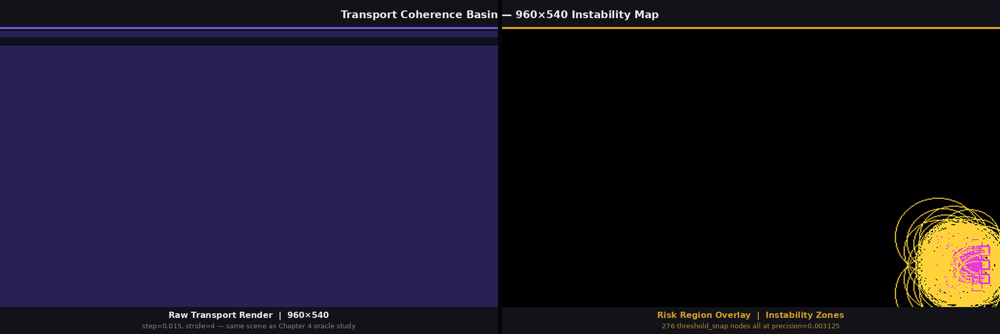
  <figcaption><strong>First 960×540 coherence basin render.</strong> Left: raw transport render. Right: risk region overlay — 276 threshold_snap nodes, all at precision=0.003125, in two symmetric horizontal bands at the GRIN field boundary. New hero capture June 2026.</figcaption>
</figure>

**Source:** `output/transport_coherence_basin_smoke/20260604T023051Z_960x540/`  
**Atlas chapter:** [Chapter 4 — Coherence Basin](chapters/chapter_04.md)  
**Hero card:** `misterylabs_artifacts/cards/coherence-basin-beauty.md`

---

## Tier 3 — Research Depth

Analytical artifacts requiring additional visual context.

---

### Transport Coherence Basin — Radial Analysis

<figure markdown>
  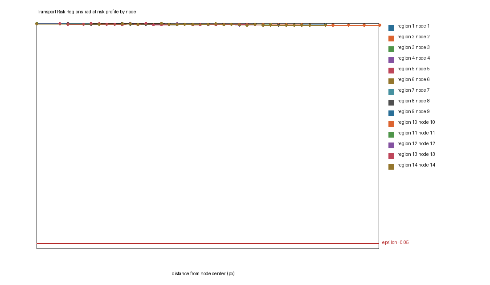
  <figcaption>Radial risk profile: risk magnitude vs. distance from instability band centers. Step discontinuity in the decay curve is the quantitative signature of a topological feature. 289 UNSEALED_NONCONVERGENT regions, all at precision=0.003125.</figcaption>
</figure>

**Source:** `output/transport_coherence_basin_smoke/20260503T001944Z/`  
**Atlas chapter:** [Chapter 4 — Coherence Basin](chapters/chapter_04.md)  
**Dataset:** `misterylabs_artifacts/datasets/transport-coherence-risk-nodes.csv` (289 rows)  
**Card:** `misterylabs_artifacts/cards/transport-coherence-basin.md`

---

### DOE Overnight — Step Length Sensitivity

<figure markdown>
  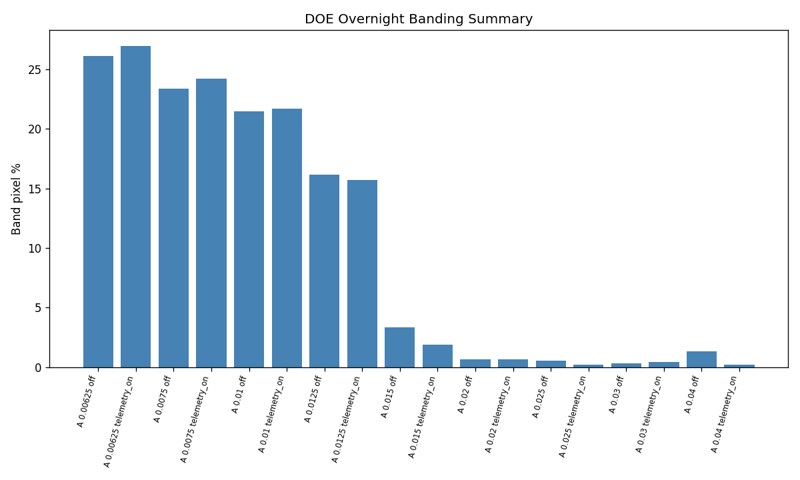
  <figcaption>Band pixel fraction vs. step length. Step=0.00625: 26% coverage. Step=0.025: 0.6%. Sharp transition between 0.013 and 0.015 corresponds to the field's natural curvature scale.</figcaption>
</figure>

**Source:** `output/doe_overnight/20260502T060652Z/`  
**Dataset:** `misterylabs_artifacts/datasets/doe-overnight.csv` (18 cells)  
**Card:** `misterylabs_artifacts/cards/doe-overnight.md`

---

### Cathedral Probe — Composite Overlays

<figure markdown>
  
  <figcaption>All six Cathedral Probe diagnostic layers rendered individually. Source: <code>Docs/assets/cathedral_probe/</code></figcaption>
</figure>

**Source:** `Docs/assets/cathedral_probe/` (repo-tracked images)  
**Atlas chapter:** [Chapter 5 — Cathedral Probe](chapters/chapter_05.md)  
**Research paper:** [Cathedral Probe Architecture](../Research/cathedral_probe_architecture.md)

---

## Pending Artifacts

| Artifact | Blocked By | Chapter |
|----------|-----------|---------|
| Side-by-side budget=32/700 render | Needs composite render with dual HUDs | Ch 3 |
| Coherence basin beauty render (high-res) | Need ≥960×540 run to distinguish 289 regions | Ch 4 |
| Recursive Mirror Ghost Portal benchmark PNG | `test-recursive-mirror-ghost-portal.tscn` must produce a beauty capture | Future Ch 6 |
| Angular-dependence disagreement sweep | Need observer pose sweep run | Ch 2 |

---

## All Promoted Files

The complete curated artifact set is in `misterylabs_artifacts/`:

```
misterylabs_artifacts/
  manifest.json          — artifact index with dependency graph
  README.md              — system explanation and promotion workflow
  visuals/               — 24 curated PNGs (< 325 KB each, 2.9 MB total)
  cards/                 — 10 website-ready card.md files
  datasets/              — 4 small CSV/JSON datasets
  validation/            — 2 validation reports
```

To promote a new artifact: `scripts/export_to_misterylabs.sh <output_folder_name> [--png <file>]`
