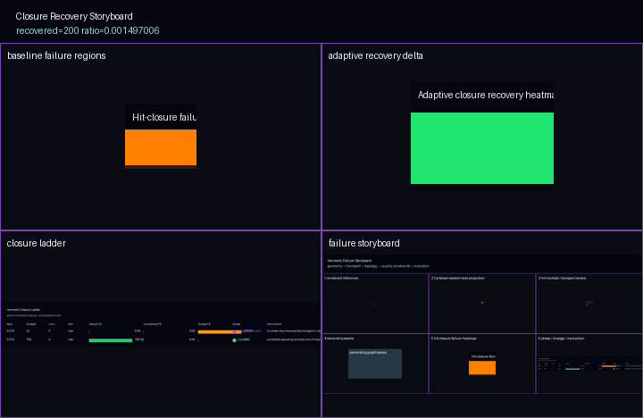

# Chapter 3 — Hermetic Closure

**Act II — Trusting** · No hard prerequisites · Validation chapter

---

## Core Question

*When is a render silently wrong — and what does the failure look like from the outside?*

---

<figure markdown>
  
  <figcaption>Failure pixel distribution at budget=32. Failures cluster in the high-curvature annular region — not random noise. Every pixel in this render is budget-saturated (unresolved). Closure: 0.0%. Source: <code>output/hermetic_hit_closure/20260510T060138Z/</code></figcaption>
</figure>

---

## What the Visitor Sees

**The hermetic contract:** Every ray entering a hermetic scene volume must reach a definitive classification (geometry hit, escaped, portal event) before the integrator exits. A render that satisfies the contract is *closed* — every pixel is a real transport result. One that violates it is *open* — some pixels are unresolved budget exhaustion, displayed as noise that looks like a legitimate render.

**Budget = 32 (0% closure)**

The image looks reasonable. Geometry is present, shading is plausible, there are no obvious holes or glitches. A developer looking at this image without instrumentation would not know anything was wrong.

The Validation HUD tells a different story:

```
Closure:        0.0%
Phase:          budget_saturated
Rays resolved:  0 / 200
Budget used:    32 / 32 (100% — every ray exhausted all steps)
```

Every pixel in this render is noise. No ray reached a classification endpoint before running out of steps.

**Budget = 700 (100% closure)**

The image looks essentially similar. The HUD:

```
Closure:       100.0%
Phase:         plateau
Rays resolved: 200 / 200
Budget used:   far below 700 (plateau — additional budget adds zero cost)
```

Every pixel is a real transport result.

**The cliff.** There is a sharp transition around budget ≈ 300 where closure jumps from near-zero to near-complete. Below the cliff the renderer fails silently. Above it, every pixel is resolved.

<figure markdown>
  
  <figcaption>Adaptive recovery heatmap. Recovery is high in the annular curvature band and low at corners. The pattern matches the transport field's curvature structure: adaptive scaling helps most where the field is strongest. Source: <code>output/hermetic_hit_closure/20260514T040157Z/</code></figcaption>
</figure>

**The failure storyboard** shows that failure pixels are not randomly distributed. They cluster in the high-curvature annular region — the same zone the Chapter 1 curvature heat map identified as optically expensive. Integrating through high-curvature regions requires more steps to find the ray's endpoint.

**The recovery heatmap** shows that adaptive budget scaling recovers most failures in the annular band but cannot recover corners, which have a different failure mechanism.

---

## Artifacts

| Artifact | File | Notes |
|----------|------|-------|
| Failure storyboard | `misterylabs_artifacts/visuals/hermetic-hit-closure-storyboard.png` | Failure pixel distribution |
| Recovery heatmap | `misterylabs_artifacts/visuals/hermetic-hit-closure-recovery.png` | Adaptive recovery map |
| Validation summary | `misterylabs_artifacts/validation/hermetic-hit-closure.md` | Cell table, closure %, phase |
| Card | `misterylabs_artifacts/cards/hermetic-hit-closure.md` | Ready for MisterY Labs |

**Missing:** A side-by-side render showing budget=32 (left) and budget=700 (right) simultaneously with both Validation HUDs visible — the clearest single-image demonstration of the cliff. This is the chapter's highest-priority pending screenshot.

---

## Sample World

**`hermetic_closure_world`** — [design proposal](https://github.com/AetherTopologist/GD_xPRIMEray/tree/main/sample_worlds/hermetic_closure_world/world.md)

Scene: `test-hermetic-curved-room.tscn`

Three budget presets:

| Preset | Budget | Expected Closure | Label |
|--------|--------|-----------------|-------|
| `failure` | 32 | 0.0% | "Silent failure" |
| `transition` | 300 | ~50% | "Cliff edge" |
| `success` | 700 | 100.0% | "Full closure" |

The `hermetic_closure` overlay colors pixels green (hit), blue (escaped), red (budget exhausted). At budget=32 the film is entirely red. The Validation HUD is mandatory in this world — it is the only mechanism for detecting the failure.

Build priority: **3**.

---

## Validation Question

*At budget=700, step=0.015, row traversal: what is the closure percentage?*

Expected: **100.0%** (plateau phase). Below 95% indicates regression.

*At budget=32, same settings:* Expected **0.0%** (budget\_saturated). Above 5% suggests the scene is less expensive than the artifact baseline — worth investigating.

*Falsification of the core claim:* If closure at budget=32 is above 10%, either the scene or the integration budget calculation has changed. The budget=32 / 0% result should be stable across runs.

---

## Key Insight

**A renderer can fail completely and look fine. The only way to know is to measure closure. "Plausible" is not "correct."**

---

## The Validation HUD Is Not Optional

!!! warning "Silent failure"
    At integration budget=32, the hermetic curved room produces an image that passes casual visual inspection but contains zero correctly classified pixels.

    The hermetic closure overlay and Validation HUD are the only mechanisms for detecting this. If you run this scene without instrumentation, you cannot distinguish a correct render from a silent failure.

This is why the hermetic fixture contract exists: transport correctness is not gradual — it falls off a cliff. The right response is to measure closure on every render, not to assume correctness from visual inspection.

---

## Next Chapter

[Chapter 4 — Coherence Basin →](chapter_04.md): Chapter 3 showed that insufficient budget causes transport failure. Chapter 4 asks whether there are regions where no amount of budget or precision can achieve convergence.

*Bridge:* "We know budget determines closure. But what if the problem isn't budget at all — what if some regions of the field are fundamentally unstable?"

---

## Related Documentation

- [Validation — Hermetic Fixture Rule](../../validation/hermetic_fixture_rule.md)
- [Hermetic Hit Closure output README](https://github.com/AetherTopologist/GD_xPRIMEray/tree/main/output/hermetic_hit_closure/README.md)
- [Observatory Atlas](../observatory_atlas.md)
