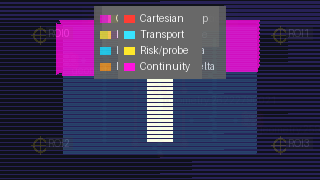
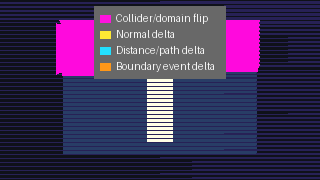

# Chapter 5 — Cathedral Probe

**Act III — Understanding** · Synthesis chapter · Requires all prior chapters

---

## Core Question

*How do you diagnose a renderer that produces wrong pixels without crashing — when you can't afford to run the full oracle on every frame?*

---

<figure markdown>
  
  <figcaption>All six Cathedral Probe diagnostic layers rendered individually. Left to right: beauty render · wireframe · transport ownership · risk probe markers · spacetime transport · continuity vectors. Source: <code>Docs/assets/cathedral_probe/cathedral_probe_contact_sheet_row_0015.png</code></figcaption>
</figure>

---

## What the Visitor Sees

### The Entry Finding: Scheduler Resonance

<figure markdown>
  
  <figcaption>Band-by-row-mod-stride heatmap. Stride=1: ~26% band coverage. Stride=4: 0.22% coverage. The collapse is deterministic — the same stride always produces the same resonance. Source: <code>output/doe_scheduler_resonance/20260503T002804Z/</code></figcaption>
</figure>

The 68-cell DOE Scheduler Resonance experiment revealed a counterintuitive finding: **transport banding is controlled by traversal stride, not by integration precision.**

| Step length | Stride=1 band % | Stride=2 band % | Stride=4 band % | Stride=8 band % |
|-------------|-----------------|-----------------|-----------------|-----------------|
| 0.00625 | 22.0% | 26.8% | **0.6%** | **0.3%** |
| 0.0125  | 33.0% | 18.1% | **0.2%** | **0.2%** |
| 0.013   | 32.6% | 11.8% | **0.5%** | **0.2%** |

Band coverage collapses at stride≥4 regardless of step length. Making integration finer *increases* band coverage because finer steps expose more transport boundary structure, which the row-major scheduler then amplifies. This inverts naive debugging intuition.

The heatmap makes the periodic structure visible: band pixels at stride=2 align with row-mod-2 patterns; at stride=4 the pattern disappears (the band collapses entirely rather than becoming a periodic stripe).

**The fix:** Scheduler decorrelation. The tile scheduler breaks the row-alignment that enables resonance. Band coverage drops from 20% (row, stride=1) to ~10% (tile). Corner instability (topological) persists unchanged across all modes.

---

### The Six-Layer Cathedral Probe

<figure markdown>
  
  <figcaption>Six-layer Cathedral Probe composite. Domain resolver stress scene, step=0.015, row traversal. Transport ownership boundaries are visible as high-density continuity vector clusters. 6,619 high-discontinuity vectors (score ≥ 1.0). All shape regions: boundary_aligns_with_high_vector_density = true.</figcaption>
</figure>

The Cathedral Probe is not a single tool — it is a layered methodology. Six passive instrumentation passes assembled into a composite that makes transport coherence structure legible as a visual space.

<figure markdown>
  
  <figcaption>Layer 5: Transport continuity vector field. High-discontinuity vectors cluster at ownership boundaries. These are the same instability zones Chapter 4 identified via the oracle — but found here from the rendered output alone.</figcaption>
</figure>

**The six layers:**

| Layer | Code Name | What it shows |
|-------|-----------|---------------|
| 1 | Beauty render | Raw integration output — the baseline |
| 2 | Cartesian wireframe | Geometric boundary structure |
| 3 | Transport ownership map | Per-pixel domain ownership coloring |
| 4 | Risk probe markers | High-risk transport nodes from oracle sampling |
| 5 | Spacetime transport diagram | Ray-path topology in scene space |
| 6 | Continuity vectors | Per-pixel transport disagreement across 6 dimensions |

**Layer 6 (continuity vectors) is the key non-oracle proxy.** Each vector encodes pixel-to-pixel disagreement across collider ownership, domain, hit distance, normal angle, path length, and boundary event. High-magnitude vector clusters appear at the same locations as the Chapter 4 oracle's 289 instability regions — without requiring a separate oracle run.

All six identified transport shape regions confirmed: `boundary_aligns_with_high_vector_density = true`. The proxy works.

---

### The Link to Chapters 3 and 4

The corner instability visible in the traversal comparison persists across all four traversal modes at 468 ownership-change samples. It is mode-independent — it is the same topological feature Chapter 4's coherence basin oracle identified. The Cathedral Probe finds it; the oracle confirms it; the coherence basin maps it.

Three independent methodologies, same finding.

---

## Artifacts

**Promoted (in `misterylabs_artifacts/`):**

| Artifact | File |
|----------|------|
| Resonance heatmap | `visuals/doe-scheduler-resonance-heatmap.png` |
| Stride plot | `visuals/doe-scheduler-resonance-stride-plot.png` |
| DOE dataset (68 cells) | `datasets/doe-scheduler-resonance.csv` |
| Card | `cards/doe-scheduler-resonance.md` |

**Canonical images (in `Docs/assets/cathedral_probe/`):**

| Image | Notes |
|-------|-------|
| `cathedral_probe_overlay_row_0015.png` | Six-layer composite — the primary diagnostic image |
| `cathedral_probe_contact_sheet_row_0015.png` | All six layers individually |
| `continuity_vectors_row_0015.png` | Layer 6 standalone — the non-oracle instability proxy |
| `traversal_contact_sheet_4mode_0015.png` | Four traversal modes at step=0.015 |
| `band_support_by_mode_0015.png` | Band coverage reduction: row → tile → checkerboard |

---

## Sample World

**`cathedral_probe_world`** — [design proposal](https://github.com/AetherTopologist/GD_xPRIMEray/tree/main/sample_worlds/cathedral_probe_world/world.md)

Scene: `test-domain-resolver-stress.tscn`

The world provides individual layer toggles for all six Cathedral Probe components plus a stride selector. The visitor can build the composite progressively or jump to the full overlay. Switching stride from 1 to 4 shows the band-coverage collapse in the step-budget-allocation heatmap before it appears as visible banding in the beauty render.

Build priority: **4**. Runtime per-layer toggling requires new implementation.

---

## Validation Question

*At stride=4, step=0.015, row traversal: what percentage of pixels should fall in the high-curvature band?*

Expected: **0.22–0.45%** (from the 68-cell DOE at varying step lengths). At stride=1: 20–33%.

*Layer 6 check:* Are the high-continuity-vector clusters in the composite aligned with the Chapter 4 instability bands (rows ~58 and ~122)? Expected: yes. The proxy and the oracle should identify the same zones.

---

## Key Insight

**Transport instability is not globally smoothable. It is localized, topological, and scheduler-amplified. The right response is scheduler decorrelation first, local precision management second, global smoothing never.**

---

## Chapter Synthesis

Chapter 5 closes the Atlas arc.

- **Chapter 1** showed that curved transport is beautiful and real.
- **Chapter 2** showed it is measurably different from straight transport.
- **Chapter 3** showed that "measurably different" is not the same as "measurably correct."
- **Chapter 4** showed that some transport regions cannot be corrected by brute force.
- **Chapter 5** showed how to find those regions systematically and how the scheduler was amplifying them into global banding.

**What comes after Chapter 5:** The recursive mirror ghost portal (pending Phase 2 scene build) is the first exhibit requiring all five chapters to interpret. Discrete mirror reflection events + continuous GRIN integration between bounces + hermetic validation + coherence basin mapping + Cathedral Probe diagnosis. It becomes Chapter 6 when its benchmark image exists.

---

## Related Research

- [Cathedral Probe Architecture](../../Research/cathedral_probe_architecture.md) — Full 14-section architecture paper
- [Scheduler Decorrelation & Local Coherence](../../Research/scheduler_decorrelation_and_local_coherence.md)
- [Traversal Council Review](../../Research/architecture_design_council_traversal_review.md)
- [Object-Seeded Null Geodesic Scheduler](../../Research/object_seeded_null_geodesic_tiling_scheduler.md)
- [Observatory Atlas](../observatory_atlas.md)
