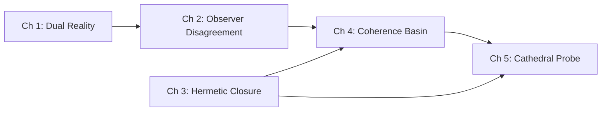

# Observatory Atlas

The Observatory Atlas is the visitor guide for xPRIMEray's research space: a museum map, a scientific expedition logbook, and a structured curriculum combined.

Its job is to transform experiments, rendered outputs, and diagnostic artifacts into a coherent story a new visitor can follow from start to finish — or enter at any chapter for a focused investigation.

---

## The Journey

```
┌──────────────────────────────────────────────────────────────┐
│                  ACT I — SEEING                              │
│                                                              │
│  Chapter 1: Dual Reality        Chapter 2: Observer Disagr.  │
│  ──────────────────────         ──────────────────────────   │
│  What does a wormhole look      How different is "curved"    │
│  like from the inside?          from "straight" — in pixels? │
└──────────────────────────────────────────────────────────────┘
                        │
                        ▼
┌──────────────────────────────────────────────────────────────┐
│                  ACT II — TRUSTING                           │
│                                                              │
│  Chapter 3: Hermetic Closure                                 │
│  ─────────────────────────────────────────────────────────   │
│  When does a render look correct but have zero correctly      │
│  classified pixels?                                          │
└──────────────────────────────────────────────────────────────┘
                        │
                        ▼
┌──────────────────────────────────────────────────────────────┐
│                  ACT III — UNDERSTANDING                     │
│                                                              │
│  Chapter 4: Coherence Basin     Chapter 5: Cathedral Probe   │
│  ──────────────────────         ────────────────────────     │
│  Where does the field refuse    How do you find and fix a    │
│  to converge — and why there?   failure without a crash?     │
└──────────────────────────────────────────────────────────────┘
```

---

## Chapters

=== "Ch 1 — Dual Reality"

    **Core Question:** What does a wormhole look like, and how do we know the bending is real?

    The entry chapter. Opens with the bare wormhole render, then progressively adds the Reference Reality inset, curvature heat map, portal glyph annotations, and collision radar — six frames total. The gap between the curved render and the straight-transport inset is the chapter's central evidence.

    **Key artifact:** Six-panel storytelling contact sheet  
    **Sample world:** `dual_reality_view_world`  
    **Status:** Ready

    [→ Chapter 1](chapters/chapter_01.md)

=== "Ch 2 — Observer Disagreement"

    **Core Question:** How much does the choice of transport model change what the observer sees?

    Runs the same scene under curved and straight transport. Computes the pixel-level delta. At 480×270 resolution and an off-axis observer: 30,839 pixels classify differently (23.8%). The dominant transition is geometry-hit → escaped: the GRIN field deflects rays away from surfaces. The asymmetry ratio is 9:1.

    **Key artifact:** 1600×1300 three-view contact sheet (curved / straight / disagreement delta)  
    **Sample world:** `observer_disagreement_world`  
    **Status:** Ready

    [→ Chapter 2](chapters/chapter_02.md)

=== "Ch 3 — Hermetic Closure"

    **Core Question:** When is a render silently wrong?

    A hermetic scene has a contract: every ray must reach a definitive classification (hit, escape, portal event) before the integrator exits. At budget=32: 0% closure — all rays exhaust steps, the image is noise that looks plausible. At budget=700: 100% closure — every pixel resolved, plateau phase. The cliff between the two is the chapter's central finding.

    **Key artifact:** Failure storyboard + adaptive recovery heatmap  
    **Sample world:** `hermetic_closure_world`  
    **Status:** Ready

    [→ Chapter 3](chapters/chapter_03.md)

=== "Ch 4 — Coherence Basin"

    **Core Question:** Where does transport refuse to converge regardless of precision?

    The oracle identifies 289 UNSEALED_NONCONVERGENT regions — instability zones that no amount of budget or precision refinement can seal. All 289 cluster symmetrically at the GRIN field boundary annulus. The uniformity of the precision floor (all at 0.003125) suggests a topological feature rather than numerical noise.

    **Key artifact:** Radial risk profile + risk-vs-step chart  
    **Sample world:** `transport_coherence_basin_world`  
    **Status:** Partial (missing beauty render at distinguishing resolution)

    [→ Chapter 4](chapters/chapter_04.md)

=== "Ch 5 — Cathedral Probe"

    **Core Question:** How do you diagnose transport failures without a crash or an oracle pass?

    The Cathedral Probe is a six-layer diagnostic methodology: coherence vectors, normal discontinuity, curvature accumulation, domain ownership, transport seams, step budget allocation. Each layer reveals a different dimension of transport structure. The scheduler resonance finding — stride=4 collapses band coverage from 33% to 0.22% — is the entry point.

    **Key artifact:** Six-layer composite overlay + four-mode traversal comparison  
    **Sample world:** `cathedral_probe_world`  
    **Status:** Ready (individual runtime layer toggles not yet implemented)

    [→ Chapter 5](chapters/chapter_05.md)

---

## Dependency Graph



Chapters 1 and 3 can be read independently. Chapter 2 builds on the "two transport modes" concept from Chapter 1. Chapters 4 and 5 are most meaningful after Chapters 2 and 3 establish the measurement and validation frameworks.

---

## Minimum Viable Observatory

**The 20-minute arc: Chapters 1 → 2 → 3**

| Chapter | Time | What the visitor takes away |
|---------|------|-----------------------------|
| Ch 1: Dual Reality | 8 min | Curved transport produces different images. The curvature is real and geometric, not decorative. |
| Ch 2: Observer Disagreement | 7 min | The difference is 23.8% of pixels at this pose. The dominant error direction: geometry hits becoming escapes. |
| Ch 3: Hermetic Closure | 5 min | A render can look correct and have zero correctly resolved pixels. The HUD is the only reliable detector. |

A general visitor who completes these three chapters understands:

- What xPRIMEray computes (not faked bending)
- Why it matters (measurable difference)
- How correctness is established (closure contract)

Chapters 4 and 5 deepen the picture for researchers and contributors.

---

## Atlas Files

The full atlas document set is in `observatory_atlas/` at the repository root:

- `observatory_atlas/README.md` — this overview (the canonical source)
- `observatory_atlas/atlas_manifest.json` — machine-readable dependency graph (artifacts → worlds → chapters → validation tests)
- `observatory_atlas/chapters/chapter_0N_*/chapter.md` — individual chapter detail documents

Related layers:
- `misterylabs_artifacts/` — curated artifact evidence for each chapter
- `sample_worlds/` — interactive world design proposals
- `output/` — raw experiment outputs (lab bench, not tracked in full)
