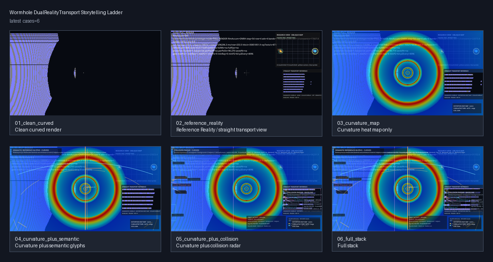
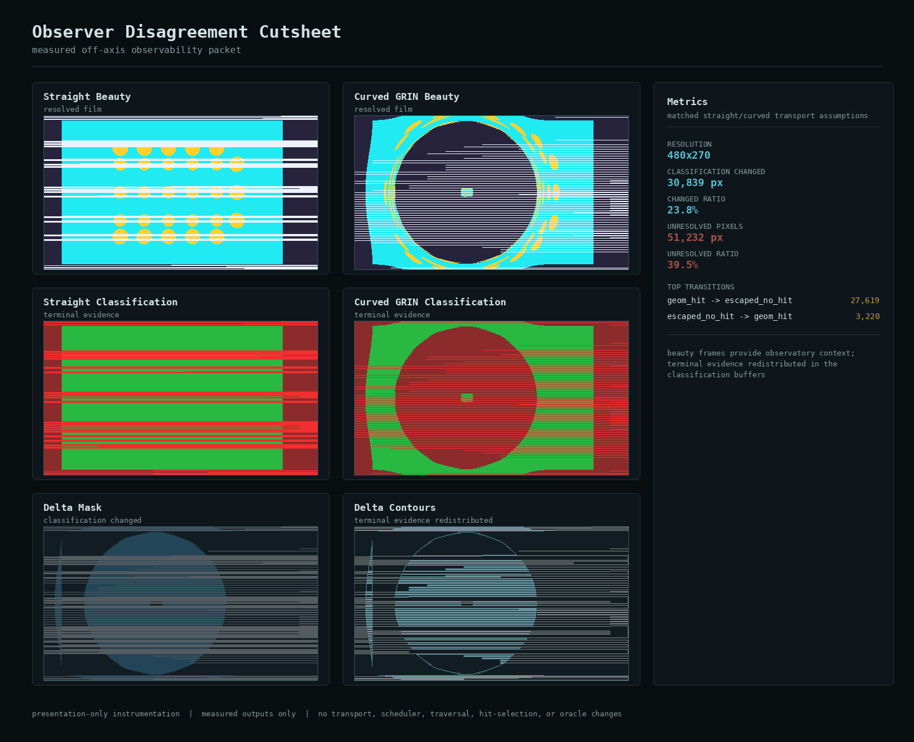
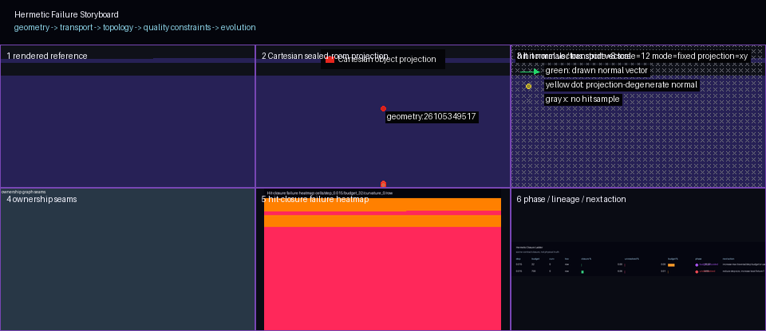

# Sample Worlds

Sample Worlds are the interactive layer of xPRIMEray's public presence: navigable scene configurations where a visitor can run the renderer, toggle overlays, and observe transport phenomena directly.

Each world demonstrates one specific finding from the Observatory Atlas. The static artifact provides the evidence; the world makes it interactive.

**Status:** All five worlds are at **Design proposal** stage. No runtime implementation exists. Each folder contains a `world.md`, `overlays.md`, and `config.schema.json`.

---

## World Summary

| # | World | Scene | Atlas Chapter | Priority | Status |
|---|-------|-------|---------------|----------|--------|
| 1 | [Dual Reality View](#dual-reality-view) | `test-overspace-wormhole-witness-fixture.tscn` | Ch 1 | 1 | Design proposal |
| 2 | [Observer Disagreement](#observer-disagreement) | `test-grin-basic-visual-minimal-offaxis-observe.tscn` | Ch 2 | 2 | Design proposal |
| 3 | [Hermetic Closure](#hermetic-closure) | `test-hermetic-curved-room.tscn` | Ch 3 | 3 | Design proposal |
| 4 | [Cathedral Probe](#cathedral-probe) | `test-domain-resolver-stress.tscn` | Ch 5 | 4 | Design proposal |
| 5 | [Transport Coherence Basin](#transport-coherence-basin) | `test-domain-resolver-stress.tscn` | Ch 4 | 5 | Design proposal |

---

## Shared Overlay Vocabulary

All worlds draw from the same overlay set. Each world's `overlays.md` specifies which modes apply.

| Overlay | Code Name | What it Shows |
|---------|-----------|---------------|
| Straight Ray | `straight_ray` | Reference transport — no curvature |
| Curved Ray | `curved_ray` | GRIN null-geodesic integration |
| Dual Reality | `dual_reality` | Curved main + straight reference inset |
| Observer Disagreement | `observer_disagreement` | Per-pixel delta: where the two transports differ |
| Hermetic Closure | `hermetic_closure` | Classification overlay: hit / escape / budget-exhausted |
| Transport Coherence | `transport_coherence` | Instability heatmap: oracle convergence status |
| Heatmap Normals | `heatmap_normals` | Curvature accumulation per pixel |
| Ray Path Traces | `ray_traces` | Explicit ray trajectory lines |
| Cathedral Probe | `cathedral_probe` | Six-layer composite diagnostic |
| Atlas Labels | `atlas_labels` | Portal glyphs, field markers, region annotations |
| Validation HUD | `validation_hud` | Live closure %, budget pressure, classification counts |

---

## Dual Reality View

**Visitor question:** *What does a wormhole look like, and how do we know the bending is real?*

**Scene:** `test-overspace-wormhole-witness-fixture.tscn`

<figure markdown>
  
  <figcaption>The six-frame static sequence this world makes interactive.</figcaption>
</figure>

The visitor starts with the bare curved render. A toggle adds the Reference Reality inset — a frozen straight-ray render of the same scene. The gap between the two is the wormhole's optical effect.

**Core interaction:** Toggle the Reference Reality inset on and off.

**Supported artifacts:** `wormhole-dual-reality-story.png`, `wormhole-structure-observatory.png`

**Overlays:** `curved_ray` → `dual_reality` → `heatmap_normals` → `atlas_labels` → `validation_hud`

**Validation question:** Is the curvature hot zone at the portal boundary (expected) or at the throat?

**Missing screenshots:** Split-screen drag interaction; camera path showing disagreement changing with viewing angle.

**Design files:** `sample_worlds/dual_reality_view_world/` — [world.md](https://github.com/AetherTopologist/GD_xPRIMEray/tree/main/sample_worlds/dual_reality_view_world/world.md) · [overlays.md](https://github.com/AetherTopologist/GD_xPRIMEray/tree/main/sample_worlds/dual_reality_view_world/overlays.md) · [config.schema.json](https://github.com/AetherTopologist/GD_xPRIMEray/tree/main/sample_worlds/dual_reality_view_world/config.schema.json)

---

## Observer Disagreement

**Visitor question:** *How much does curved transport change what you see vs. straight — in pixels?*

**Scene:** `test-grin-basic-visual-minimal-offaxis-observe.tscn` + straight variant

<figure markdown>
  
  <figcaption>The three-view contact sheet this world reproduces as a live toggle.</figcaption>
</figure>

Three-mode toggle: curved / straight / disagreement delta. The Validation HUD shows live classification counts. The visitor sees ~30,839 blue-tinted pixels and can compare to the reference dataset.

**Core interaction:** Toggle between curved, straight, and disagreement-delta modes.

**Supported artifacts:** `observer-disagreement-contact-sheet.png`, `datasets/observer-disagreement.json`

**Overlays:** `curved_ray` → `straight_ray` → `observer_disagreement` → `validation_hud`

**Validation question:** Total disagreement ≈ 23.8%; dominant transition geom\_hit → escaped (9:1 asymmetry)?

**Missing screenshots:** A second camera pose for the angular-dependence experiment; live pixel-count HUD capture.

**Design files:** `sample_worlds/observer_disagreement_world/` — [world.md](https://github.com/AetherTopologist/GD_xPRIMEray/tree/main/sample_worlds/observer_disagreement_world/world.md) · [overlays.md](https://github.com/AetherTopologist/GD_xPRIMEray/tree/main/sample_worlds/observer_disagreement_world/overlays.md) · [config.schema.json](https://github.com/AetherTopologist/GD_xPRIMEray/tree/main/sample_worlds/observer_disagreement_world/config.schema.json)

---

## Hermetic Closure

**Visitor question:** *When does the integrator fail silently, and what does failure look like?*

**Scene:** `test-hermetic-curved-room.tscn`

<figure markdown>
  
  <figcaption>Failure pixel distribution at budget=32. The image looks plausible; the Validation HUD says 0% closure.</figcaption>
</figure>

Budget selector with three presets: 32 (0% closure), 300 (cliff edge), 700 (100% closure). The `hermetic_closure` overlay colors pixels green/blue/red. The Validation HUD is mandatory — it is the only reliable detector of the failure mode.

**Core interaction:** Switch between budget presets; observe HUD closure percentage change.

**Supported artifacts:** `hermetic-hit-closure-storyboard.png`, `hermetic-hit-closure-recovery.png`, `validation/hermetic-hit-closure.md`

**Overlays:** `hermetic_closure` (default on) + `validation_hud` (required) → `heatmap_normals` → `ray_traces`

**Validation question:** Budget=700: 100% closure (plateau). Budget=32: 0% closure (budget\_saturated).

**Missing screenshots:** Side-by-side render with budget=32 left / budget=700 right, both HUDs visible.

**Design files:** `sample_worlds/hermetic_closure_world/` — [world.md](https://github.com/AetherTopologist/GD_xPRIMEray/tree/main/sample_worlds/hermetic_closure_world/world.md) · [overlays.md](https://github.com/AetherTopologist/GD_xPRIMEray/tree/main/sample_worlds/hermetic_closure_world/overlays.md) · [config.schema.json](https://github.com/AetherTopologist/GD_xPRIMEray/tree/main/sample_worlds/hermetic_closure_world/config.schema.json)

---

## Cathedral Probe

**Visitor question:** *How do you diagnose a renderer that produces wrong pixels without crashing?*

**Scene:** `test-domain-resolver-stress.tscn`

The world provides individual layer toggles for the six Cathedral Probe components plus a stride selector. The visitor builds the composite progressively and can observe the scheduler resonance collapse live by switching from stride=1 to stride=4.

**Core interaction:** Enable Cathedral Probe layers one at a time; toggle stride to observe resonance.

**Supported artifacts:** `doe-scheduler-resonance-heatmap.png`, `doe-scheduler-resonance-stride-plot.png`, `cathedral-probe-contact-sheet.png`

**Overlays:** Six Cathedral Probe layers individually + `cathedral_probe` (composite) + `validation_hud`

**Validation question:** At stride=4, step=0.015: band coverage ≈ 0.22–0.45%. At stride=1: 20–33%.

**Missing screenshots:** Per-layer individual screenshots at stride=4 showing the resonance stripes.

**Design files:** `sample_worlds/cathedral_probe_world/` — [world.md](https://github.com/AetherTopologist/GD_xPRIMEray/tree/main/sample_worlds/cathedral_probe_world/world.md) · [overlays.md](https://github.com/AetherTopologist/GD_xPRIMEray/tree/main/sample_worlds/cathedral_probe_world/overlays.md) · [config.schema.json](https://github.com/AetherTopologist/GD_xPRIMEray/tree/main/sample_worlds/cathedral_probe_world/config.schema.json)

---

## Transport Coherence Basin

**Visitor question:** *Where in the scene does transport refuse to converge — and why there?*

**Scene:** `test-domain-resolver-stress.tscn`

The `transport_coherence` overlay shows convergence status per pixel. The 289 instability regions appear as two symmetric bright bands. The IOR gradient experiment lets the visitor test whether the instability is parameterization-dependent or topological.

**Core interaction:** Observe the instability bands; adjust IOR gradient; compare before/after.

**Supported artifacts:** `transport-coherence-radial.png`, `datasets/transport-coherence-risk-nodes.csv`, `validation/transport-coherence-basin.md`

**Overlays:** `transport_coherence` + `validation_hud` → `heatmap_normals` → `atlas_labels`

**Validation question:** 289 UNSEALED regions; all at precision 0.003125; symmetric around row ~90 (midline)?

**Missing:** Beauty render at resolution where 289 regions are individually distinguishable; live oracle querying.

**Design files:** `sample_worlds/transport_coherence_basin_world/` — [world.md](https://github.com/AetherTopologist/GD_xPRIMEray/tree/main/sample_worlds/transport_coherence_basin_world/world.md) · [overlays.md](https://github.com/AetherTopologist/GD_xPRIMEray/tree/main/sample_worlds/transport_coherence_basin_world/overlays.md) · [config.schema.json](https://github.com/AetherTopologist/GD_xPRIMEray/tree/main/sample_worlds/transport_coherence_basin_world/config.schema.json)

---

## Build Roadmap

```
Tier 1 (build first):
  1. dual_reality_view_world     — richest artifact support, most accessible
  2. observer_disagreement_world — self-validating via pixel counts
  3. hermetic_closure_world      — strongest validation story, clearest cliff

Tier 2 (after Tier 1 stable):
  4. cathedral_probe_world       — requires per-layer overlay runtime API
  5. transport_coherence_basin_world — requires live oracle querying
```

Full design documentation is at `sample_worlds/README.md` in the repository.
