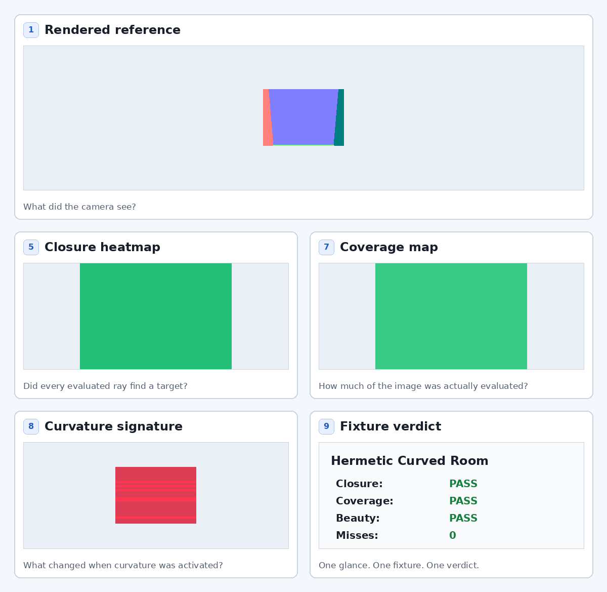

# Observatory Gallery

**Where transport diagnostics become visible.**

xPRIMEray is an instrumented curved-ray transport observatory. A strong fixture classifies every evaluated pixel within its declared scene contract: hits, misses, exits, portal events, and budget stress are reported explicitly. The Gallery is the visitor-facing museum; the Observatory chapters are the deeper 20-minute tour through methods, history, and experiments.

## Read This First

Before comparing fixtures, start with [What the Observatory Measures](./what_the_observatory_measures.md). It defines Observatory Stories, hermetic closure, Curvature Signature, reference integration, budget stress, and the claims xPRIMEray does not make.

## Start Here

The simplest complete example is **Hermetic Curved Room** in [Canonical Fixtures](./canonical_fixtures.md#hermetic_curved_room). It is the clean 9/9 Observatory Story: a sealed room, a known scene contract, zero misses when closure passes, and a curvature ramp that can be compared against the 0% baseline.

*Hermetic Storyboard v2 shows the full validation chain for the sealed-room fixture: rendered reference, geometry, transport, seams, closure, coverage, curvature signature, and final fixture verdict. It confirms scene-contract completion for this fixture; it does not claim physical ground truth.*

For the detailed 3×3 Observatory Story, open the full [Hermetic Storyboard v2](../assets/observatory/hermetic_storyboard_v2.png).

Start with [What the Observatory Measures](./what_the_observatory_measures.md), then compare fixture roles in [Canonical Fixtures](./canonical_fixtures.md). The latest mini full-coverage benchmark comparison is published as [Curvature Full-Coverage Mini Experiment](./curvature_full_coverage_experiment.md).

**15–20 Minute Visitor Path**

- Start with [What the Observatory Measures](./what_the_observatory_measures.md), then the Hermetic Curved Room in **Canonical Fixtures**.
- Explore the **Curvature Benchmark** to see the signature ladders and precision floors.
- Dive into **Research Fixtures** for the full taxonomy.
- Browse the **Experimental Archive** for the complete record.

**Core Philosophy (on every page)**

- Observation precedes explanation.
- Plausible image ≠ diagnostic agreement.
- Every claim is instrumented and falsifiable.

Use the sidebar or top navigation to move between the permanent sections of the museum. When a card says "7/9 panels", use the [nine-panel reading guide](./what_the_observatory_measures.md#nine-panel-reading-guide) to see which evidence is present and which panels are missing.

---

## Signature Exhibits

- **Hermetic Closure Hero** ([Closure Diagnostics](./closure_diagnostics.md)) — Two renders that look identical; only the closure status map tells them apart. The plausible noise detector.
- **Observer Disagreement** ([Ch 2 — Observer Disagreement](../Observatory/chapters/chapter_02.md)) — 23.8% of pixels classify differently between curved and straight transport models in this scene.
- **Coherence Basin** ([Ch 4 — Coherence Basin](../Observatory/chapters/chapter_04.md)) — Topological instability bands that no integration budget can eliminate.
- **Curvature Signature Ladders** ([Curvature Benchmark](./curvature_benchmark.md)) — Where and why curved transport diverges from straight-line traversal.

Full artifact folders (`output/<name>/`) are self-contained. Each ships with a README.md that serves as the exhibit card.
