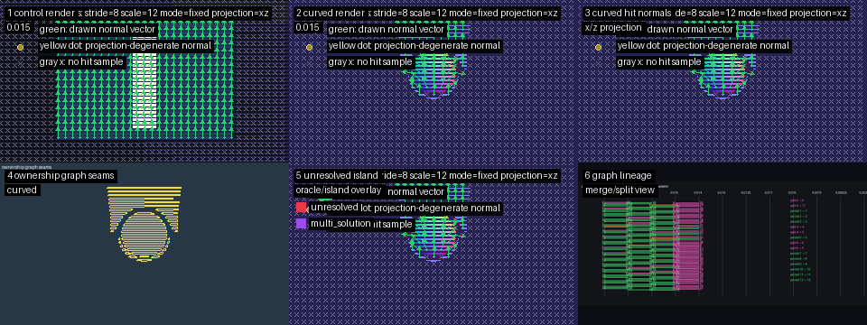
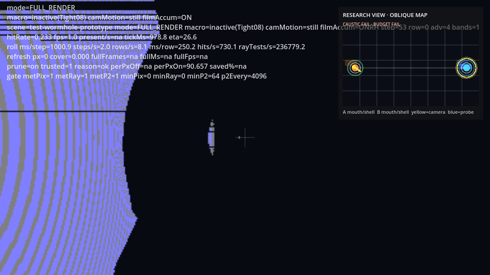
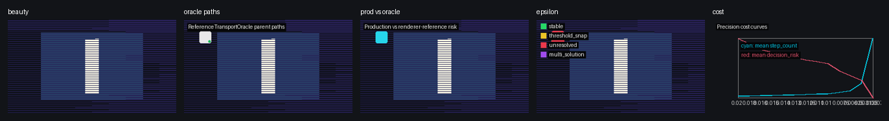

# xPRIMEray Transport Observatory Overview


> xPRIMEray is a curved-ray optical transport observatory built in Godot for visualizing propagation, boundary behavior, curvature domains, GRIN fields, wormhole seams, and observer-relative diagnostics.

---

## What xPRIMEray Is

xPRIMEray operates on three levels simultaneously:

=== "Renderer"

    A ray transport engine that solves the eikonal ODE — `ẋ = p/n(x)`, `ṗ = ∇n(x)` — for null geodesics through gradient-index (GRIN) media and Gordon effective metric fields. Rays are curved by the field; they are not faked with post-process lens distortion. Every render is validated against a hermetic fixture contract: 100% pixel classification, zero unresolved exits.

    **What this means in practice:** give the engine a GRIN field source, a scene with geometry, and a camera — and it solves the correct geodesic transport for every pixel. The renderer finds hits, seams, high-curvature regions, and boundary events from the scene data, not from hardcoded special cases.

=== "Observatory"

    A visual diagnostics platform with a growing library of overlay modes. The observatory approach: let the model show what the model shows. Run an overlay, observe what the transport structure reveals. Do not assert conclusions until the renderer's own diagnostics confirm them independently.

    Current active observatories:
    - **Atomic Visual Observatory** — multi-cell atomic orbital GRIN field comparison (V0-V4 cell × shading × contour)
    - **Wormhole Structure Observatory** — multi-panel transport structure visualization (clean_curved, dual-reality, depth, domain_diagnostics, minimap)
    - **Domain Audit Visual** — domain resolver impact heatmap suite (step budget, domain ownership, boundary confidence, normal discontinuity, selection flip)

=== "Research Map"

    A structured diagnostic infrastructure connecting renderer behavior to theoretical frameworks. The Cathedral Probe, ReferenceTransportOracle, and SceneTransportMemory systems separate multiple independent failure layers — scheduler-induced banding, local geometry seam instability, and transport island topology — that naive per-pixel analysis conflates.

    Research produces findings, not proofs: empirical observations about transport behavior that the diagnostics can confirm or refute.

---

## Why It Is a Transport Observatory

The engine does not try to prove gravity. It reveals transport structure.

When a ray terminates on a boundary, that is a boundary crossing event. When the domain resolver finds a seam between curvature zones, that is a domain transition. When two adjacent pixels disagree about which domain owns them, that is a selection flip. The renderer produces these as measurable, classifiable, visualizable events — not as narrative claims about physics.

This is the same intellectual posture as celestial holography: rather than working directly in a hard space (full Einstein gravity), look for equivalent descriptions that reveal the same structure more legibly. The Celestial Boundary Overlay (proposed) would do exactly this — project ray terminal angles onto a reference sphere, making the transport structure visible as a map.

**What the engine asserts:** transport paths, hit events, field geometry, curvature bounds, domain boundaries, and their visual signatures.

**What the engine does not assert:** that any of this is the correct description of real spacetime. These are geodesics of an effective GRIN metric. They are useful analogs, not proofs.

---

## How the Systems Fit Together

```
Scene Setup
├── FieldSource3D           (GRIN field: shape, profile, strength)
├── AtomicEigenmodeFieldSource3D  (atomic orbital density field)
├── BoundaryLayerVolume     (domain boundary + crossing policy)
└── Geometry                (scene objects for hit detection)

Transport Pipeline
├── FieldTLAS               (spatial acceleration for field queries)
├── CurvatureBoundGrid      (pre-computed Kmax for step sizing)
├── MetricHeuristicIntegrator  (2-point midpoint adaptive step)
├── GeometryTLAS            (BVH AABB hit detection)
└── GrinFilmCamera          (master: per-pixel ray → integration → hit)

Domain System
├── DomainTelemetry         (CurvatureDomainKind per pixel)
├── ObjectSeededTileScheduler  (transport ownership + DecisionRisk)
└── Domain resolver         (inside GrinFilmCamera)

Diagnostic / Research Layer
├── ReferenceTransportOracle  (best-known reference paths; diagnostic-only)
├── SceneTransportMemory    (coherence basins, unstable seams; diagnostic-only)
└── FieldProbe3D            (debug field sampling and visualization)

Overlay Layer
├── FilmOverlay2D           (2D film-plane: ray polylines, hit normals)
├── RayViz                  (3D scene-space: bend polylines)
├── WormholeResearchOverlay  (portal research readout)
└── Python toolchain        (contact sheets, heatmaps, diff composites)
```

The render pipeline is downstream of the field and geometry setup. The diagnostic layer is parallel to the pipeline, not inside it — guardrails enforced in code prevent diagnostic data from feeding back into transport decisions.

---

## Current Renderer State

Derived from [FEATURE_INDEX.md](../FEATURE_INDEX.md) and [Release/FEATURE_READINESS_AUDIT.md](../Release/FEATURE_READINESS_AUDIT.md).

### Ready to Ship

| System | Key Files |
|--------|-----------|
| GRIN field evaluation | `FieldSystem.cs`, `FieldMath.cs`, `FieldCurves.cs`, `FieldTLAS.cs`, `CurvatureBoundGrid.cs` |
| GRIN field authoring | `FieldSource3D.cs` |
| Atomic orbital field | `AtomicEigenmodeFieldSource3D.cs` |
| Boundary layer volumes | `BoundaryLayerVolume.cs` |
| Hit detection | `GeometryTLAS.cs` + `RayBeamRenderer.cs` collision subsystem |
| Step pipeline interfaces | `IIntegrator.cs`, `MetricTransportTypes.cs`, `StepResult.cs`, `StepPolicy.cs` |
| 2D/3D visualization | `FilmOverlay2D.cs`, `RayViz.cs`, `curved_view.gdshader` |
| Wormhole portal overlays | `WormholeResearchOverlay.cs`, `WireframeReferenceOverlay.cs`, `CameraSpaceCollisionOverlay.cs` |
| Test fixtures (46 scenes) | `Fixtures/*.tscn` + controllers |
| Render test runner | `RendererCore/Testing/RenderTestRunner.cs` |
| TestBench UI | `UI/TestBenchController.cs`, `UI/testbench_recipes.json` |
| Observatory scripts | `scripts/run_atomic_orbital_visual_observatory.sh`, `scripts/run_wormhole_structure_observatory_quick.sh` |
| Python diagnostic toolchain | `tools/diagnostic_wireframe_overlay.py`, `tools/atomic_orbital_visual_diff.py`, etc. |

### In Progress

| Feature | Status |
|---------|--------|
| TestBench recipe system | `UI/TestBenchController.cs` — modified May 13; API evolving |
| Wormhole prototype rig | `Wormhole/WormholePrototypeRig.cs` — 3798 lines; active experiment |
| Atomic orbital observatory fixture | `Fixtures/AtomicOrbitalVisualObservatoryController.cs` — modified May 11 |

### Research / Diagnostic Only

These systems have explicit guardrails. They are not part of the production rendering pipeline.

| System | Guardrail |
|--------|-----------|
| `ReferenceTransportOracle.cs` | "diagnostic-only" file header |
| `SceneTransportMemory.cs` | "diagnostic-only" file header |
| `MetricHeuristicIntegrator.cs` | 4 open TODOs; heuristic not full GR |
| `GrinFilmCamera_RESEARCHMODE.cs.ref` | Reference file; not compiled |

### Proposed Overlays

| Priority | Overlay | Blocker |
|----------|---------|---------|
| High | Celestial Boundary Overlay | Render pass for ray terminal angles |
| High | Curvature Domain Map | Python heatmap pass for `DomainTelemetry.CurvatureDomainKind` |
| High | Bulk-to-Boundary Dual View | Boundary projection layer on dual-reality toolchain |
| Medium | Transport Memory Overlay | Renderer hookup for `SceneTransportMemory` records |
| Medium | S-Matrix Event Ledger | Logging schema for boundary crossing in/out state |

Full list: [Observatory/OVERLAY_MASTER_LIST.md](../Observatory/OVERLAY_MASTER_LIST.md)

---

## Gallery

### Curved Field Validation



*Curved-vs-control storyboard: GRIN transport active on left, straight-ray control on right. Oracle step 0.0015625. All 64 sampled pixels sealed at step 0.02 — zero replay failures.*

---

### Six-Layer Cathedral Probe Diagnostic


*Cathedral Probe six-layer composite: beauty render · geometric wireframe · transport ownership map · risk probe markers · spacetime transport diagram · transport continuity vectors. Each layer is independent. Two failure modes confirmed: global banding (scheduler) and local seam instability (topology).*

---

### Wormhole Transport Validation



*Wormhole validation composed overlay. Two causally isolated overspaces joined at topological throat. Full curved-ray physics in both regions.*

---

### Transport Island Oracle Contact Sheet



*Oracle-guided transport island microscopy. Dense sample (289 pixels) confirms precision closure: all pixels seal at step 0.00625, zero oracle replay failures. Island was not independently flagged by Cathedral Probe continuity vectors — oracle microscopy surfaces topology that phase-space diagnostics miss.*

---

## Recommended Next Actions

From [Release/FEATURE_READINESS_AUDIT.md](../Release/FEATURE_READINESS_AUDIT.md):

1. **Orphan file cleanup** — Remove `HitPayload.cs` (1 byte, empty), `MetricRayState.cs.uid` (orphan UID), all `*.bak`/`*.tmp` files
2. **Root scene organization** — Move 60 root-level `.tscn` files into `Fixtures/`; keep only `overspace_trophy_room_demo.tscn` at root
3. **WormholePrototypeRig decomposition** — Split 3798-line monolith before packaging
4. **Curvature Domain Map overlay** — Wire `DomainTelemetry.CurvatureDomainKind` into a Python heatmap pass (data ready; one script away)
5. **Celestial Boundary Overlay** — First proposed overlay; highest MisterY Labs narrative impact

---

## Inspiration Cards

The [MisterY Labs Inspiration Cards](../MisterYLabs/INSPIRATION_CARD_FEATURE_LINKS.md) connect thinkers to xPRIMEray features:

| Thinker | Connection | Relevant Overlays |
|---------|-----------|-------------------|
| Sabrina Pasterski | Celestial holography; bulk-to-boundary translation; "gravity is hard — find an equivalent description" | Celestial Boundary Overlay (proposed), Bulk-to-Boundary Dual View (proposed), Boundary Confidence Map |
| Emmy Noether | Symmetry → conserved currents → transport invariants and their breaking | Transport Memory Overlay, S-Matrix Event Ledger |
| MTW (Misner/Thorne/Wheeler) | Metric tensor language; transport frame as partial tetrad | Metric Grid / Stress-Tensor Style Overlay |
| Maxwell / GRIN optics | Gradient-index optics tradition; curved rays through varying n | Density Contour Overlay, Curvature Contour Overlay |
| Feynman | Path integral; all paths contribute; coherence basins as interference | Transport Memory Overlay, Correspondence Failure Heatmap |

---

## Further Reading

| Document | Description |
|----------|-------------|
| [FEATURE_INDEX.md](../FEATURE_INDEX.md) | Master feature index with all audit links |
| [Release/FEATURE_READINESS_AUDIT.md](../Release/FEATURE_READINESS_AUDIT.md) | Full release readiness classification |
| [Research/OPTICAL_TRANSPORT_FEATURE_MAP.md](../Research/OPTICAL_TRANSPORT_FEATURE_MAP.md) | Transport system completeness and gap analysis |
| [Observatory/OVERLAY_MASTER_LIST.md](../Observatory/OVERLAY_MASTER_LIST.md) | All 34 overlay modes, existing and proposed |
| [MisterYLabs/INSPIRATION_CARD_FEATURE_LINKS.md](../MisterYLabs/INSPIRATION_CARD_FEATURE_LINKS.md) | Thinker-to-feature inspiration cards |
| [glossary.md](../glossary.md) | Technical term definitions |
| [Research/cathedral_probe_architecture.md](../Research/cathedral_probe_architecture.md) | Cathedral Probe methodology |
