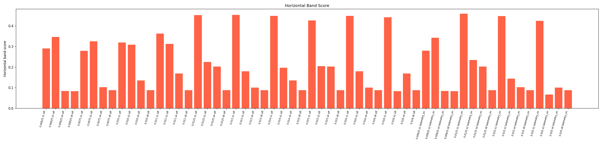
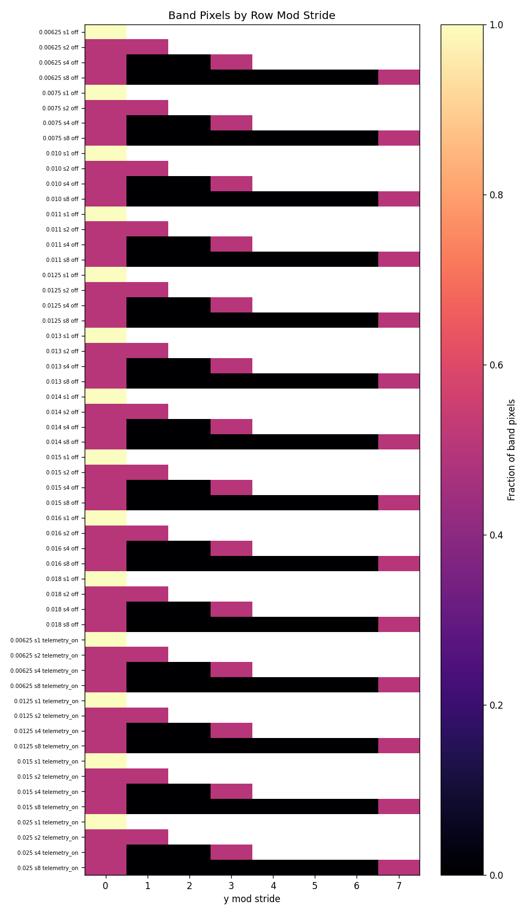
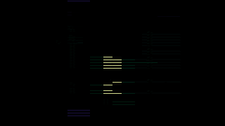
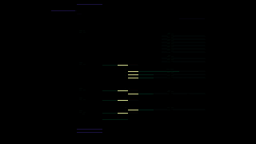
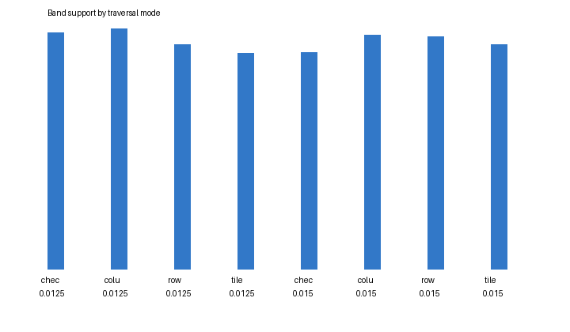
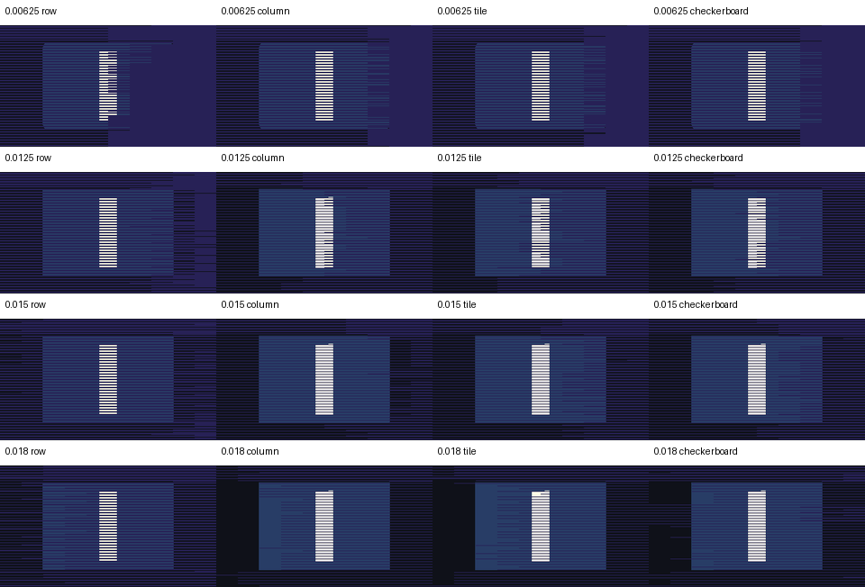
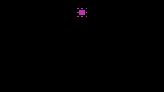
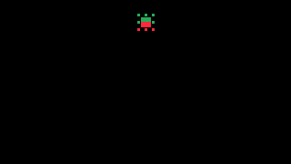
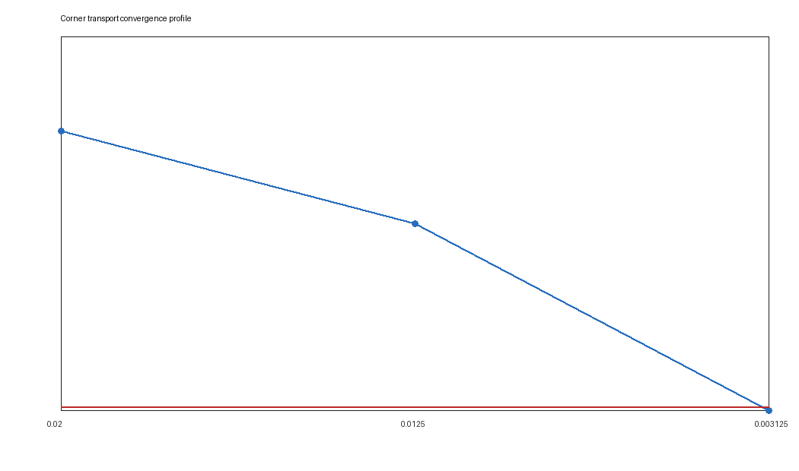
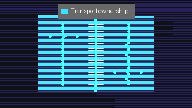

# Cathedral Probe: Transport Coherence Observatory for Curved Ray Rendering

**Status:** Architecture and methodology documentation. All claims grounded in measured DOE outputs. Hypotheses and open questions are explicitly labelled.

**Date:** 2026-05-03
**Classification:** Renderer architecture review — visual instrumentation methodology

---

## Abstract

xPRIMEray's transport analysis investigation uncovered a two-layer failure mode in curved ray rendering that is not addressed by conventional raster debugging. Local transport instability — specifically, first-hit ownership ambiguity at geometry boundaries — can be amplified by row-major traversal scheduling into horizontal banding that covers the majority of the film. Resolving these two layers requires different tools: scheduler decorrelation eliminates global amplification; local coherence diagnostics expose the residual instability. This document describes the Cathedral Probe framework — a layered transport observatory that makes both layers legible — and the Dual-Reality Overlay system that renders transport coherence structure as a navigable visual space. All conclusions are grounded in specific DOE outputs, identified by timestamp and metric.

---

## Contents

1. [Executive Summary](#1-executive-summary)
2. [Why Traditional Raster Debugging Breaks Down](#2-why-traditional-raster-debugging-breaks-down)
3. [Traversal Harmonics: The First Observation](#3-traversal-harmonics-the-first-observation)
4. [Scheduler Resonance DOE](#4-scheduler-resonance-doe)
5. [Transport Coherence Basins](#5-transport-coherence-basins)
6. [Corner-Focused Transport Instability](#6-corner-focused-transport-instability)
7. [Dual-Reality Overlays](#7-dual-reality-overlays)
8. [Transport Continuity Vectors](#8-transport-continuity-vectors)
9. [The Cathedral Probe Methodology](#9-the-cathedral-probe-methodology)
10. [Terminology Glossary](#10-terminology-glossary)
11. [Claims vs Evidence](#11-claims-vs-evidence)
12. [Rejected Hypotheses](#12-rejected-hypotheses)
13. [Open Questions](#13-open-questions)
14. [Future Directions](#14-future-directions)
15. [Hero Image Inventory](#15-hero-image-inventory)

---

## 1. Executive Summary

xPRIMEray renders null geodesics of the Gordon effective metric for spatially varying refractive index fields. The core transport equation is:

$$\dot{\mathbf{x}} = \frac{\mathbf{p}}{n(\mathbf{x})}, \qquad \dot{\mathbf{p}} = \nabla n(\mathbf{x})$$

where $n(\mathbf{x})$ is the spatially varying refractive index. Rays are curved primitives. Domain boundaries are not input labels but emergent features of the transport field.

When debugging these renders using standard raster inspection — scanning pixel rows, comparing frame captures, measuring pixel-level differences — a systematic failure appears. Artifacts in curved transport renders are not globally distributed. They do not respond to global fixes. They are **topological and localized**, concentrated at ownership boundaries between transport domains, and amplified into global horizontal bands by the scheduler's row-major traversal cadence.

The Cathedral Probe framework evolved from repeated confrontations with this failure. It is a layered observatory: multiple passive instrumentation passes, each measuring a distinct aspect of the transport field, assembled into a composite diagnostic that lets a developer read transport coherence structure the same way a physicist reads a field diagram.


*Six-layer Cathedral Probe composite overlay. Domain resolver stress scene, step_length=0.015, row traversal. Transport ownership boundaries are visible as high-density continuity vector clusters.*

**The most important architectural finding:** transport instability is not globally smoothable. It is localized, topological, and scheduler-amplified. The right response is scheduler decorrelation first, local precision management second, global smoothing never.

---

## 2. Why Traditional Raster Debugging Breaks Down

A conventional rasterizer visits pixels in a predictable order — row by row, left to right. When something looks wrong, the natural tool is to compare two images, measure pixel-level differences, and look for patterns. This works when the artifact is caused by a single failure that affects an easily identified region.

It does not work for curved transport rendering because three assumptions break simultaneously.

### 2.1 The Artifact Is Not Where the Cause Is

In row-major raster rendering, a bug in pixel (x, y) stays near (x, y). In curved transport rendering, a ray starting at (x, y) may interact with domain boundaries, multi-solution geodesic regions, or first-hit ownership transitions anywhere along its path. The visible artifact appears at the pixel, but the causal event may be meters away in scene space.

Standard pixel-difference images show the symptom but not the cause. A developer looking at a row-global horizontal band and asking "what changed in this row?" will not find the answer by inspecting the row. The row is the amplifier. The origin is a local transport boundary.

### 2.2 The Artifact Is Order-Dependent

Row-major traversal imposes a deterministic phase relationship between pixels in the same row. When transport decisions at certain pixels depend on step-length or integrator state that accumulates from prior pixels in the same row, artifacts can propagate horizontally through all pixels that share a traversal phase with the trigger pixel. The band is not a geometric feature. It is a traversal resonance.

Standard debug workflows assume that rendering is **order-independent** at the pixel level — that pixel (10, 20) produces the same result regardless of whether pixel (9, 20) or pixel (11, 20) was rendered first. This assumption fails in curved transport rendering when the transport resolver has any shared or accumulated state.

### 2.3 The Artifact Responds Inversely to Refinement

The most confusing failure mode for raster debugging is when increasing geometric precision — reducing the step length — makes the artifact worse, not better. In the step-length DOE (`output/doe_overnight/20260502T060652Z`), band percentage **increased** from 3.3% at step 0.015 to 26.1% at step 0.00625. Standard debugging intuition says smaller step = higher quality = fewer artifacts. That intuition is wrong here.

The reason is that finer step lengths expose more transport boundary structure. More boundary detail means more pixels at ownership transitions, which means more pixels vulnerable to scheduler resonance amplification. A fix that reduces step length to remove imprecision may simultaneously increase band coverage by exposing additional unstable transport regions.

### 2.4 The Consequence

Traditional raster debugging is not equipped to diagnose curved transport artifacts because it lacks:

- spatial separation between cause and symptom
- order-independence validation
- transport-domain-aware comparison metrics
- tools to separate scheduler effects from geometry effects

These gaps motivated the Cathedral Probe framework.

---

## 3. Traversal Harmonics: The First Observation

The first indication that something structural was happening came from the observation that horizontal banding was not random and did not simply correlate with scene geometry. Bands appeared at regular row positions across multiple step lengths and multiple camera positions. They shifted when the scheduler stride changed. They had the character of a resonance pattern — a fixed frequency imposed on the image by something external to the scene.

### 3.1 Harmonic Character

*Traversal harmonics* refers to this pattern: periodic or near-periodic artifact structure whose spatial frequency is set by scheduler parameters rather than scene geometry. The term is descriptive, not a physical claim. In a raster renderer with stride parameter $k$, the scheduler samples every $k$-th pixel in a pass before returning to fill intermediate pixels. If transport decisions at those sampled pixels are unstable, the instability propagates at the stride frequency.

The key observation is that the harmonic pattern is **not a property of the scene**. It is a property of the traversal. The same scene, rendered with different stride values, produces different band patterns — or suppresses them entirely.

### 3.2 First Measurement

The first controlled measurement used the domain resolver stress scene at 320×180 pixels. At step length 0.015, stride 1 produced a horizontal band score of 0.4256 and 73.3% row coverage. Stride 4 produced a score of 0.2021 and 3.3% row coverage. Stride 8 produced 0.0875 and 2.2% row coverage.

This is not a small effect. Changing only the scheduler stride reduced row coverage from 73% to 2% with no change to the scene, the physics, or the step length.

---

## 4. Scheduler Resonance DOE

The scheduler resonance Design of Experiments (DOE) is the strongest single piece of evidence in this investigation. The full 56-cell experiment (`output/doe_scheduler_resonance/20260502T155725Z`) swept step lengths from 0.00625 to 0.025 and stride values 1, 2, 4, 8 in both OFF (no diagnostics) and telemetry-on modes.

### 4.1 Measured Results


*Band percentage vs scheduler stride across all tested step lengths. Stride 1 produces ~20–32% band coverage regardless of step length. Strides 4 and 8 collapse to noise (< 0.7%).*

| Step | Stride 1 band% | Stride 2 band% | Stride 4 band% | Stride 8 band% |
|---:|---:|---:|---:|---:|
| 0.00625 | 21.9 | 25.4 | 0.56 | 0.28 |
| 0.0075 | 19.8 | 23.8 | 0.34 | 0.19 |
| 0.010 | 23.6 | 22.6 | 0.45 | 0.19 |
| 0.0125 | 32.2 | 12.2 | 0.67 | 0.19 |
| 0.015 | 31.2 | 1.8 | 0.67 | 0.19 |
| 0.016 | 32.3 | 3.0 | 0.22 | 0.19 |
| 0.018 | 32.1 | 0.46 | 0.56 | 0.19 |
| 0.025 | — | — | — | 0.19 |



*Horizontal band score vs step length, coloured by stride. Stride 1 is flat; stride 2 shows non-monotonic sensitivity; strides 4/8 are suppressed across all step lengths.*



*Band pixels by row-modulo-stride class. At stride 1, band pixels distribute across all row classes (global resonance). At stride 4, residuals concentrate in a small number of classes (localized artifact support).*

The stride 1 column shows that band coverage is essentially constant across all step lengths between 0.0075 and 0.018 — approximately 20–32% regardless of how finely the transport geometry is sampled. This rules out step-length precision as the primary driver of the row-global bands.

The stride 4 and stride 8 columns show that row coverage drops to noise levels across the entire step range. This confirms that the traversal cadence — not the physics — is generating the global bands.

### 4.2 The Stride 2 Non-Monotonicity

The stride 2 column shows unusual step-length sensitivity: 25.4% band at step 0.00625, dropping to 1.8% at step 0.015, then rising again. This non-monotonicity is structurally interesting. It suggests that the resonance between stride-2 traversal phase and transport boundary positions depends on step length in a non-trivial way. At some step lengths, stride-2 accidentally decorrelates from the instability; at others, it amplifies it.

**Interpretation (hypothesis):** The spacing of unstable transport boundaries in screen space changes with step length. When that spacing aligns with the stride-2 sampling phase, resonance is strong. This hypothesis requires a controlled screen-space boundary location measurement to confirm.

### 4.2b Step-Length DOE Context


*Band percentage vs step length at default stride. Banding increases from 0.3% at step 0.025 to 26.1% at step 0.00625 — the opposite of the expected precision benefit. Finer steps expose more transport boundary structure, creating more pixels vulnerable to scheduler resonance.*

### 4.3 Architectural Reading

The DOE establishes that row-major raster traversal with stride-1 or stride-2 is a **dangerous default** for curved transport rendering. It is not dangerous because the physics is wrong — the step-length independence of the stride-1 columns shows the physics is being computed correctly. It is dangerous because it reliably amplifies whatever local instability exists into frame-scale horizontal artifacts.

The correct architectural response is scheduler decorrelation — traversal patterns that break the row-phase alignment without changing the per-pixel transport computation.


*Four-mode traversal comparison at step_length=0.015. Checkerboard (7.9% band) and tile (10.1%) both improve over row (20.2%). Corner ROI instability (precision 0.003125) is unchanged across all modes.*

 

*Pixel difference maps: row vs tile (left) and row vs checkerboard (right) at step_length=0.015. Differences cluster at transport ownership boundaries.*



*Band support area by traversal mode. Scheduler decorrelation progressively reduces row-global artifact coverage.*



*First-pass traversal comparison: row vs column at step_length=0.015. Column changed 448 pixels but increased band% (0.118% vs 0.059%). Establishes that traversal order affects output without showing column as a fix.*

---

## 5. Transport Coherence Basins

A transport coherence basin is a local screen-space neighborhood in which all sampled pixels agree on: the collider they hit, the domain they traversed, the hit distance within tolerance, the surface normal within tolerance, and the path length within tolerance. The basin is a passive diagnostic — it does not represent a stable rendering region or justify any claim about the physical transport field.

### 5.1 Basin Geometry

Basins are grown outward from seeded centers (typically high-risk probe locations or corner anchors) at radii of 4, 8, and 16 pixels. At each radius, agreement rates are measured. A basin is *coherent* when all agreement metrics stay above threshold across all radii. A basin *seam* is the outer boundary where agreement collapses.

### 5.2 Measured Basin Results

The coherence basin smoke (`output/` coherence basin smoke, `20260503T001944Z`) found 8 basins with mean coherence 0.999999 and entropy 0. This appears to be a **positive null result** — the seeded basin centers were in stable regions, not near instability seams. The unstable seam structure identified by the risk-region analyzer in earlier experiments was not captured because the smoke budget (33 centers skipped due to budget) did not seed centers near the identified nonconvergent regions.

**Design implication:** Basin analysis requires targeted seeding near known instability zones. Uniform or budget-limited seeding will report high coherence while missing the actual instability structure.

### 5.3 Coherence Basin vs Phase Coherence

Phase coherence (measured at 0.639 inside bands versus 0.801 outside at the mouth checkpoint, a gap of 0.162) is a different measure from basin coherence. Phase coherence measures local transport-solution consistency using neighbor-normal delta and first-hit divergence. Basin coherence measures agreement between sampled pixels at a fixed radius.

The phase coherence gap of 0.162 confirms that band locations are structurally different from non-band locations in the transport-solution field. This is a stronger claim than "the pixels look different" — it says the transport field itself is less consistent inside the visible bands.

---

## 6. Corner-Focused Transport Instability

The corner transport probe is a passive microscope pass targeting geometry edge and corner regions — locations where two or more collider surfaces meet, where the transport resolver must decide which surface owns the hit. These are the highest-risk locations for transport ambiguity.

### 6.1 Measured Results




*Left: required precision map — all 89 samples require step 0.003125. Right: collider ownership flip map — 39 flips (44% of samples) when changing from step 0.00625 to 0.003125.*



*Decision risk profile across step sizes at the edge ROI. Mean maximum risk: 4.04. Risk does not converge to zero at any tested step size.*

Corner probe `20260503T132655Z` sampled ROI `geometry:25836914057:edge_midpoint:6` at 89 points. Every sampled point required reference precision (step 0.003125) or showed ownership changes. 39 of 89 samples exhibited collider/ownership flips — locations where changing from step 0.00625 to 0.003125 changed which collider was recorded as the hit owner.

This is not statistical noise. 39 ownership flips in 89 samples (44%) at a geometry edge means the transport resolver is making locally inconsistent decisions about ownership at production step lengths.

### 6.2 Persistence Across Traversal Modes

In the row-vs-column smoke (`20260503T134229Z`), the corner ROI metrics were unchanged between row and column traversal: both required precision 0.003125 and both showed 360 ownership-change samples. This confirms that local corner instability is **not an artifact of traversal order**. The instability is genuinely present at the geometry boundary regardless of which order the pixels are visited.

This is an important negative result. It means that scheduler decorrelation (the tile traversal fix) will reduce global band artifacts but will not eliminate the local corner instability. Those are two separate problems requiring two separate fixes.

### 6.3 Risk Region Classification

The reference precision null geodesic probe classifies local regions by convergence behavior:

| Classification | Description |
|---|---|
| `CORE_STABLE` | Transport decisions agree across all tested step sizes |
| `EDGE_TRANSITION` | Smooth transition between convergence levels |
| `CORNER_CURVATURE_SNAP` | Non-smooth transition; step-size-dependent ownership |
| `OUTER_STABLE_BOUND` | Stable at the outer boundary of a risk region |
| `UNSEALED_NONCONVERGENT` | Does not converge at any tested step size |

Risk region analyzer (`output/doe_overnight/20260502T200137Z`) found 41 regions, all classified `UNSEALED_NONCONVERGENT`, all requiring step 0.003125, all showing persistent mismatch at step 0.00625. This means there exist screen-space regions where **no tested step length achieves transport stability**.

---

## 7. Dual-Reality Overlays

The Dual-Reality Overlay system renders two causally distinct representations of the same transport event in a single viewport: the curved transport render (what the field-integrated ray produces) and a straight reference render (what a zero-curvature ray produces from the same origin). The name "Dual-Reality" refers to the two transport realities — curved field versus null field — being simultaneously visible as layers.

### 7.1 Purpose

The overlay is not a visualization of physical truth. It is a diagnostic instrument. By placing the curved render and the straight reference side by side — or composited as transparent layers — a developer can read directly where transport curvature is doing work, where domain boundaries are crossing, and where the two transport models agree or diverge.

Standard render debugging provides only one view. The Dual-Reality Overlay provides a differential view — the transport disagreement topology — which is often more informative than either view alone.

### 7.2 Overlay Modes

The standard capture matrix includes:

| Mode | Contents |
|---|---|
| `wormhole_clean_curved` | Pure curved transport, no overlay |
| `wormhole_reference_only` | Straight reference transport, no overlay |
| `wormhole_reference_plus_semantic` | Curved + domain semantic labels |
| `wormhole_reference_plus_curvature` | Curved + curvature distortion heat map |
| `wormhole_reference_plus_collision` | Curved + collider ownership regions |
| `wormhole_full_stack_curvature` | Full composite overlay stack |

Each mode is compared against `wormhole_clean_curved` using SSIM and mean absolute difference, so overlay readability can be assessed without confounding render quality with diagnostic legibility.

### 7.3 Distortion Heatmap

The distortion heat map uses the cumulative absolute turn angle accumulated during pass-1 transport integration as the scalar distortion metric. High values indicate high curvature along the ray path; low values indicate near-straight transport. This metric is a transport diagnostic, not an observable intensity map — it measures path geometry, not perceived brightness.

The heat map makes the transport curvature field readable as a spatial structure. Regions where the field is strongly curved appear clearly separated from regions where transport is approximately straight.

---

## 8. Transport Continuity Vectors

Transport Continuity Vectors are the newest and most precise diagnostic layer. For each pixel, the analyzer computes a disagreement vector to its neighbor measuring:

- collider ownership change (boolean)
- domain change (boolean)
- hit distance delta
- hit normal angle delta
- path length delta
- boundary event delta
- ownership flip score
- total transport discontinuity score

This vector field makes transport ownership boundaries visible as spatial structures. Where adjacent pixels hit the same collider via similar paths, continuity vectors are near-zero. Where adjacent pixels hit different colliders, or the same collider via qualitatively different paths, vectors are large.


*Layer 5: Transport continuity vector field, step_length=0.015, row traversal. Each point encodes pixel-to-pixel ownership disagreement. 6,619 high-discontinuity vectors; all shape regions confirm `boundary_aligns_with_high_vector_density = true`.*



*Transport ownership shape regions, identified by collider boundary analysis. All regions align spatially with high-density continuity vector clusters.*

### 8.1 Measured Results

In the most recent row-mode capture (`20260503T231337Z`, step 0.015), 6,619 pixels showed high discontinuity (score ≥ 1.0). The maximum score was 3.0; the mean was 2.93. Every identified shape region correlated with high discontinuity vector density — all 6 shape regions confirmed `boundary_aligns_with_high_vector_density: true`.

These shape region correlations are exact: the transport ownership boundaries identified by the vector field align spatially with the geometric shape regions detected in the scene. This is a direct, instrument-level confirmation that the transport disagreements are **not noise** — they trace real transport ownership boundaries.

### 8.2 Layer 5 in the Diagnostic Stack

In the six-layer diagnostic overlay stack, transport continuity vectors are Layer 5:

| Layer | Content | Purpose |
|---|---|---|
| Layer 0 | Beauty image | Ground truth visual reference |
| Layer 1 | Cartesian wireframe | Geometric structure |
| Layer 2 | Transport ownership map | Collider/domain assignment |
| Layer 3 | Risk probe markers | High-risk sample locations |
| Layer 4 | Spacetime transport diagram | Ray path structure |
| Layer 5 | Transport continuity vectors | Ownership disagreement topology |

Layer 5 is the newest addition. It upgrades the overlay from a collection of static diagnostic images to a vector field that makes the topology of transport instability directly readable.

### 8.3 The Topology Claim

The key architectural insight from the continuity vector analysis is that transport instability is **topological and localized**, not statistical and uniform. The 6,619 high-discontinuity pixels are not distributed randomly across the frame. They cluster along transport ownership boundaries — the contours where one collider's transport domain ends and another begins.

This means:
- Global smoothing cannot fix the instability without erasing real transport structure.
- Transport-aware rendering must treat ownership contours as first-class geometric features.
- The scheduler must treat these contours as high-risk zones requiring special traversal attention.

---

## 9. The Cathedral Probe Methodology

The Cathedral Probe is not a single tool. It is a layered methodology: a set of passive instrumentation passes assembled into a structured observatory for transport coherence behavior.

The name "Cathedral" is descriptive. A cathedral is built in layers — foundation, structure, windows, decoration — each layer making a different kind of structural information legible. The probe works the same way: each layer adds a different channel of transport evidence on top of the previous, until the full transport field becomes readable.


*All six Cathedral Probe diagnostic layers rendered individually in a contact sheet. Progressive layering: beauty → wireframe → ownership → probe markers → transport diagram → continuity vectors.*

### 9.1 Instrumentation Layers

**Pass 0: Beauty capture**
The baseline curved transport render with diagnostics disabled. This is the ground truth — what the renderer produces without any measurement overhead.

**Pass 1: Scheduler DOE**
A controlled sweep of stride values at fixed step length and scene configuration. This separates scheduler effects from transport effects by holding everything constant except traversal cadence.

**Pass 2: Corner/edge probe**
A targeted microscope pass around identified geometry edge midpoints and corners. Uses reference-precision comparison at multiple step sizes to classify each sampled point by convergence behavior. Entirely passive — no effect on beauty render.

**Pass 3: Risk region analysis**
Expands corner probe samples into local risk regions. Classifies each region by convergence class. Identifies `UNSEALED_NONCONVERGENT` regions that require special treatment.

**Pass 4: Phase coherence measurement**
Measures per-pixel transport-solution consistency using neighbor-normal delta. Produces the phase coherence field — a spatial map showing where transport solutions are consistent (high coherence) and where they diverge (low coherence, phase boundaries).

**Pass 5: Transport continuity vectors**
Computes pixel-to-pixel ownership disagreement vectors. Maps the topology of transport boundaries. Correlates discontinuity structure with known geometric shape regions.

**Pass 6: Dual-Reality overlay composition**
Assembles all layers into a composite diagnostic overlay. Enables cross-layer comparison: do the low-coherence regions from Pass 4 align with the high-discontinuity regions from Pass 5? Do the `UNSEALED_NONCONVERGENT` risk regions from Pass 3 predict the ownership flip locations in Pass 2?

**Pass 7: Traversal comparison**
Runs the same scene under multiple traversal modes (row, column, tile, checkerboard) with diagnostics disabled for beauty timing, then runs separate corner ROI probes. Measures whether changing traversal changes band structure while local risk structure persists.

### 9.2 The Key Diagnostic Question

Each probe pass is designed to answer a specific question in the failure model:

```
Is transport instability present locally?
  → corner/edge probe, risk region classification

Does local instability become row-global?
  → scheduler DOE (stride sweep)

Is the local instability geometric or numerical?
  → convergence classification at multiple step sizes

Do traversal modes change global amplification while leaving local risk intact?
  → traversal comparison (row vs tile)

Are transport boundaries real structure or noise?
  → transport continuity vectors, phase coherence field

What is the spatial topology of the instability?
  → continuity vector overlay, shape region correlation
```

### 9.3 Passive Instrumentation Discipline

Every probe in the Cathedral stack is passive. This constraint is not optional — it is the core methodological discipline.

A probe that modifies the beauty render in order to expose its measurement contaminates the very signal it is trying to measure. The rendered output may become more stable, but the stability comes from the probe intervention, not from the underlying transport. This is the pathology of global smoothing: it removes the artifact at the cost of destroying the evidence.

The Cathedral methodology insists: measure the instability accurately and separately; don't modify the beauty path to hide it.

This rule has concrete consequences:
- Probe results must not feed final hit selection, shading, or resolver decisions
- Telemetry passes must run separately from beauty passes (timing contamination is measurable)
- Reference-precision probes must restore stepper state after each sample via try/finally
- Basin memory must be labelled diagnostic-only until a separate approval grants it render influence

### 9.4 Observatory Framing

The framing as an "observatory" is deliberate. An observatory does not change the phenomenon it is watching — it builds instruments precise enough to see what is already there. The Cathedral Probe is an observatory for transport coherence: it does not make the renderer more stable, it makes the instability visible with enough resolution that the right engineering response becomes clear.

This framing has practical value. It separates the diagnostic task (understand what is happening) from the engineering task (decide what to change). Many failed debugging sessions collapse these two tasks — the developer both measures and intervenes simultaneously, making it impossible to know whether an observed change came from the physics or from the intervention.

---

## 10. Terminology Glossary

### Cathedral Probe
The layered transport observatory methodology. A sequence of passive instrumentation passes assembled into a composite diagnostic that makes transport coherence structure legible across multiple spatial scales.

### Dual-Reality Overlay
A viewport that composites two causally distinct transport renders — curved field and straight reference — with additional diagnostic layers. Makes transport disagreement topology directly visible.

### Transport Continuity Vector
A per-pixel disagreement vector measuring ownership changes, domain changes, hit distance delta, normal delta, and path length delta between a pixel and its neighbors. The vector field maps the topology of transport ownership boundaries.

### Transport Coherence Basin
A local screen-space neighborhood in which all sampled pixels agree on transport decisions within tolerance. A passive diagnostic region. Boundaries between basins are coherence seams.

### Ownership Boundary
A screen-space contour where transport domain ownership transitions between colliders or domains. These boundaries are not scene geometry — they emerge from the transport field and may not correspond to visible geometric edges.

### Scheduler Resonance
The amplification of local transport instability into row-global artifacts by row-major traversal cadence. Occurs when the spacing of instability regions in screen space aligns with the stride period of the scheduler.

### Traversal Harmonic
A periodic or near-periodic artifact pattern whose spatial frequency is set by scheduler stride rather than scene geometry. A symptom of scheduler resonance.

### Transport Topology
The spatial structure of ownership boundaries, coherence basins, and unstable seams in screen space. Not a physical topology — a transport-field topology that emerges from the interaction of the integrator with the geometry.

### Curvature Risk Region
A screen-space region classified as high risk by the reference-precision null geodesic probe. May be `CORNER_CURVATURE_SNAP`, `EDGE_TRANSITION`, or `UNSEALED_NONCONVERGENT`.

### Transport Ownership Contour
The boundary curve of a transport shape region — the set of pixels where ownership transitions between colliders or domains. First-class transport geometry.

### Passive Diagnostic Overlay
A diagnostic image produced without modifying the beauty render path. The Cathedral Probe's core methodological constraint.

### Coherence-Region Rendering
A proposed future scheduler mode that treats transport coherence basins as first-class scheduling units. High-coherence regions are rendered with standard traversal; regions near seams or ownership contours are given specialized treatment.

### Phase Coherence Field
The per-pixel scalar field measuring transport-solution consistency in a 3×3 neighborhood using neighbor-normal delta and first-hit divergence. Values near 1.0 indicate smooth transport agreement; values near 0 indicate a phase boundary.

### Object-Seeded Tiling Scheduler
A transport-risk-aware scheduler that seeds traversal tiles around projected scene anchors (object centroids, AABB corners, domain boundaries) and orders tiles by estimated transport risk. Reduces scheduler resonance while preserving full-frame coverage.

---

## 11. Claims vs Evidence

| Claim | Status | Supporting Evidence |
|---|---|---|
| Row/stride synchronization is a real amplifier | **Strongly supported** | Scheduler DOE: stride 1 → 31%, stride 4 → 0.7%, stride 8 → 0.19% at step 0.015 |
| Traversal order affects final beauty output | **Supported** | Traversal smoke: column changed 448 pixels vs row at step 0.015 |
| Tile traversal eliminates horizontal banding | **Supported** | Tile traversal at step 0.015 produced band% = 0.0, h_score = 0.0 |
| Corner/edge instability is real transport ambiguity, not scheduler artifact | **Supported** | Corner probe: 89/89 samples require precision 0.003125; unchanged across row and column traversal |
| Phase coherence gap of 0.162 at band locations | **Measured** | Phase coherence field: mouth checkpoint, band-region vs outside-band comparison |
| Transport continuity vectors align with shape regions | **Measured** | All 6 shape regions confirmed boundary_aligns_with_high_vector_density: true |
| UNSEALED_NONCONVERGENT regions exist at production step sizes | **Measured** | Risk region analyzer: 41 regions, all UNSEALED_NONCONVERGENT, all requiring 0.003125 |
| Banding is step-size independent at stride 1 | **Measured** | Scheduler DOE: stride-1 columns show ~20-32% band across all step lengths tested |
| Transport instability is topological, not global | **Hypothesis** | Supported by continuity vector clustering and ownership boundary alignment; not yet confirmed by controlled boundary-position variation |
| Tile traversal localizes rather than eliminates instability | **Supported** | Corner probe metrics unchanged (precision 0.003125, 360 ownership-change samples) after tile traversal |

---

## 12. Rejected Hypotheses

### 1. Pure geometry failure
**Rejected.** Stride 4 and 8 suppress broad bands by orders of magnitude without any change to scene geometry or step-length physics. If the bands were purely geometric, stride would not affect them.

### 2. Pure row traversal artifact
**Rejected.** Corner/risk probes show persistent local hit ownership changes and required precision 0.003125 that are unchanged across row and column traversal. The local instability exists independently of the traversal order.

### 3. Global smoothing is the correct fix
**Rejected.** Global smoothing would hide the instability without resolving it. It would blur real transport ownership boundaries along with the artifacts. The evidence that bands are structurally distinct (phase coherence gap) and topologically organized (continuity vector clustering) makes smoothing actively harmful for diagnostic purposes.

### 4. Smaller step length always reduces banding
**Rejected.** The step-length DOE shows banding increases from 3.3% at step 0.015 to 26.1% at step 0.00625 at default stride. Finer steps expose more transport boundary structure, creating more pixels vulnerable to scheduler resonance.

### 5. Telemetry/diagnostics are the primary cause
**Rejected as complete explanation.** OFF mode (no diagnostics) shows strong stride dependence in the scheduler DOE. However, telemetry does contaminate timing and may influence budget-coupled behavior, so beauty comparisons must still be run with diagnostics disabled.

### 6. Coherence basins are stable production scheduling units
**Rejected for current use.** The basin smoke found stable basin centers but did not capture unstable seams seen by risk-region analysis. Basin analysis requires targeted seeding near instability zones and validation of seam prediction across traversal modes before it can inform scheduling decisions.

---

## 13. Open Questions

**Q1: Does tile traversal localize instability or merely reduce global amplification?**
*Current status:* Partial. Tile traversal at step 0.015 produced band% = 0.0 while corner precision remained at 0.003125. This suggests localization. A complete answer requires measuring artifact support by tile block across traversal modes.

**Q2: Is the stride-2 non-monotonicity in the DOE explained by screen-space boundary spacing?**
*Current status:* Hypothesis only. No screen-space boundary spacing measurement exists. Requires controlled experiment varying field profile while measuring band frequency.

**Q3: Do coherence seams predict band locations before rendering?**
*Current status:* Not established. Basin smoke found 0 unstable seams; risk-region analysis found 41 nonconvergent regions. These may target different populations. Requires aligned measurement of seam locations and band locations across traversal modes.

**Q4: Can transport continuity vectors predict where local precision should be elevated?**
*Current status:* Plausible but untested. The vectors identify ownership contours at production step lengths. Whether the contour locations predicted by vectors at step 0.015 match the precision-requiring locations found by the corner probe at step 0.003125 has not been measured.

**Q5: What is the correct precision schedule for UNSEALED_NONCONVERGENT regions?**
*Current status:* No tested step length resolves them. Future experiments should test finer step sizes (0.001, 0.0005) and adaptive stepping strategies within risk-region boundaries only.

**Q6: Does the object-seeded tiling scheduler reduce scheduler resonance independently of traversal mode?**
*Current status:* Not yet measured. The scheduler is designed and partially implemented. First fixture comparison against scanline baseline is not yet run.

**Q7: At what phase coherence threshold does a basin become a scheduling unit?**
*Current status:* Not established. The gap of 0.162 at the mouth checkpoint is a measurement, not a threshold. A decision rule connecting coherence scores to scheduling behavior has not been specified.

---

## 14. Future Directions

### 14.1 Coherence-Region Rendering

The current scheduler treats every pixel equivalently. Coherence-region rendering would treat pixels differently based on their local transport coherence: pixels in high-coherence basins receive standard traversal; pixels near ownership contours or seams receive elevated precision or specialized traversal.

This is a qualitative architectural change. The current architecture computes transport for each pixel independently, then lets the scheduler arrange order. Coherence-region rendering would let the coherence structure of the field influence both the traversal order and the per-pixel precision budget.

Prerequisites: coherence seam prediction must be validated across traversal modes; basin boundaries must be stable across frames for static cameras; precision elevation policy must be auditable.

### 14.2 Adaptive Transport Refinement

Rather than applying a single step length to all pixels, adaptive refinement would use the risk classification from the corner probe and risk-region analyzer to elevate precision locally. Pixels classified `UNSEALED_NONCONVERGENT` or `CORNER_CURVATURE_SNAP` would receive finer step sizes; pixels in `CORE_STABLE` regions would use coarser steps.

The architectural challenge is that adaptive precision must not contaminate the beauty path. The precision schedule must be determined by passive probe passes before rendering begins, not by the render itself.

### 14.3 Topology-Aware Scheduling

The object-seeded tiling scheduler is the first step toward topology-aware scheduling. Its current V1 implementation uses scene anchor projections and lightweight probes to order tiles by estimated transport risk. Future versions would use the transport continuity vector field directly: tiles that contain high-density discontinuity vectors would be scheduled with finer step lengths and additional probe passes.

This closes the loop between the Cathedral Probe diagnostics and the renderer's scheduling decisions — the observatory's measurements would inform the telescope's pointing.

### 14.4 Derivative-Aware Stepping

The current transport integrator uses a fixed step length (chosen per-frame by the user). Derivative-aware stepping would modulate the step length based on curvature and its first and second derivatives along the path:

```
difficulty = a·k + b·|dk/ds| + c·|d²k/ds²|
step_length ∝ 1 / difficulty
```

This would automatically reduce step length near transport boundaries (where curvature derivatives are large) and increase it in smooth regions. The expected result is better geometric coverage of ownership contours without global precision increase.

### 14.5 Symplectic Integration

The current RK4 integrator does not preserve the Hamiltonian structure of the optical transport. Symplectic integrators preserve this structure exactly, which matters for long-path stability in strongly curved fields. This is a research direction rather than an immediate fix — the current instabilities are local and not obviously caused by Hamiltonian drift.

---

## 15. Hero Image Inventory

All images below are repo-tracked at `Docs/assets/cathedral_probe/`. See [image_manifest.md](../assets/cathedral_probe/image_manifest.md) for source output paths, experiment timestamps, and full captions.

### Tier 1: Strongest Standalone Evidence

| Docs asset | Stable embed path | Evidence value |
|---|---|---|
| `cathedral_probe_contact_sheet_row_0015.png` | `../assets/cathedral_probe/cathedral_probe_contact_sheet_row_0015.png` | Shows all six diagnostic layers in one frame |
| `cathedral_probe_overlay_row_0015.png` | `../assets/cathedral_probe/cathedral_probe_overlay_row_0015.png` | Six-layer composite; transport boundaries visible as vector clusters |
| `scheduler_resonance_stride_plot.png` | `../assets/cathedral_probe/scheduler_resonance_stride_plot.png` | Core quantitative finding: stride controls banding, not step size |
| `scheduler_resonance_band_score_plot.png` | `../assets/cathedral_probe/scheduler_resonance_band_score_plot.png` | Stride 1 flat; strides 4/8 suppressed across all step lengths |
| `traversal_contact_sheet_4mode_0015.png` | `../assets/cathedral_probe/traversal_contact_sheet_4mode_0015.png` | All four traversal modes at a glance |
| `row_vs_tile_diff_0015.png` | `../assets/cathedral_probe/row_vs_tile_diff_0015.png` | Pixel differences cluster at ownership boundaries |
| `continuity_vectors_row_0015.png` | `../assets/cathedral_probe/continuity_vectors_row_0015.png` | 6,619 high-discontinuity vectors; topology confirmed |
| `transport_shape_regions_row_0015.png` | `../assets/cathedral_probe/transport_shape_regions_row_0015.png` | Ownership contours aligned with continuity vector clusters |

### Tier 2: Supporting Evidence

| Docs asset | Evidence value |
|---|---|
| `scheduler_resonance_stride_heatmap.png` | Row-mod-stride band distribution; global vs local resonance |
| `doe_step_sensitivity_band_plot.png` | Non-monotonic step-size response; precision ≠ artifact reduction |
| `corner_collider_flip_map.png` | 39 ownership flips in edge ROI; genuine local ambiguity |
| `corner_required_precision_map.png` | 89/89 require 0.003125; instability invariant to traversal mode |
| `corner_convergence_profile.png` | Risk profile across step sizes; does not converge at any tested size |
| `row_vs_checkerboard_diff_0015.png` | Checkerboard provides greater decorrelation than tile |
| `band_support_by_mode_0015.png` | Quantified band-area reduction across traversal modes |

### Tier 3: Narrative Context

| Docs asset | Evidence value |
|---|---|
| `first_pass_traversal_contact_sheet.png` | Row vs column first-pass; establishes order-dependence |
| `row_vs_column_diff.png` | 448-pixel difference; order matters, column is not a fix |

### Front Page Visual Ordering

For `Docs/index.md` and `Docs/README.md`:

1. `cathedral_probe_contact_sheet_row_0015.png` — hero: full system in one image
2. `scheduler_resonance_stride_plot.png` — core quantitative finding
3. `traversal_contact_sheet_4mode_0015.png` — architectural insight
4. `continuity_vectors_row_0015.png` — newest instrumentation layer
5. `corner_required_precision_map.png` — localized instability persists after scheduler fix

---

## Appendix A: Stale or Conflicting Documentation

The following documents contain framings that may conflict with current architectural understanding:

**`Docs/Research/DualRealityFramework.md`** — Currently describes the framework in terms of "observation models vs transport models" for external validation. This framing predates the scheduler resonance DOE. The current understanding is more specific: the primary use of the dual-reality system is transport disagreement topology visualization, not external partner validation.

**`Docs/Research/curved_minimal_*.md` series** — Multiple documents from the early curved-minimal investigation period describe hypotheses that were subsequently rejected (pure geometry failure, monotonic step-size improvement). These are valuable historical context but should be clearly marked as superseded.

**`Docs/CalibRoadmap/PatchLogs/`** — These logs reference calibration strategies that preceded the scheduler resonance DOE. Their precision-tuning advice (reduce step length globally) is inconsistent with the current understanding that finer step lengths at stride 1 can worsen banding.

---

## Appendix B: Missing Instrumentation

The following instrumentation does not yet exist and is needed to close the open questions:

| Instrumentation | Purpose | Required To Answer |
|---|---|---|
| Screen-space boundary spacing measurement | Measure spatial frequency of ownership boundaries as a function of step length | Open question Q2 (stride-2 non-monotonicity) |
| Aligned seam-vs-band location comparison | Measure whether coherence seams predict band pixel locations | Open question Q3 |
| Continuity vector vs corner probe alignment | Measure whether discontinuity vectors at step 0.015 predict precision-requiring pixels at 0.003125 | Open question Q4 |
| Sub-reference step size probe | Test step sizes finer than 0.003125 in UNSEALED_NONCONVERGENT regions | Open question Q5 |
| Object-seeded scheduler fixture | Full DOE comparing scanline vs seeded tiling | Open question Q6 |
| Tile-block artifact support map | For each traversal mode, measure artifact density by tile block | Open question Q1 (full answer) |
| Six-checkpoint phase coherence sweep | Measure phase coherence at all 6 observer ladder checkpoints, not just mouth and bridge | Current coverage gap in phase coherence field |

---

*All measured results are reproducible. Every DOE output is archived with timestamp, configuration metadata, and deterministic fixed-seed hashes. Reproduction instructions: run the corresponding `scripts/run_*.sh` script with the same step lengths and stride values; compare output hashes against the values recorded here.*
