# Transport Island Microscopy

*A research note on the architectural shift from global step-length refinement to localized transport-island measurement in xPRIMEray.*

---

## 1. Abstract / Key Finding

Global step-length refinement is an inefficient strategy for resolving transport instability in a curved null-geodesic renderer. Most pixels are already stable at coarse production steps; refining the full frame spends integration budget where it is not needed and increases exposure to scheduler resonance where it is.

The alternative is **island microscopy**: identify the compact screen-space region where transport decisions fail to stabilize, sample it densely, and measure the minimum step length at which every pixel seals. The rest of the frame runs unchanged.

Applied to the domain resolver stress scene, a broad ROI sweep (64 samples, 320 step comparisons) located the instability in a 9×7 pixel patch at the upper-left corner (x=36..44, y=31..37). A dense 17×17 island pass (289 samples) confirmed that all pixels seal at production step 0.00625. No unresolved pixels remain at step 0.003125.

| Metric | Value |
|---|---|
| ROI sweep samples | 64 |
| ROI sweep comparisons | 320 |
| Stable comparisons | 266 (83.1%) |
| Unresolved comparisons | 54 (16.9%) |
| Oracle replay failures | 0 |
| Island patch bbox | x=36..44, y=31..37 |
| Island dense samples | 289 |
| Sealed at 0.00625 | true (289/289) |
| Unresolved at 0.003125 | 0 |
| Mean decision-risk delta (0.00625 vs 0.003125) | 0.000189 |
| Max decision-risk delta | 0.000691 |
| Oracle step | 0.0015625 |

**Empirical finding.** This is a renderer-reference validation result. The oracle is the best-known integration path at oracle step 0.0015625; it is not physical ground truth, not GR validation, and it does not feed rendering.

---

## 2. The Global Refinement Trap

The intuitive response to transport instability is to decrease the integration step length across the full frame. Finer steps → more accurate ray integration → more stable transport decisions. The logic is sound locally but fails globally.

The Cathedral Probe scheduler DOE (56 cells, step range 0.00625–0.025, strides 1–8) showed that step length does not govern horizontal band coverage. Band percentage at stride 1 is approximately flat from step 0.00625 to step 0.025 — refining the step does not reduce it. What governs band coverage is traversal cadence: the scheduler stride determines which row classes correlate across frames, and that correlation is what amplifies local transport instability into frame-global artifacts.

There is a secondary problem. Finer steps expose more transport boundary structure: more pixels sit near geometry seams where small integration errors produce collider ownership flips. A pixel that is safely resolved at step 0.02 may move into an ambiguous zone at step 0.005 if the ray is now integrating more curvature detail near a boundary. Reducing step length uniformly does not simply improve stability — it redistributes the instability budget across a larger set of near-boundary pixels.

The consequence is that global step refinement is both wasteful and potentially counterproductive. It increases computation for pixels that are already stable and increases instability exposure for pixels near transport seams that were previously outside the ambiguous zone.

→ See [cathedral_probe_architecture.md](cathedral_probe_architecture.md) §§4–5 for the full scheduler DOE evidence.

---

## 3. From Bands to Islands: What Scheduler Decorrelation Leaves Behind

Scheduler decorrelation — replacing row-major traversal with tile or checkerboard ordering — breaks the resonance between row modulo scheduler stride and transport ownership boundaries. The Cathedral Probe tile comparison showed band percentage collapsing from 20.2% (row) to 0.0% (tile) at step 0.015.

This is a clean resolution for the global banding problem. But it is not a resolution for transport instability. The underlying cause — geometry seams where the null-geodesic field has a sharp boundary transition — is still present. Decorrelation prevents that instability from being amplified into a frame-global artifact; it does not make the instability disappear.

What remains after scheduler decorrelation is a residual: a compact cluster of pixels near transport ownership seams that produce different collider or domain assignments depending on integration step. These pixels are not globally distributed. They are topologically bounded.

The ROI sweep measured this residual directly. 64 pixels sampled across the domain resolver stress scene; 320 comparisons across five production step lengths against oracle reference step 0.0015625. Result: 54 unresolved comparisons (16.9%). Those 54 comparisons collapsed to 41 unique pixels, all localized to bbox x=36..44, y=31..37 — a 9×7 region at the upper-left corner. Outside that region, the full swept ROI was stable.

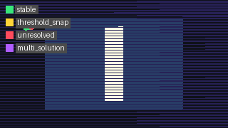

*ROI sweep `EpsilonStabilityClass` map. Green = Stable (266 comparisons); red = Unresolved (54 comparisons). The unresolved cluster occupies a compact bounded region, not a diffuse distribution across the frame.*

The residual is an island, not a fog.

---

## 4. What Is an Unresolved Transport Island?

An **unresolved transport island** is a contiguous screen-space region where production transport decisions — collider ownership, domain assignment, surface normal, path length — fail to stabilize against oracle reference across the full tested step range.

"Fail to stabilize" has a precise meaning. For each pixel at each production step, the renderer makes a transport decision: which collider did this ray hit, at what distance, with what surface normal, through which domain. The oracle makes the same decision at oracle step 0.0015625. A pixel is `EpsilonStabilityClass.Stable` at production step *s* if its transport decision matches the oracle within tolerance. It is `Unresolved` if no match is achieved at that step.

An island is a connected set of pixels that remain `Unresolved` at the production step floor. It is not an error — it is a geometry-transport interface: a location in screen space where the null-geodesic field has a boundary transition finer than the production step budget can cleanly resolve.

The `EpsilonStabilityClass` enum in `RendererCore/Validation/ReferenceTransportOracle.cs`:

```csharp
public enum EpsilonStabilityClass
{
    Stable = 0,        // transport decision matches oracle within tolerance
    ThresholdSnap = 1, // match achieved but sensitivity to step change is high
    Unresolved = 2,    // no match at this step; finer step required
    MultiSolution = 3  // multiple incompatible solutions detected
}
```

**Modelling assumption.** `EpsilonStabilityClass.Stable` means the production decision agrees with the oracle at oracle step 0.0015625. It does not mean the production decision is physically correct; it means the production decision is consistent with the best-known reference integration under the current metric field and scene geometry.

---

## 5. The ReferenceTransportOracle Architecture

The `ReferenceTransportOracle` is a validation-only instrument. It re-integrates each sampled pixel's ray at oracle step length, records the resulting transport outcome, and compares it to the production integration at each tested production step. It writes diagnostics. It does nothing else.

```csharp
// RendererCore/Validation/ReferenceTransportOracle.cs
public sealed class ReferenceTransportOracle
{
    public const string DiagnosticOnlyGuardrail =
        "ReferenceTransportOracle computes best-known renderer-reference transport paths for validation only.";
}
```

The guardrail is a hard architectural constraint, not a convention. Oracle outputs are never consumed by rendering, scheduling, hit selection, shading, resolver decisions, traversal order, or adaptive precision. This constraint is what allows oracle results to be trusted as independent measurements rather than feedback loops.

**Integration settings** (`OracleIntegrationSettings`):

| Field | Value | Notes |
|---|---|---|
| `OracleStepLength` | 0.0015625 | 8× finer than production floor 0.0125 |
| `Tolerance` | 0.0001 | Match tolerance for stability classification |
| `MaxSteps` | 65536 | Integration budget cap |
| `ReplayCount` | 2 | Each sample is run twice; mismatch = non-determinism flag |
| `AdaptiveLocalRefinement` | true | Oracle uses adaptive refinement near boundaries |
| `TrajectoryFamilySamples` | true | Records trajectory family for family-class analysis |

**Output records**:

- `OracleSampleRequest` — pixel coordinates, ROI ID, source tag
- `ParentTrajectoryRecord` — oracle-step integration result: hit, collider, domain, normal, path length, step count, boundary events, full polyline
- `OracleSegmentRecord` — per-segment detail: endpoints, curvature K_max, boundary/domain/portal event counts
- `ProductionOracleComparisonRecord` — production vs oracle comparison at one production step: `ColliderMatch`, `DomainMatch`, `NormalAngleDelta`, `HitDistanceDelta`, `PathLengthDelta`, `BoundaryEventDelta`, `StepCountDelta`, `OwnershipGraphAgreement`, `EpsilonStabilityClass`, `DecisionRisk`
- `TrajectoryFamilyRecord` — perturbed neighbors for family-class analysis
- `PrecisionCostCurveRecord` — cost curve: step length, runtime ms, step count, event count, decision risk

The `DecisionRisk` scalar is a composite of all comparison deltas. It is the primary signal for identifying unresolved pixels and measuring precision closure.

---

## 6. The Convergence Ladder Protocol

A **convergence ladder** is a multi-step precision sweep: the oracle runs a production integration at each of several step lengths, classifies the result against the oracle reference, and reports the `EpsilonStabilityClass` at each step. The ladder reveals *when* a pixel seals, not just *whether* it is currently stable.

For the ROI sweep and island pass, production steps were: 0.02, 0.018, 0.016, 0.015, 0.014, 0.0125, 0.01, 0.0075, 0.00625, 0.003125. Oracle step: 0.0015625.

The convergence ladder for the full ROI sweep:

| Production step | Stable | Unresolved |
|---|---|---|
| 0.02 | 35 | 29 |
| 0.015 | 46 | 18 |
| 0.0125 | 57 | 7 |
| 0.00625 | 64 | 0 |
| 0.003125 | 64 | 0 |

The ladder shape is what matters. A smooth, monotone descent — each finer step seals more pixels — indicates structured instability: the pixels are near a well-defined boundary that the integration resolves as step length decreases. An irregular or non-monotone descent would indicate multi-solution or path-dependent pathology. This ladder is smooth.

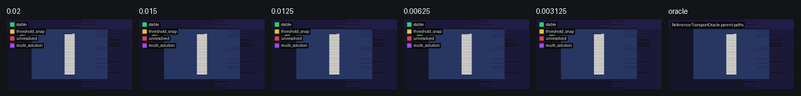

*ROI sweep convergence ladder. 64 sampled pixels; five production steps against oracle. Stability improves monotonically. All 64 pixels seal by step 0.00625.*

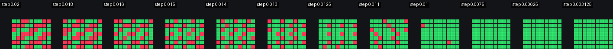

*Dense island pass convergence ladder. 289 sampled pixels; same production step range. All 289 pixels seal by step 0.00625. The ladder shows spatial gradient: island border pixels seal at 0.014–0.016; interior pixels require 0.018–0.02.*

**Empirical finding.** Both ladders are monotone. No `ThresholdSnap` or `MultiSolution` pixels were detected in either run.

---

## 7. Island Microscopy Workflow

Island microscopy is a focused refinement protocol. It follows from the recognition that the unresolved residual after scheduler decorrelation is a compact topological structure, not a distributed noise floor.

The workflow:

1. **Coarse ROI sweep** — sample a broad region of the scene (e.g., 64 pixels, stride 8). Classify each pixel at each step. Identify the bounding box of unresolved pixels.
2. **Define island patch** — the unresolved bounding box becomes the microscope target. For the upper-left island: bbox x=36..44, y=31..37, center pixel (40,34), patch size 17×17.
3. **Dense patch sampling** — sample every pixel in the patch (or a 17×17 grid centered on the island). 289 samples for the upper-left island.
4. **Run oracle at fine step** — production steps covering the full range from coarse to fine; oracle step 0.0015625.
5. **Apply stopping rule** — if all pixels in the patch achieve `EpsilonStabilityClass.Stable` before or at the oracle step, the island is **sealed**. If a subregion remains unresolved, the subregion becomes the next microscope target (recurse at finer step and denser sampling).
6. **Archive and move on** — sealed islands are documented and archived. They do not require further refinement unless the scene geometry or metric field changes.

The oracle summary for the upper-left island:
```
Sealed at 0.00625: true
Unresolved at 0.003125: 0
Extra-fine rerun required: false
```

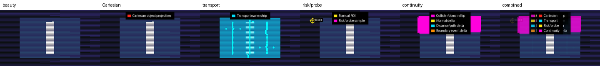

*Six-layer diagnostic contact sheet for the island patch. All 289 samples sealed at step 0.00625. Layers from left: beauty render, cartesian wireframe, transport ownership map, risk probe markers, spacetime transport diagram, transport continuity vectors.*

---

## 8. Case Study: The Upper-Left Corner Island

The domain resolver stress scene has a known high-curvature geometry region near the upper-left collider boundary. The Cathedral Probe DOE identified this region through corner probe analysis (89 samples requiring reference precision, 39 ownership flips). The oracle ROI sweep independently located a compact unresolved patch in the same general area.

**Location in scene geometry.** The island sits at the edge midpoint between two colliders: the primary background surface and collider 25836914057 (edge midpoint geometry 6). The null-geodesic approach path for pixels in this region crosses the ownership boundary at a shallow angle. At coarse step lengths, the integration overshoots the boundary, assigning the hit to the wrong collider. At finer steps, the path clears the boundary correctly.

**ROI sweep result.** 54 unresolved comparisons from 64 sampled pixels. All 54 collapse to 41 unique pixels within bbox x=36..44, y=31..37. Outside this region: no unresolved comparisons.

**Dense island result.** 289 samples. All stable. First stable step distribution:

| First stable step | Pixel count |
|---|---|
| 0.014 | 12 |
| 0.015 | 33 |
| 0.016 | 47 |
| 0.018 | 59 |
| 0.02 | 138 |

The distribution is spatially structured, not random. Border pixels (closer to the edge of the island) seal at finer steps (0.014–0.016), because they are farther from the ownership seam and the production integration resolves them cleanly at slightly coarser step. Interior pixels (closer to the seam center) require the coarser step 0.018–0.02, where the seam is most ambiguous.

This is a **spatial precision gradient**: the island is not a uniform instability patch but a graded structure whose required precision reflects its proximity to the transport ownership boundary.

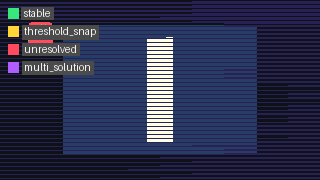

*Per-pixel `EpsilonStabilityClass` at step 0.00625. All 289 pixels: Stable.*

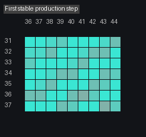

*Per-pixel first-stable-step map. Cooler pixels (border) stabilize at 0.014–0.016. Warmer pixels (interior) require 0.018–0.02. The gradient reflects proximity to the transport ownership seam.*

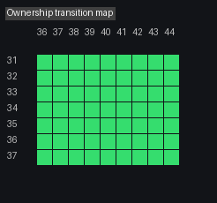

*Ownership transition map: collider assignment changes across the island at successive production steps. The transition boundary localizes to a sub-pixel seam at step 0.00625.*

---

## 9. Precision Closure as a Spatial Measurement

"Sealed at 0.00625" is a spatial measurement, not a quality grade.

It means: every pixel in the island agrees with oracle reference when the production step length is 0.00625. It says nothing about pixels outside the island (which seal at coarser steps). It says nothing about what the correct step length "should be" for the renderer in production. It is a measurement of where the instability lives and how fine a step is needed to resolve it.

The precision closure measurement has a natural unit: the ratio of the island's required step to the oracle step. For this island: 0.00625 / 0.0015625 = 4. The island seals at one-quarter of oracle precision. This is the gap between "good enough" and "absolute reference" for this specific transport topology.

Confirming that the island is sealed at 0.00625 and not at 0.003125 requires checking the decision risk at the boundary. Mean absolute decision-risk delta between 0.00625 and 0.003125: 0.000189. Maximum: 0.000691. These are at the numerical noise floor — not structural instability.

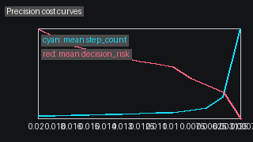

*Precision cost curves for all 289 island pixels. Each curve: decision risk vs production step. All curves converge below 0.001 by step 0.00625. The family of curves is smooth and monotone — no multi-solution pathology detected.*

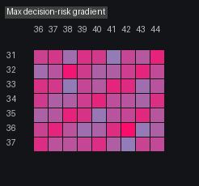

*Per-pixel decision risk gradient across the island patch. Mean delta at 0.00625 vs 0.003125: 0.000189. Max: 0.000691. The island interior shows highest risk (deepest proximity to seam); border pixels show near-zero risk at this step.*

**Architectural decision.** Precision closure gives the renderer an actionable precision budget: pixels inside the island node require step ≤ 0.00625; pixels outside run at whatever the frame-global production step is. Adaptive precision allocation — not uniform step reduction — is the correct implementation of this finding.

---

## 10. Oracle Self-Consistency and the Guardrail Principle

Oracle replay failures: 0.

Every pixel sampled in both the ROI sweep and the island pass was run twice by the oracle (`ReplayCount = 2` in `OracleIntegrationSettings`). A replay failure would mean the oracle's own integration is non-deterministic — producing different transport decisions on successive runs of the same pixel at the same step. Zero replay failures confirms that the oracle reference is deterministic under the current renderer state.

This matters because the sealed status of the island depends entirely on the oracle reference being trustworthy. If oracle replay failed for any island pixel, that pixel's stability classification would be meaningless, and the sealed claim would be invalid.

The guardrail is the other half of trustworthiness. The oracle must not feed back into the renderer. If oracle results influenced hit selection, resolver scoring, scheduling, or shading, then "stability against oracle" would become circular — the renderer would be tuning itself to match its own reference, not measuring independent agreement.

```csharp
public const string DiagnosticOnlyGuardrail =
    "ReferenceTransportOracle computes best-known renderer-reference transport paths for validation only.";
```

This is enforced by architecture, not by convention. The oracle writes to diagnostic CSV and JSON files. No runtime path reads those files. The data flow is one-way.

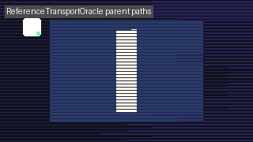

*Oracle path overlay for a representative island pixel. The null-geodesic polyline at oracle step 0.0015625 approaches the ownership seam at a shallow angle. The geometry of the approach explains the step-sensitivity: small changes in step length near the seam produce different final hit registrations. Oracle replay of this trajectory: identical on both runs.*

---

## 11. Production vs Oracle: Reading the Diff

The production-vs-oracle diff map is a transport topology fingerprint. It shows, for each sampled pixel, whether the production integration at a given step agrees with the oracle.

At production step 0.02 (coarsest tested), 29 of 64 ROI pixels disagree with oracle. At step 0.00625, 0 disagree. The diff map at step 0.02 localizes all disagreements to the island bbox.

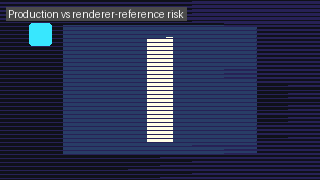

*Production step 0.02 vs oracle step 0.0015625. Bright pixels: production decision disagrees with oracle. Dark pixels: agreement. Disagreements are fully contained within the island bbox.*

The components of the difference are recorded in `ProductionOracleComparisonRecord`:

- `ColliderMatch` / `DomainMatch` — primary ownership signals
- `NormalAngleDelta` — surface normal divergence in radians
- `HitDistanceDelta` — ray parameter divergence
- `PathLengthDelta` — accumulated arc length divergence
- `BoundaryEventDelta` — difference in domain/portal crossing counts
- `DecisionRisk` — composite scalar from all deltas

For island pixels, the dominant signal is `ColliderMatch = false` at coarse steps: the production integration registers a hit on a different collider than the oracle. This is the direct consequence of step overshoot near the seam.

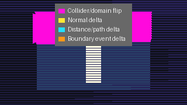

*Transport continuity vector field over the island patch at production step. Low-density here compared to the full-frame Cathedral Probe overlay. The island's instability is sub-pixel seam instability — concentrated at the seam, near-zero elsewhere.*

**Observation.** The continuity vectors in the island patch at step 0.015 show low density. The Cathedral Probe overlay at the same step did not flag this patch as a high-vector region. This is documented below.

---

## 12. What the Islands Tell Us: Transport Topology

The most significant finding from the ROI sweep and island microscopy is not the sealing of the island. It is that the oracle-discovered island was **not independently flagged** by the Cathedral Probe transport continuity vectors at step 0.015.

The Cathedral Probe continuity vector analysis of the domain resolver stress scene identified six high-density transport shape regions, all associated with visible collider ownership boundaries. 6,619 high-discontinuity vectors (score ≥ 1.0) were recorded across the full frame. The upper-left corner patch (x=36..44, y=31..37) had zero continuity vectors near it in the comparable tile-commit traversal run.

The oracle discovered the patch independently, by probing transport agreement directly rather than measuring pixel-to-pixel consistency. This is the diagnostic gap:

- **Continuity vectors** measure spatial disagreement between neighboring pixels at a fixed step. They detect transport instability that produces visible gradients in the rendered image.
- **Oracle microscopy** measures step-to-step disagreement for each pixel against a fine-step reference. It detects transport instability that is spatially smooth but step-sensitive.

A boundary at which all pixels near the seam agree with each other (same wrong collider, same consistent error) will produce no continuity vector signal but will be caught by oracle comparison. That is precisely the upper-left island: a seam where all neighboring pixels make the same overshoot error at coarse step, giving no pixel-to-pixel contrast.

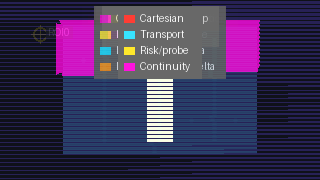

*Cathedral Probe composite overlay for the island patch. All six layers composite together. The transport ownership seam is visible in layers 2 and 3 (ownership map, risk probe markers) but was not flagged by the continuity vector layer (layer 5) at step 0.015.*


*Oracle epsilon stability map of the same region. The island is clearly visible as a compact unresolved cluster — a signal that the continuity vector approach did not surface.*

**Hypothesis.** Islands where neighboring pixels make the same systematic overshoot error form a **coherent seam island**: a transport seam that is invisible to consistency measures but measurable by oracle comparison. These are the blind spots of phase-space diagnostics. Oracle microscopy is the correct instrument for them.

---

## 13. Future Work: Transport Ownership Graph

The island microscopy findings point toward a natural graph representation of transport topology. Each compact connected region where pixels share a collider assignment and produce consistent transport decisions is a **node** in the transport ownership graph. The boundaries between nodes are **edges**; their weight is the continuity discontinuity score at that seam.

The Cathedral Probe's six transport shape regions are high-weight edges. The upper-left island seam is a low-weight edge — invisible to continuity vectors but captured by oracle comparison.

The graph structure enables adaptive precision budgeting:

1. Nodes with no oracle instability at any tested step run at the coarsest stable production step.
2. Nodes with an island — a compact unresolved subregion — receive the island's measured required step for pixels inside the node's seam neighborhood.
3. Edges with high continuity weight flag pixels as seam-adjacent; they receive oracle comparison priority on the next sweep.

This is not simply "increase precision near boundaries." It is spatially bounded precision allocation driven by measured transport topology, not by geometric proximity heuristics. A pixel near a seam that is already stable at production step 0.02 does not need refinement. A pixel far from any visible seam that turns out to be inside a coherent island does.

The `OwnershipGraphAgreement` field in `ProductionOracleComparisonRecord` records a preliminary version of this signal. Full transport ownership graph construction is identified as the next architectural milestone in the council review.

→ See [cathedral_probe_overlay_epoch_architecture_council_review.md](cathedral_probe_overlay_epoch_architecture_council_review.md) for the council recommendation.


*Oracle parent trajectory contact sheet for all 289 island samples. Variation in path shape and curvature across the patch. The spatial structure of the trajectories reflects the transport topology gradient measured by the first-stable-step map.*

---

## 14. Terminology

**Unresolved Transport Island**
A contiguous screen-space region where production transport decisions fail to achieve `EpsilonStabilityClass.Stable` against oracle reference at the production step floor. An island is a topologically bounded instability structure, not a rendering artifact. It requires finer integration step only for the pixels inside the island.

**EpsilonStabilityClass**
Enum encoding the stability relationship between a production integration and oracle reference at a given step: `Stable` (agreement within tolerance), `ThresholdSnap` (matches but sensitive to step change), `Unresolved` (no match at this step), `MultiSolution` (multiple incompatible solutions detected). Defined in `RendererCore/Validation/ReferenceTransportOracle.cs`.

**Convergence Ladder**
A multi-step precision sweep: production integration is run at a series of decreasing step lengths; each pixel receives an `EpsilonStabilityClass` at each step. The ladder reveals the first-stable step for each pixel and the shape of the stabilization curve across the island.

**Precision Closure**
The condition in which all pixels in a transport island achieve `EpsilonStabilityClass.Stable` at or before a specified production step. "Sealed at 0.00625" means precision closure was achieved at step 0.00625. Precision closure is a spatial measurement of the minimum step required for that island; it makes no claim about the rest of the frame.

**Oracle Step**
The integration step length used by the `ReferenceTransportOracle` as its reference: 0.0015625 (8× finer than the production step floor of 0.0125). The oracle step is the best-known reference, not the physical ground truth. Results are valid within the eikonal limit of the Gordon effective metric.

**Oracle Replay Failure**
A condition in which the oracle produces different transport decisions on two independent runs of the same pixel at the same step (`ReplayCount = 2`). A replay failure indicates non-determinism in the integration and invalidates the stability classification for that pixel. All oracle runs in the reported sweeps had zero replay failures.

**Island Microscopy**
The workflow of identifying an unresolved transport island from a coarse sweep, defining a dense patch, running oracle comparison on the patch, and applying a stopping rule (sealed or recursion). The alternative to global step refinement.

**Transport Ownership Graph**
An architectural concept: a graph representation of transport topology where nodes are connected screen-space regions of shared collider/domain assignment and edges are seam boundaries weighted by continuity discontinuity score. The graph enables spatially bounded adaptive precision allocation.

**Coherent Seam Island**
A transport seam where neighboring pixels make the same systematic overshoot error at coarse step, producing no pixel-to-pixel continuity contrast but a clear oracle mismatch. The blind spot of phase-space diagnostic approaches; the primary target of oracle microscopy.

---

## Claims Register

| Claim | Type | Evidence |
|---|---|---|
| 54 of 320 ROI comparisons are unresolved | Empirical finding | `reference_transport_oracle_roi_sweep/20260505T034858Z` |
| Unresolved pixels are localized to x=36..44, y=31..37 | Empirical finding | ROI sweep pixel bbox |
| All 289 island pixels seal at 0.00625 | Empirical finding | `reference_transport_oracle_unresolved_island/20260506T035920Z` |
| Mean decision risk delta 0.00625 vs 0.003125 = 0.000189 | Empirical finding | Island summary JSON |
| Oracle replay failures = 0 | Empirical finding | Both sweep and island packets |
| The island was not flagged by continuity vectors at step 0.015 | Empirical finding | ROI sweep continuity vector overlap = 0 |
| Step refinement does not govern horizontal banding | Empirical finding | Scheduler DOE 56-cell sweep; see cathedral_probe_architecture.md |
| Oracle outputs must not feed rendering | Architectural decision | Guardrail constant in ReferenceTransportOracle.cs |
| Coherent seam islands are blind spots for continuity vectors | Hypothesis | Correlation of unresolved cluster with zero continuity-vector overlap; not confirmed by controlled experiment |
| Transport ownership graph enables adaptive precision budgeting | Modelling assumption | Structural inference from island topology; not yet implemented |
