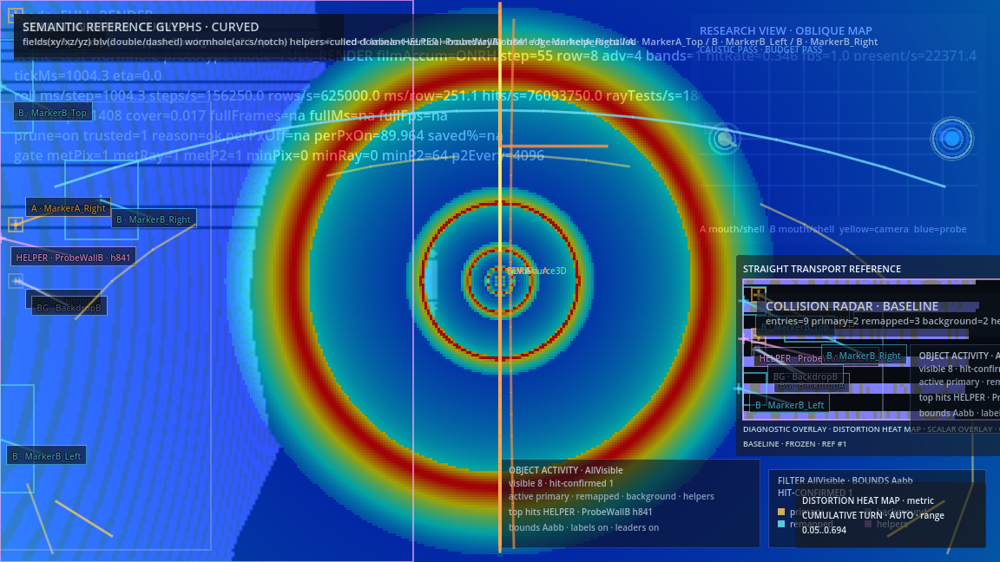

# Wormhole DualRealityTransport Workflow



*Current wormhole DualRealityTransport capture showing the curved main view, straight transport reference panel, and diagnostic overlays.*

`DualRealityTransport` is the wormhole-side capture and comparison workflow for layered perceptual diagnostics. The user-facing label for the straight-path reference layer is `Reference Reality`.

## Purpose

The workflow reuses the existing curved-minimal comparison style where practical:

- deterministic scene launch
- capture matrix with named modes
- Python image comparison against a clean curved baseline
- compact run-root summaries under a dedicated output folder

Unlike `curved_minimal`, the wormhole workflow uses the fixture's existing in-harness capture paths:

- raw film capture for the clean curved baseline
- composed viewport capture for stacked `DualRealityTransport` modes

## Capture Matrix

The standard matrix is:

- `wormhole_clean_curved`
- `wormhole_reference_only`
- `wormhole_reference_plus_semantic`
- `wormhole_reference_plus_curvature`
- `wormhole_reference_plus_collision`
- `wormhole_full_stack_curvature`

These cases are written under:

- `output/wormhole_dual_reality_analysis/<timestamp>/images/`
- `output/wormhole_dual_reality_analysis/<timestamp>/logs/`
- `output/wormhole_dual_reality_analysis/<timestamp>/reports/`

The same run root also contains:

- `summary.txt`
- `summary.json`

## Reused Analysis

The workflow reuses `tools/image_compare.py` for:

- SSIM
- mean absolute difference

Each stacked mode is compared against `wormhole_clean_curved` so that overlay readability can be assessed against the uncluttered curved transport image.

## Distortion Heat Map

The user-facing label is `Distortion Heat Map`. In screenshots and live diagnostics, the legend still states the actual metric being shown so curvature, activity, and placeholder metrics are not conflated.

The preferred scalar distortion metric is the per-pixel cumulative absolute turn angle accumulated during pass-1 transport integration. This is exposed through the same telemetry heatmap path already used by the repo's metric-test infrastructure, rather than through a separate wormhole-only implementation.

Alternative curvature-adjacent modes remain available for diagnostics:

- maximum local turn angle
- mean curvature proxy
- maximum curvature proxy
- pass-1 step density placeholder

## Running It

```bash
./scripts/run_wormhole_dual_reality_analysis.sh
```

This leaves the default fixture behavior unchanged unless the workflow script is invoked directly.
