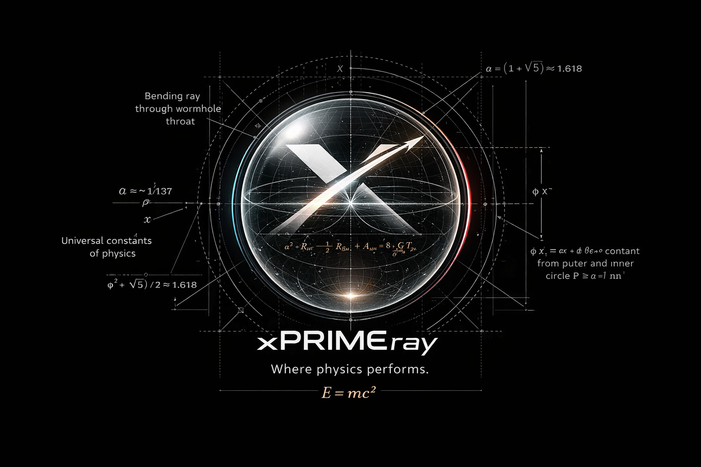

  
  
Where physics performs.

  
E = mc²

---

**xPRIMEray** is a research-grade curved ray transport engine built on Godot 4.x.
It replaces straight-line ray casting with physics-driven propagation through gradient-index (GRIN) fields, enabling simulation of graded refractive media, wormhole geometries, and general metric-driven optical transport.

GRIN Optics
Wormhole Transport
RK4 Integration
Hermetic Validation
Penrose Causal Consistency
MIT License

---

## Research Papers

The xPRIMEray invariant trilogy establishes geometric contracts for wormhole rendering correctness.
Each paper is structured as an arXiv-facing research note with deterministic harness artifacts.

| # | Title | Status |
|---|-------|--------|
| [000](papers/paper_000_unified_summary/paper.md) | Unified Summary of the Wormhole Invariant Trilogy | Draft |
| [001](papers/paper_001_proto_caustic_invariant/paper.md) | Proto-Caustic Invariant in Geometry-Aware Wormhole Transport | Draft |
| [002](papers/paper_002_low_value_sector_budget/paper.md) | Low-Value Sector Budget as a Negative Invariant | Draft |
| [003](papers/paper_003_coupled_invariants_phase_space/paper.md) | Coupled Invariants and Stability Phase Space | Draft |
| [004](papers/paper_004_hermetic_throat_validation/paper.md) | Hermetic Throat Validation | Draft |

→ [Full paper index with abstracts and conventions](papers/index.md)

---

## Validation Figures

Each deterministic harness run produces a figure quartet:

| Figure | Description |
|--------|-------------|
| A | Raw render output |
| B | Render + research overlay |
| C | Portal-sector density map |
| D | Invariant + performance summary table |
| E | Coupled phase-space plot |

<figure>
  
  <figcaption>Figure B — Wormhole DualRealityTransport capture: curved main view, straight transport reference panel, and diagnostic overlays.</figcaption>
</figure>

---

## Documentation Hub

### Start here

- [System Architecture](architecture.md) — compact pipeline summary
- [Architecture Overview](architecture_overview.md) — renderer structure and subsystem boundaries
- [Code Map (Big 12)](code_map_big12.md) — contributor-facing code map
- [Specification Index](SPEC_INDEX.md) — full spec map, current vs legacy
- [Validation Framework](validation.md) — validation modes and verification context
- [Architecture Charter (Current)](_xPRIMEray_arch_charter_v3-ChatClaudeGrokCoherencePass2.md) — working charter

### Physics and transport

- [Metric Null Geodesic Parameter Map](metric_null_geodesic_param_map.md)
- [Next-Generation Metric Transport Roadmap](metric_transport_nextgen_roadmap.md)
- [BlackHole Fast Compare — GRIN vs Metric](blackhole_fast_compare.md)
- [Black Hole Optical Texture Reference](black_hole_optical_texture_reference.md)
- [Overspaces](overspaces.md) — metadata-first world/layer/anchor/link graph

### Current specifications

- [SceneSnapshot Data Layout](spec_scene_snapshot_data_layout_1.md)
- [Field System (GRIN Evaluation)](spec_field_system_grin_1.md)
- [FieldSource3D Canonical Params](spec_fieldsource3d_canonical_params_1.md)
- [Metric Models (GRIN vs Gordon)](spec_metric_models_grin_vs_gordon_1.md)
- [Field Extraction Rules](spec_field_extraction_rules_1.md)
- [Curved Ray Segment Integration](spec_curved_ray_chunks_1.md)
- [BVH Acceleration System](spec_bvh_acceleration_1.md)
- [Scheduler & Task Graph](spec_scheduler_task_graph_1.md)
- [Rendering Backends](spec_rendering_backends_1.md)
- [Telemetry, Debug, and Diagnostics](spec_telemetry_debug_1.md)
- [Ray Transport & Portability Interfaces](spec_ray_transport_interfaces_1.md)
- [Research Mode](spec_research_mode_1.md)
- [Wormhole Multi-Scene System](spec_wormhole_scene_graph_1.md)

### Research & experimental frameworks

- [Dual Reality Framework](Research/DualRealityFramework.md)
- [Overspace Architecture Layer](Research/overspace_architecture_layer.md) — wormhole systems, rabbit-hole nesting, scale-clock-density transforms
- [Wormhole Render Pipeline Validation](Research/wormhole_render_pipeline_validation.md) — ground-truth pipeline, proof methodology, failure-mode history
- [Wormhole DualRealityTransport Workflow](Research/wormhole_dual_reality_transport_workflow.md) — capture-matrix and comparison workflow
- [GRIN Fixture Auto-Calibration Framework](Research/grin_fixture_auto_calibration_phase_plan.md)
- [Fixture 001 — Radial GRIN Baseline](Research/fixture_001_radial_grin_baseline.md)
- [Fixture 002 — Linear Transport Baseline](Research/fixture_002_linear_transport_baseline.md)
- [Fixture 003 — Offset Field Baseline](Research/fixture_003_offset_field_baseline.md)
- [Fixture 004 — Dual Attractor Baseline](Research/fixture_004_dual_attractor_baseline.md)

### Validation

- [Hermetic Fixture Rule](validation/hermetic_fixture_rule.md)
- [Wormhole Observer Ladder](validation/wormhole_observer_ladder.md)
- [Boundary Layer Fixtures](BoundaryLayerFixtures.md)

### Calibration roadmap

- [C1.0 g.1 — Canonical Signature Fields](CalibRoadmap/PatchLogs/C1_0_g_1.md)
- [C1.7 g.X — AutoCal Weak-Signal Stopgap](CalibRoadmap/PatchLogs/C1_7_g_X.md)

### Legacy baseline specifications

Retained for historical context and design evolution comparison.

- [SceneSnapshot Data Layout (Legacy)](spec_scene_snapshot_data_layout.md)
- [Field System GRIN (Legacy)](spec_field_system_grin.md)
- [Metric Models (Legacy)](spec_metric_models_grin_vs_gordon.md)
- [Field Extraction Rules (Legacy)](spec_field_extraction_rules.md)
- [Curved Ray Chunk Integration (Legacy)](spec_curved_ray_chunks.md)
- [BVH Acceleration (Legacy)](spec_bvh_acceleration.md)
- [Scheduler & Task Graph (Legacy)](spec_scheduler_task_graph.md)

---

## License & Citation

Licensed under **MIT** — suitable for both academic and creative use.

If this work informs your research, please cite the relevant paper from the invariant trilogy (see [Papers](papers/index.md) for BibTeX templates).

---

*Built on [Godot 4.x](https://godotengine.org) · Documentation via [MkDocs Material](https://squidfunk.github.io/mkdocs-material/)*
