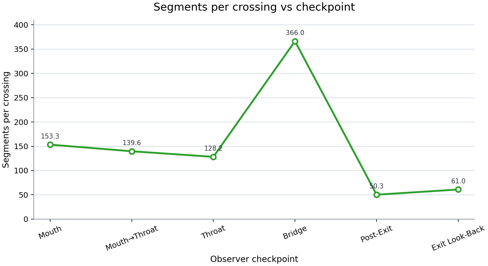
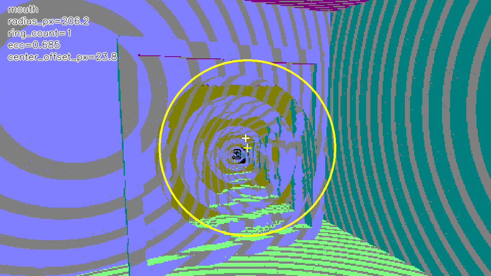
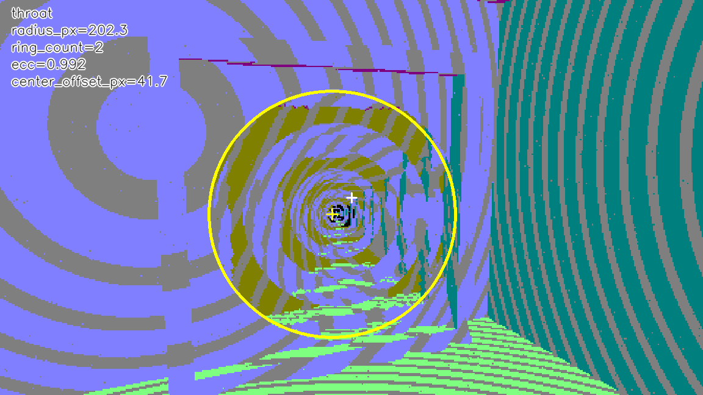
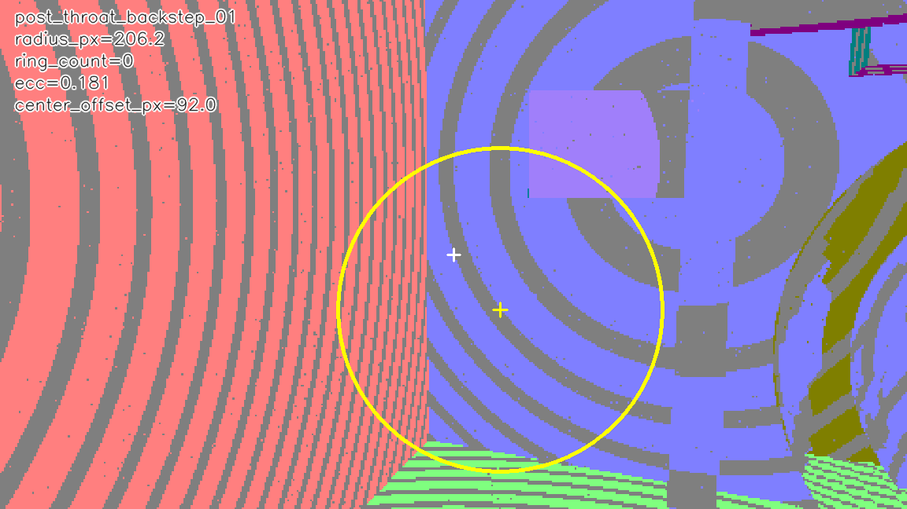
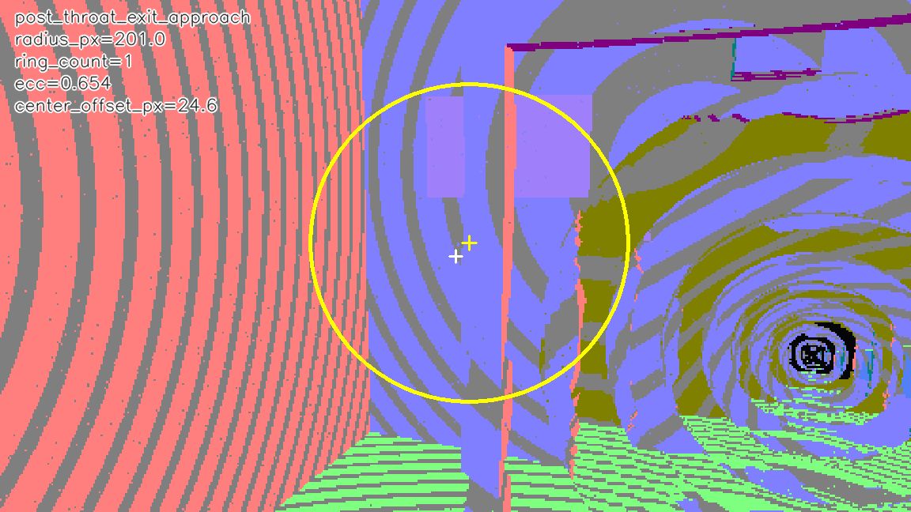
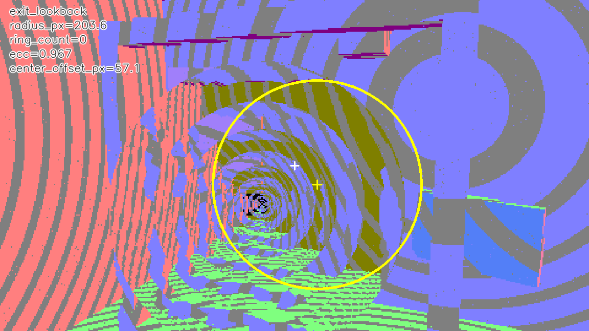
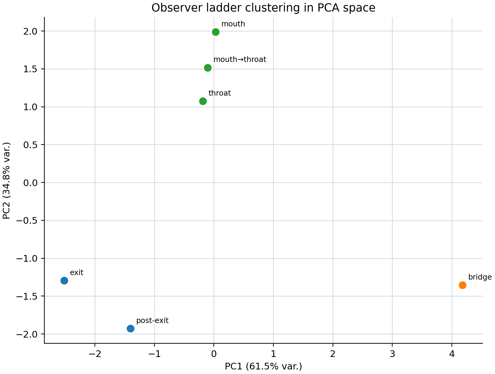

  
  
The Universal Baseline for Curved Field Transport

  
Where physics performs.

---

<figure style="margin:0 0 2rem 0;">
  
  <figcaption style="text-align:center;font-size:0.82rem;opacity:0.65;margin-top:0.5rem;">
    DualRealityTransport baseline — curved main view (left) and straight-ray reference panel (right) rendered simultaneously from two causally distinct scenes joined at the wormhole throat. Every pixel is classified; every metric is archived.
  </figcaption>
</figure>

---

## What xPRIMEray Does

xPRIMEray is a **research-grade curved-ray transport engine** embedded in Godot 4.x.
It integrates the null-geodesic ray equations of the **Gordon effective metric** — the exact physics of light in a spatially varying refractive-index field — and produces the correct image of that effective spacetime within the eikonal limit.

This is not a straight-ray renderer with post-process distortion. It is a field-transport integrator. The difference is measureable, reproducible, and citable.

Gordon Metric · Null Geodesics
Morris–Thorne Wormholes
RK4 Curved Integration
Hermetic Validation
Penrose Causal Consistency
Dual Reality Rendering
MIT License

---

## Foundational Physics

xPRIMEray is built on a century of peer-reviewed optics and relativity.
Every design decision has a citation.

| Foundation | Source | What it enables in xPRIMEray |
|---|---|---|
| Effective metric for light in a dielectric | Gordon (1923); Plebański (1960) | The transport ODE xPRIMEray integrates — exact, not approximate |
| GRIN Hamiltonian ray equations | Luneburg (1964) | RK4 integration structure and curvature-bound step control |
| Geodesic deviation + curvature thresholds | Born & Wolf (1999) | Derivative-aware adaptive stepping |
| Traversable wormhole geometry | Morris & Thorne (1988) | Throat taxonomy, causal observer ladder, $b(r)$ framing |
| Trapped surfaces / geodesic incompleteness | Penrose (1965) | Hermetic rule: `escaped_no_hit = 0` — no computational singularity |
| Causal boundary formalism | Hawking & Ellis (1973) | Observer ladder as causal-structure probe |
| The rendering equation | Kajiya (1986) | Conservation analogue: hermetic pixel closure |
| Rendering as physics instrument | James, Thorne et al. (2015) — *Interstellar* | Cinematic + scientific in the same pipeline |
| M87* photon ring confirmed | Event Horizon Telescope (2019) | Observational proof that annular null-ray concentration is real |
| Wormhole photon spheres | Shaikh et al. (2019); Müller (2014) | Analytic predecessor of xPRIMEray's proto-caustic annulus |

Full bibliography: [papers/shared_bibliography.bib](papers/shared_bibliography.bib) · Full survey: [papers/shared_related_work.md](papers/shared_related_work.md)

---

## Gallery

<figure style="margin:0;">
  
  <figcaption style="font-size:0.78rem;opacity:0.65;margin-top:0.35rem;text-align:center;">
    <strong>DualRealityTransport</strong> — curved main view + straight reference panel + transport HUD. Two causally distinct scenes, one render.
  </figcaption>
</figure>

<figure style="margin:0;">
  
  <figcaption style="font-size:0.78rem;opacity:0.65;margin-top:0.35rem;text-align:center;">
    <strong>Proto-Caustic Ring Density</strong> — destination-side annular concentration. The GRIN-harness analogue of M87*'s photon ring.
  </figcaption>
</figure>

<figure style="margin:0;">
  
  <figcaption style="font-size:0.78rem;opacity:0.65;margin-top:0.35rem;text-align:center;">
    <strong>Raw Render</strong> — film-buffer output from the deterministic hermetic harness. No post-processing. 100% classified pixels.
  </figcaption>
</figure>

<figure style="margin:0;">
  
  <figcaption style="font-size:0.78rem;opacity:0.65;margin-top:0.35rem;text-align:center;">
    <strong>Coupled Invariant Phase Space</strong> — proto-caustic contract and budget constraint define a bounded stability region. Physics as a constraint set.
  </figcaption>
</figure>

---

## Two Audience Streams

xPRIMEray serves two communities from the same engine and the same physics.

---

### 🔬 Research Track

Build reproducible, citable experiments on curved-field transport.
Everything below is deterministic, hermetically validated, and archive-ready.

| What | Where |
|---|---|
| System architecture and pipeline | [architecture/overview.md](architecture/overview.md) |
| Hermetic fixture rule | [validation/hermetic_fixture_rule.md](validation/hermetic_fixture_rule.md) |
| Causal observer ladder | [validation/wormhole_observer_ladder.md](validation/wormhole_observer_ladder.md) |
| Curvature heat maps | [diagnostics/heatmaps.md](diagnostics/heatmaps.md) |
| Domain ownership + regime clustering | [diagnostics/domain_ownership.md](diagnostics/domain_ownership.md) |
| Phase coherence field | [diagnostics/phase_coherence.md](diagnostics/phase_coherence.md) |
| Tile coherence and sampling texture | [diagnostics/tile_coherence.md](diagnostics/tile_coherence.md) |
| Geometric sampling texture synthesis | [research/geometric_sampling_texture.md](research/geometric_sampling_texture.md) |
| Curvature domain ownership research | [research/curvature_domain_ownership.md](research/curvature_domain_ownership.md) |
| Phase coherence field research | [research/phase_coherence_field.md](research/phase_coherence_field.md) |
| Transport model review | [Research/curved_ray_transport_model_review.md](Research/curved_ray_transport_model_review.md) |

**Papers (pre-print, arXiv-facing):**

| # | Title | Status |
|---|---|---|
| [000](papers/paper_000_unified_summary/paper.md) | Unified Summary of the Wormhole Invariant Trilogy | Draft |
| [001](papers/paper_001_causal_observer_ladders/paper.md) | Causal Observer Ladders for Wormhole Ray Transport | Active |
| [002](papers/paper_002_low_value_sector_budget/paper.md) | Low-Value Sector Budget as a Negative Invariant | Draft |
| [003](papers/paper_003_coupled_invariants_phase_space/paper.md) | Coupled Invariants and Stability Phase Space | Draft |
| [004](papers/paper_004_hermetic_throat_validation/paper.md) | Hermetic Throat Validation | Draft |

The honest positioning: xPRIMEray renders null geodesics of the **Gordon effective metric**, not solutions to the Einstein equations. Within the eikonal limit for a static isotropic medium, this is exact. Claims that exceed this are labelled as hypotheses or analogies throughout the documentation.

---

### 🎨 Creative / Entertainment Track

> ⚠️ **Artistic Capabilities Notice**
> The visual output of xPRIMEray is rendered physics — correct images of an effective spacetime — not observationally validated astrophysical data. Use freely for creative and cinematic purposes with that understanding. The wormholes are physically motivated, not physically proven.

---

#### The Rabbit Hole Universe

A wormhole in xPRIMEray is not a tunnel. It is an **owned universe**.

Every rabbit-hole scene is a hermetically sealed `overspace` — its own geometry, its own GRIN field, its own transport budget, its own photon-ring structure. When a ray crosses the throat, it doesn't enter a different room in the same world. It enters a world that is causally isolated from the one it came from.

This has a concrete technical consequence: **no stray geometry bleeds through**. No unclassified pixels escape. The rabbit hole is sealed. The rabbit hole is safe. The rabbit hole is *complete*.

Think **Super Mario Galaxy** — each planetoid its own gravitational world, its own up, its own horizon. xPRIMEray makes that composable for optical transport: chain rabbit holes, nest them, rotate their fields, give each one a different $n(\mathbf{x})$. They cannot corrupt each other. Each is hermetically validated before it goes in.

**Dual Reality** is the view from inside: two sovereign scenes stitched at the throat, both rendered with full curved-ray physics, presented simultaneously. The HUD reads out the field at every pixel. Like an **Iron Man suit** for optical physics — real-time curvature maps, phase-coherence overlays, transport-cost visualisations.

**Cultural touchstones:**
- *Super Mario Galaxy* (2007) — spherical gravity worlds, each complete, each sovereign
- *Interstellar* (2014) — null-geodesic rendering as a scientific instrument; the DNGR code that produced the wormhole visuals is a direct academic predecessor
- *Portal* / *Antichamber* — non-Euclidean geometry as a first-class game mechanic
- *Iron Man* HUD — field diagnostics as visual language
- Pixar illumination pipeline — physically-motivated light transport as a studio standard

**The aspiration:** what Pixar's RenderMan did for physically-based rendering, xPRIMEray is designed to do for curved-field transport — establish a reproducible, well-defined baseline that studios, educators, and researchers can all build from.

---

## The Observer Ladder

Six validated observer positions through a wormhole. Each fresh-instance. Each hermetic. Three transport domains recovered automatically.

<figure>
  
  <figcaption style="font-size:0.8rem;opacity:0.65;margin-top:0.4rem;text-align:center;">
    Segments per crossing across the six-checkpoint ladder. The bridge (post-throat backstep) is the transport anomaly: 366 segments per crossing vs 50–153 everywhere else. Three anomaly detectors agree. z-score: 4.40.
  </figcaption>
</figure>

| Checkpoint | Domain | Segments/crossing | Character |
|---|---|---:|---|
| mouth | near-side | 153 | Dense, smooth |
| mouth-to-throat | near-side | 140 | Continuous approach |
| throat | near-side | 128 | Transition hinge |
| **bridge (backstep)** | **anomaly** | **366** | **Transport singularity** |
| exit-approach | far-side | 50 | Re-densification |
| exit-lookback | far-side | 61 | Maximum portal density |

The throat is not the discontinuity. The bridge is.
[→ Full analysis: papers/paper_001_causal_observer_ladders/paper.md](papers/paper_001_causal_observer_ladders/paper.md)

---

## Morphology Across the Ladder

<figure style="margin:0;">
  
  <figcaption style="font-size:0.72rem;opacity:0.6;text-align:center;margin-top:0.25rem;">Mouth — near-side</figcaption>
</figure>

<figure style="margin:0;">
  
  <figcaption style="font-size:0.72rem;opacity:0.6;text-align:center;margin-top:0.25rem;">Throat — hinge</figcaption>
</figure>

<figure style="margin:0;">
  
  <figcaption style="font-size:0.72rem;opacity:0.6;text-align:center;margin-top:0.25rem;">Bridge — anomaly (214 Hough lines)</figcaption>
</figure>

<figure style="margin:0;">
  
  <figcaption style="font-size:0.72rem;opacity:0.6;text-align:center;margin-top:0.25rem;">Exit-approach — far-side</figcaption>
</figure>

<figure style="margin:0;">
  
  <figcaption style="font-size:0.72rem;opacity:0.6;text-align:center;margin-top:0.25rem;">Exit-lookback — max portal density</figcaption>
</figure>

<figure style="margin:0;">
  
  <figcaption style="font-size:0.72rem;opacity:0.6;text-align:center;margin-top:0.25rem;">PCA regime clustering (k=3, ARI=0.595)</figcaption>
</figure>

---

## Documentation Hub

### Start here

- [**README.md**](README.md) — technical documentation entry and navigation
- [**Glossary**](glossary.md) — null geodesic · GRIN · Gordon metric · domain boundary · phase coherence · curvature centre

### Architecture

- [architecture/overview.md](architecture/overview.md) — pipeline, Pass 1 vs Pass 2, stored-hit system, domain emergence
- [architecture_overview.md](architecture_overview.md) — detailed subsystem contracts and data-flow diagrams
- [code_map_big12.md](code_map_big12.md) — contributor code map

### Diagnostics

- [diagnostics/README.md](diagnostics/README.md) — what each diagnostic measures
- [diagnostics/heatmaps.md](diagnostics/heatmaps.md) — curvature heat maps
- [diagnostics/tile_coherence.md](diagnostics/tile_coherence.md) — adaptive vs polar tile geometry
- [diagnostics/phase_coherence.md](diagnostics/phase_coherence.md) — phase-coherence field
- [diagnostics/domain_ownership.md](diagnostics/domain_ownership.md) — regime decomposition

### Research

- [research/geometric_sampling_texture.md](research/geometric_sampling_texture.md) — sampling texture synthesis
- [research/phase_coherence_field.md](research/phase_coherence_field.md) — phase coherence research + geometric phase memory roadmap
- [research/curvature_domain_ownership.md](research/curvature_domain_ownership.md) — domain decomposition and bridge anomaly

### Specifications

- [SPEC_INDEX.md](SPEC_INDEX.md) — full spec map
- [spec_field_system_grin_1.md](spec_field_system_grin_1.md) — GRIN field evaluation
- [spec_curved_ray_chunks_1.md](spec_curved_ray_chunks_1.md) — curved ray segment integration
- [spec_metric_models_grin_vs_gordon_1.md](spec_metric_models_grin_vs_gordon_1.md) — metric model framing
- [spec_wormhole_scene_graph_1.md](spec_wormhole_scene_graph_1.md) — multi-scene wormhole system

### Validation

- [validation/hermetic_fixture_rule.md](validation/hermetic_fixture_rule.md)
- [validation/wormhole_observer_ladder.md](validation/wormhole_observer_ladder.md)
- [validation.md](validation.md)

### Physics and transport

- [metric_null_geodesic_param_map.md](metric_null_geodesic_param_map.md)
- [metric_transport_nextgen_roadmap.md](metric_transport_nextgen_roadmap.md)
- [Research/curved_ray_transport_model_review.md](Research/curved_ray_transport_model_review.md)
- [Research/wormhole_curvature_heatmap_literature_crosswalk.md](Research/wormhole_curvature_heatmap_literature_crosswalk.md)
- [overspaces.md](overspaces.md)

---

## License & Citation

**MIT** — academic and creative use welcome.

Cite from [papers/shared_bibliography.bib](papers/shared_bibliography.bib).

---

Built on <a href="https://godotengine.org">Godot 4.x</a> ·
Physics: Gordon (1923) → EHT (2019) ·
Rendering: Kajiya (1986) → xPRIMEray (2026) ·
Documentation via <a href="https://squidfunk.github.io/mkdocs-material/">MkDocs Material</a>

