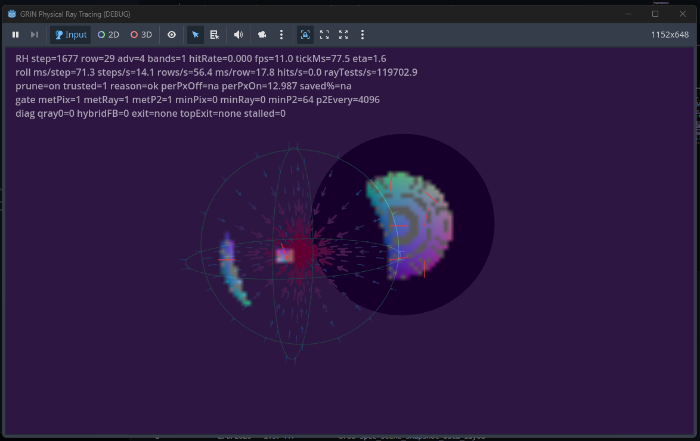

# GD_xPRIMEray: Curved Ray Transport Engine for GRIN Fields

**A research-grade ray propagation framework** for Godot, combining gradient index (GRIN) optics with symbolic + numerical ray integration.  
Positioned as both a **scientific research toolkit** and an **open-source GPU/CPU optical transport engine**.

---

## 🧠 Overview

GD_xPRIMEray is a hybrid symbolic-numeric ray transport system built on Godot Engine.  
It augments Godot’s renderer with **curved ray physics** — enabling simulation of graded refractive media, advanced optical phenomena, and non-Euclidean propagation domains.

Rather than tracing straight rays through space, GD_xPRIMEray integrates rays through fields defined by continuous curvature functions (e.g., GRIN profiles), enabling high-fidelity modeling of complex refractive environments such as:

- Gradient-index lenses
- Curved optics and non-linear media
- Abstract optical metamaterials
- Physics-based camera and illumination systems

This framework is intended to bridge academic optics, experimental physics, and game-engine optics research.

---

## Documentation Map

- [Architecture](architecture.md) - compact pipeline summary
- [Architecture Overview](architecture_overview.md) - renderer structure and subsystem boundaries
- [Metric Models](spec_metric_models_grin_vs_gordon.md) - GRIN vs Gordon vs geodesic tier framing
- [Metric Transport Next-Gen Roadmap](metric_transport_nextgen_roadmap.md) - staged plan from the current metric scaffold toward persistent geodesic transport
- [Black Hole Optical Texture Reference](black_hole_optical_texture_reference.md) - black-hole visual targets for shadow geometry, photon rings, caustics, and transport validation
- [Validation Index](VALIDATION_INDEX.md) - compact map of ladders, sweeps, comparisons, overlays, and gating references
- [Validation](validation.md) - validation modes and verification context
- [Spec Index](SPEC_INDEX.md) - master spec and documentation tree

---

## 🧩 Scientific Context

Traditional ray tracers treat rays as straight paths between interaction points. In GD_xPRIMEray, rays follow **curved trajectories** through graded index fields — akin to real lens physics and gravitational geodesics in optical analog systems.

Curved ray integration in continuous refractive fields requires solving differential path equations — here implemented with both numeric (RK4) and symbolic integration strategies derived from first principles. This transforms the rendering pipeline into a hybrid physical simulator.

---

## 📊 Features

- **GRIN Field Models** — Refractive index profiles with radial/anisotropic control  
- **Curved Ray Integrators** — High-precision RK4 stepping through continuous refractive potentials  
- **Modular Shader & Ray Logic** — Godot integration for real-time and offline rendering  
- **Symbolic + Numeric Solver Combination** — Powerful for verification, visualization, and research  
- **Experimentation & Validation Tools** — Visual debug, path sampling heatmaps, and curve diagnostics  

---

## 🧪 Example Outputs

_This section will grow as rendered outputs and figures are added to `/docs/_figures/`._

| Scenario | Description |
|----------|-------------|
| 🌈 **GRIN Lens Visualization** | Rays bending through a radial refractive index profile |
| 🌀 **Non-Euclidean Ray Paths** | Curved geodesic propagation in synthetic index fields |
| 📈 **Path Diagnostics Graphs** | Visualization of curvature vs. path length |

---

## 🛠 Installation

Clone and import into Godot (4.x).  
Recommended installation paths and branch strategy will be outlined in `docs/setup.md`.

---

## 🚀 Contributing

This project is both a research engine and a collaborative platform.  
Contributions may include:

- New refractive field models
- Higher-order integrators
- Visual diagnostic tools
- Sample scenes and rendered galleries

---

## 📄 License & Citation

Licensed under MIT — recommended for both academic and creative use.

If used in academic work, please cite accordingly.

