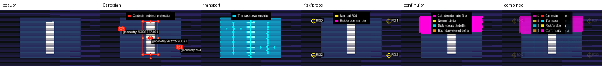
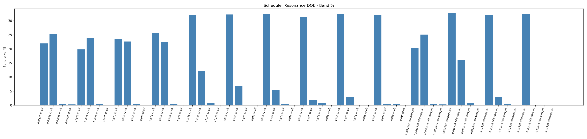
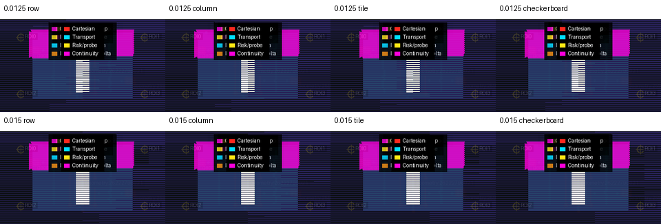

  
   
  <em>Where physics performs.</em>

---

xPRIMEray is an experimental curved-ray transport engine built in Godot 4 C#. It integrates null geodesics of the Gordon effective metric — `ẋ = p/n(x)`, `ṗ = ∇n(x)` — using RK4 with derivative-aware adaptive step control, and validates every render against a hermetic fixture contract: 100% pixel classification, zero unresolved exits. It is a benchmarkable visual physics platform, not a game renderer.

---

## What This Is

- **A null-geodesic integrator** — curved rays are first-class primitives. Transport is solved, not faked with lens shaders or post-process distortion.
- **A GRIN and Gordon-metric renderer** — refractive-index fields define an effective spacetime; the renderer solves the correct eikonal transport through it.
- **A hermetic validation harness** — every render run is classified: source hit, background hit, portal, absorbed, escaped. `escaped_no_hit = 0` is the contract.
- **A multi-scene wormhole system** — two causally isolated overspaces joined at a topological throat, each rendered with full curved-ray physics.
- **A transport diagnostics platform** — six-layer Cathedral Probe overlays, scheduler resonance DOE, domain telemetry, oracle reference comparison, and transport island microscopy.

---

## Core Capabilities

### Transport

| Capability | Status |
|---|---|
| RK4 null-geodesic integration (eikonal ODE) | ✅ Production |
| GRIN field sources (`FieldSource3D`, spatially varying n(x)) | ✅ Production |
| Gordon effective metric framing | ✅ Production |
| Tiered metric hierarchy (Tier 0 GRIN → Tier 3 exotic) | ✅ Production |
| Morris-Thorne wormhole topology (causal observer ladder) | ✅ Production |
| Dual-scene overspace composition | ✅ Production |
| Derivative-aware adaptive step control | ✅ Production |

### In-Game Overlays (live, no render pass required)

| Overlay | Toggle |
|---|---|
| Dual-reality straight-reference inset | `EnableDualRealityResearchMode` |
| Curvature heatmap (5 metric modes) | `DualRealityOverlayMode` |
| Semantic wireframe glyphs (portals, fields, BLVs) | `WireframeReferenceOverlay` |
| Collision radar (projected AABB/sphere bounds) | `DualRealityCollisionRadarOverlayEnabled` |
| Hit normal vectors + film gradient normals | `FilmOverlay2D` |
| Debug ray polylines | `DebugOverlayOwnedByFilm` |
| Top-down / oblique research overlay | `WormholeResearchOverlay` |

### Experimental Feature Flags

- **`EnableDomainTelemetry`** — exports per-pixel renderer diagnostics: `domain_id`, `domain_confidence`, `boundary_confidence`, `selection_flip`, `normal_discontinuity`.
- **`EnableDomainAwareFirstHitResolver`** — experimental domain-aware first-hit heuristic. Off by default. Requires `EnableDomainTelemetry`.
- **`EnableTileMetricsScaffold`** — tile-metrics subsystem: reorder simulation, execution, and persistent-priors scheduling.
- **`EnableObjectSeededTileScheduler`** — tile ordering seeded from projected scene object centroids.

---

## Validation and Diagnostics

The hermetic fixture rule enforces complete pixel classification on every run. Fixture 011 (six-checkpoint wormhole observer ladder) is the canonical validation sequence.

The bridge (post-throat backstep) is the confirmed transport anomaly: 366 segments/crossing vs. 50–153 at all other checkpoints (z-score 4.40). Three independent anomaly detectors agree. Domain-aware analysis separates three transport regimes (near-side, bridge anomaly, far-side) via PCA and k-means clustering (k=3, ARI=0.595).

The Cathedral Probe framework — six passive diagnostic layers composited over a single render — separates scheduler-induced global banding from localized topology failure. The key finding: transport instability is topological and localized, not globally smoothable. Scheduler decorrelation (tile traversal) eliminates horizontal banding; it does not eliminate local geometry seam instability. Those are two independent failure layers.

The ReferenceTransportOracle measures transport stability against a fine-step reference (0.0015625) without feeding results back into the renderer — a guardrail enforced in code, not by convention. Oracle microscopy surfaces transport topology that phase-space diagnostics miss.

---

## Current Research Frontier

### Cathedral Probe — Scheduler Resonance and Dual-Layer Transport Failure

*Six-layer Cathedral Probe diagnostic contact sheet — domain resolver stress scene, step_length=0.015, row traversal. From left: beauty render, geometric wireframe, transport ownership map, risk probe markers, spacetime transport diagram, transport continuity vectors.*

*Scheduler stride sweep (56-cell DOE). Stride 1: ~31% band coverage across all step lengths. Stride 4: < 0.7%. Traversal cadence — not physics precision — is the primary amplifier of row-global banding.*

*Traversal mode comparison at step_length=0.015. Scheduler decorrelation reduces banding across modes. Local corner instability persists unchanged — two independent failure layers confirmed.*

→ [Cathedral Probe architecture paper](Research/cathedral_probe_architecture.md)

### Transport Island Microscopy — Oracle-Guided Precision Closure

Following scheduler decorrelation, a ReferenceTransportOracle ROI sweep identified a compact unresolved transport island (x=36..44, y=31..37). Dense island microscopy (289 samples) confirmed precision closure: all pixels seal at step 0.00625, with zero oracle replay failures. The island was not independently flagged by the Cathedral Probe continuity vectors — demonstrating that oracle microscopy surfaces transport topology that phase-space diagnostics miss.

| Island measurement | Value |
|---|---|
| ROI sweep unresolved pixels | 54 / 320 comparisons (16.9%) |
| Island bbox | x=36..44, y=31..37 |
| Dense pass samples | 289 |
| Sealed at step 0.00625 | true (289/289) |
| Mean decision-risk delta (0.00625 vs 0.003125) | 0.000189 |
| Oracle replay failures | 0 |

→ [Transport Island Microscopy paper](Research/transport_island_microscopy.md)

---

## Architecture

xPRIMEray uses a tiered transport hierarchy: Tier 0 GRIN ray integration → Tier 1 metric parameter extraction → Tier 2 Gordon Metric bridge → Tier 3 exotic metrics. The multi-scene wormhole system joins two causally isolated overspaces at the wormhole throat. The hermetic fixture rule (`escaped_no_hit = 0`) enforces complete pixel classification.

→ [Architecture overview](architecture/overview.md) — pipeline, stored-hit system, domain emergence, Gordon metric math  
→ [Architecture subsystems](architecture_overview.md) — subsystem contracts and data-flow diagrams

---

## Read Next

### Research papers
| Paper | Description |
|---|---|
| [Cathedral Probe architecture](Research/cathedral_probe_architecture.md) | Scheduler resonance DOE, dual-layer failure model, six-layer overlay methodology |
| [Transport Island Microscopy](Research/transport_island_microscopy.md) | Oracle-guided precision closure, island identification, convergence ladders |
| [Paper 001 — Causal Observer Ladders](papers/paper_001_causal_observer_ladders/paper.md) | Six-checkpoint wormhole fixture, transport anomaly z-scores, regime clustering |
| [Paper 004 — Hermetic Throat Validation](papers/paper_004_hermetic_throat_validation/paper.md) | Coverage contract, bridge anomaly evidence, throat-depth maps |

### Diagnostics and analysis
| Document | Description |
|---|---|
| [Phase coherence field](Research/phase_coherence_field.md) | Per-pixel coherence scores correlating banding with domain-boundary transitions |
| [Domain ownership analysis](Research/curvature_domain_ownership.md) | Transport regime decomposition, spectral ruling-out of oscillatory model |
| [Feature maturity matrix](Research/xprimeray_feature_maturity_matrix.md) | What is live in-game vs. harness-only vs. post-process only |
| [Visual milestone inventory](Research/xprimeray_visual_milestone_inventory.md) | Chronological archaeology of all rendered output artifacts |

### Reference
| Document | Description |
|---|---|
| [Glossary](glossary.md) | Null geodesic · GRIN · Gordon metric · domain boundary · phase coherence |
| [Hermetic fixture rule](validation/hermetic_fixture_rule.md) | What 100% pixel classification means and why it matters |
| [Spec index](SPEC_INDEX.md) | All active specifications |

---

## Repository

[github.com/AetherTopologist/GD_xPRIMEray](https://github.com/AetherTopologist/GD_xPRIMEray)

**License:** MIT — academic, commercial, and creative use welcome.  
**Citation templates:** [papers/shared_bibliography.bib](papers/shared_bibliography.bib)
