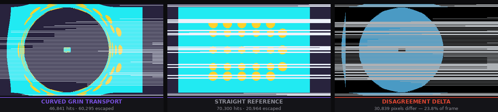
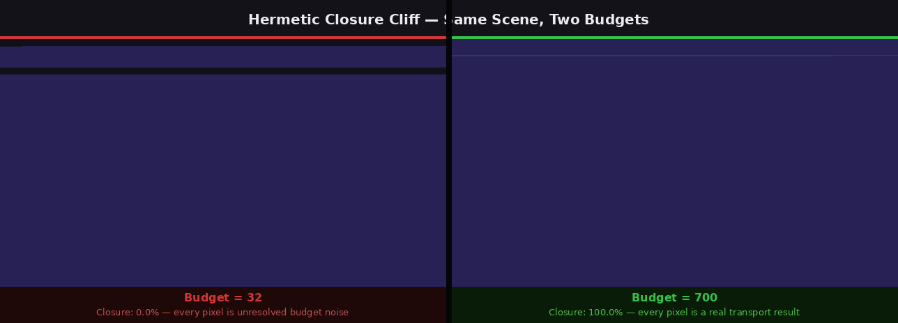
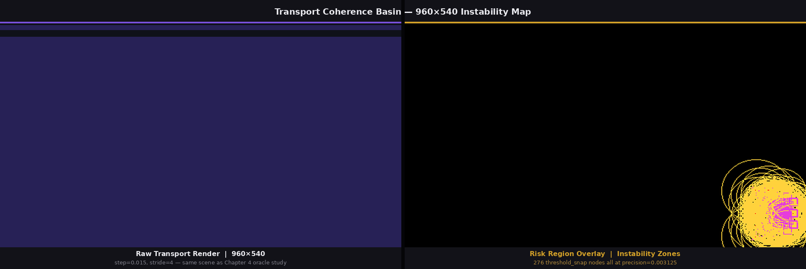
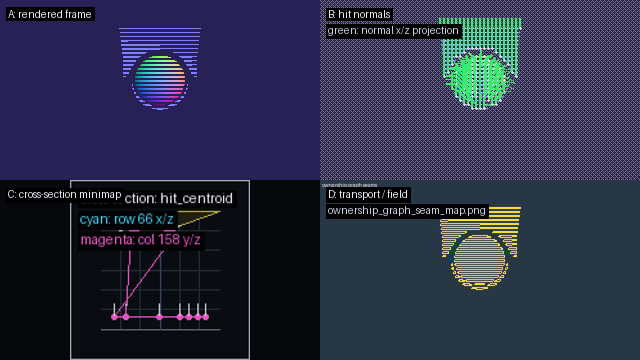
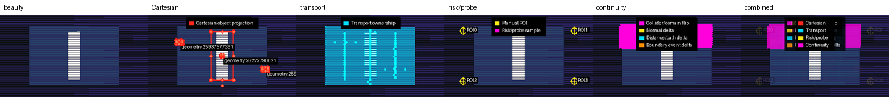
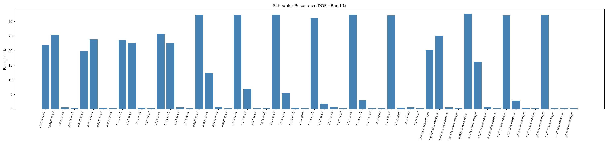
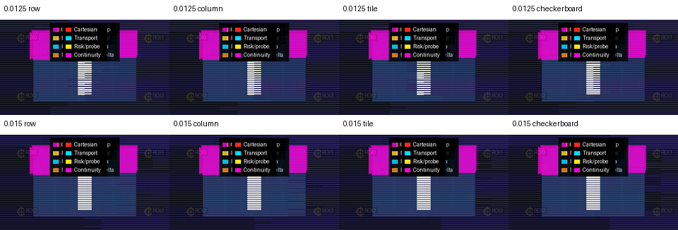

  
  
A Portable Observatory for optical transport.

  Same frame. Same transport. Different questions.

A hit changes where the instrument looks next. The image grows around evidence.

<figure class="xp-obs-visual" markdown>
  { .xp-plate }
  <figcaption>One sealed plate. Contact Events mapping. Q rereads the same acquisition — it does not take another picture. Color is presentation mapping, not measurement authority.</figcaption>
</figure>

  
Engine State

  <dl>
    

      <dt>Formal authority</dt>
      <dd>BVH-v0
        Contact: XPrimeRaySpatialKernel/BVH-v0 · witness LinearScan-v0 · secondary GodotPhysics/DeterministicReplay-v1 · Formal G is a fresh single-worker SNAPSHOT · PixelMemory shadow only · no Meander
      </dd>
    

    

      <dt>Just landed</dt>
      <dd>LIVE OverlapOnly broadphase
        717e7230 · TLAS-backed LIVE geometry pruning · interaction row budget · Compute Envelope permission · confirmed LIVE hits · Formal G isolated
      </dd>
    

    

      <dt>Now</dt>
      <dd>PixelMemory shadow instrumentation landed
        P3-G1 has no landing commit · a hit will change where LIVE looks next, not what neighbors are measured to be
      </dd>
    

    

      <dt>Next</dt>
      <dd>Pixel Meander frontiers
        then Cathedral Probe object-seeding · Third Observer G4/G5 · Deep Field · optical-closure policy under G
      </dd>
    

  </dl>
  
Interaction owns latency. Measurement owns semantics. Compute spends remaining budget on useful unresolved evidence. Envelope is permission, not obligation. Deferred: Pass2 threading · BVH live prefilter.

Outcome → Contact Events → Transport Effort

<figure markdown>
  { .xp-plate }
  <figcaption><strong>Q  Outcome</strong> Terminal semantic class. This plate may be legitimately flat.</figcaption>
</figure>

<figure markdown>
  { .xp-plate }
  <figcaption><strong>Q  Contact Events</strong> Accepted per-step contacts. Not HitGeometry. Not a unique-surface census.</figcaption>
</figure>

<figure markdown>
  { .xp-plate }
  <figcaption><strong>Q  Transport Effort</strong> Numerical step budget used. Not time, energy, or field strength.</figcaption>
</figure>

E chooses the experiment · F reveals the field · G measures · Q interrogates V Walk/Fly · Tab telemetry · Esc Workbench Render the path. Inspect the journey. Q rereads one sealed acquisition. Third Observer identity names a different observer context. Those are different claims. Experiment chooses the world. Measurement chooses the question. Compute chooses how aggressively the machine may answer. Compute Envelope is permission, not obligation. Three clocks: interaction · live film · Formal G. Adaptive acquisition is live film only.

## How a pixel becomes evidence

xPRIMEray does not ask every pixel the same question forever. Confirmed LIVE hits seed where the instrument looks next. Neighbors inherit **priority**, not measured values.

  <svg viewBox="0 0 640 220" xmlns="http://www.w3.org/2000/svg">
    <rect width="640" height="220" fill="#2a1848"/>
    <text x="16" y="22" fill="#c4b0e0" font-size="11" font-family="ui-monospace, monospace" letter-spacing="0.12em">MAGENTA / UNRESOLVED PLATE</text>
    <circle cx="210" cy="120" r="54" fill="#5a2f8a" opacity="0.55"/>
    <circle cx="210" cy="120" r="32" fill="#7a48b0" opacity="0.7"/>
    <circle cx="210" cy="120" r="6" fill="#e8d080"/>
    <text x="210" y="78" text-anchor="middle" fill="#e8d080" font-size="11" font-family="ui-monospace, monospace">Object A seed</text>
    <text x="210" y="188" text-anchor="middle" fill="#d8c4f0" font-size="10" font-family="ui-monospace, monospace">frontier A · priority only</text>
    <circle cx="430" cy="128" r="48" fill="#2f6a78" opacity="0.5"/>
    <circle cx="430" cy="128" r="28" fill="#3e8a96" opacity="0.7"/>
    <circle cx="430" cy="128" r="6" fill="#9ee8d0"/>
    <text x="430" y="86" text-anchor="middle" fill="#9ee8d0" font-size="11" font-family="ui-monospace, monospace">Object B seed</text>
    <text x="430" y="196" text-anchor="middle" fill="#d8c4f0" font-size="10" font-family="ui-monospace, monospace">frontier B · independent</text>
  </svg>
  
A hit changes where the instrument looks next, not what its neighbors are measured to be. Pixel Meander is planned. PixelMemory is landed as shadow instrumentation only.

  <ol class="xp-tree__list">
    <li>Landed Observer + experiment → LIVE context → Pass1 → TLAS → OverlapOnly broadphase → contact</li>
    <li>Landed shadow PixelMemory-v0 + hitEntityId object-seed identity</li>
    <li>Shadow / in development PixelMemory-v1 Meander importance field</li>
    <li>Planned Pixel Meander frontiers · Cathedral Probe object-seeding · Deep Field</li>
    <li>Formal only G SNAPSHOT — fresh, sealed, BVH-v0, no LIVE memory</li>
  </ol>

Magenta / unresolved = not enough LIVE evidence yet. Deferred = budget spent elsewhere. Hit = confirmed LIVE contact. Stronger sealed claims require Formal G.

Canonical tree: [Live Acquisition Decision Tree](architecture/live-acquisition-decision-tree.md)

## Explore / Demos

  <a href="#probe-views">Three Probe Views</a>
  <a href="architecture/live-acquisition-decision-tree/">Live acquisition tree</a>
  <a href="Observatory/chapters/chapter_02/">Observer Disagreement</a>
  <a href="Observatory/chapters/chapter_03/">Hermetic Closure</a>
  <a href="Observatory_Gallery/">Observatory Gallery</a>
  <a href="Observatory/artifacts/">Artifact Gallery</a>
  <a href="portable_observatory/">Portable Observatory</a>
  Mirror ray tracingon deck
  Lens imagingon deck
  Refractionon deck
  GRIN slabon deck
  Field bendingon deck
  Multi-observeron deck

## Findings

23.8%
of pixels classify differently

Same scene. Same camera. Two transport models. Curved rays miss geometry that straight rays hit — not randomly, but directionally: 9 misses for every 1 new contact.

A straight-ray renderer would report 33% more geometry hits for this scene. The difference is not a visual effect. It is the result of solving the transport equation, not a lens-shader effect.

<a class="xp-exhibit-link" href="Observatory/chapters/chapter_02.md">Ch 2 — Observer Disagreement →</a>

0%
closure at budget = 32

Two renders that look identical. Left panel: every pixel is unresolved budget noise. Right panel: every pixel is a real transport result. The images are indistinguishable by eye.

A render can pass visual inspection while being completely wrong. The Validation HUD is the only reliable detector. Plausible ≠ correct.

<a class="xp-exhibit-link" href="Observatory/chapters/chapter_03.md">Ch 3 — Hermetic Closure →</a>

276
instability nodes, all at the same precision floor

Two symmetric horizontal bands that no integration budget can eliminate. The oracle finds them at every precision level. Their uniformity is the finding — it points to topology, not noise.

Some transport failures are structural. The field geometry creates a convergence floor the integrator cannot cross. Scheduler decorrelation reduces banding; it does not remove these zones.

<a class="xp-exhibit-link" href="Observatory/chapters/chapter_04.md">Ch 4 — Coherence Basin →</a>

[Take the 20-Minute Tour](start_here.md){ .md-button .md-button--primary }
[Observatory Atlas](Observatory/observatory_atlas.md){ .md-button }
[Artifact Gallery](Observatory/artifacts.md){ .md-button }

---

## Three ways to enter

| Entry | What you will find |
|---|---|
| [xPRIMEray Runtime](start_here.md) | Curved-ray observatory and diagnostics |
| [Portable Observatory](portable_observatory/index.md) | Public ontology: Scene → Transport Lens → Plate → Evidence |
| [Project Glowing Heart](xPRIMEray/project_glowing_heart_atlas_link.md) | Protocol and artifact trail |
| [Observation Atlas](Observatory/Observation_Atlas/README.md) | Observer field guide, not a ranking |

Observatory Atlas is the chapter tour. Observation Atlas is the observer map.

---

## What xPRIMEray Is

=== "Renderer"
    A null-geodesic integrator where curved rays are first-class primitives. Transport is solved, not faked with lens shaders or post-process distortion. GRIN and Gordon-metric fields define an effective spacetime; the renderer solves the correct eikonal transport through it.

=== "Observatory"
    A visual diagnostics platform. The engine finds hits, seams, high-curvature regions, unstable domains, and boundary-layer events from scene data — then reveals their structure through an expanding library of overlay modes: film overlays, heatmaps, contact sheets, domain maps, curvature contours, and transport ownership graphs.

=== "Research Map"
    A structured diagnostic infrastructure connecting renderer behavior to theoretical frameworks. Six-layer Cathedral Probe overlays, scheduler resonance DOE, domain telemetry, oracle reference comparison, and transport island microscopy separate independent failure layers that naive per-pixel analysis conflates.

---

## Current Renderer State

| Category | Count | Examples |
|----------|-------|---------|
| Ready to ship | 20+ systems | GRIN fields, boundary layers, hit detection, overlays, 46 fixture scenes, observatory scripts |
| In progress | 4 systems | WormholePrototypeRig, TestBench recipes, atomic orbital observatory fixture |
| Research / diagnostic only | 5 systems | ReferenceTransportOracle, SceneTransportMemory, MetricHeuristicIntegrator (4 open TODOs) |
| Active overlays | 21 modes | FilmOverlay2D, step budget heatmap, domain ownership map, curvature contours, observatory contact sheets |
| Proposed overlays | 13 modes | Celestial Boundary Overlay, Bulk-to-Boundary Dual View, Curvature Domain Map, S-Matrix Event Ledger |

→ [Full Feature Index](FEATURE_INDEX.md) · [Release Readiness Audit](Release/FEATURE_READINESS_AUDIT.md) · [Overlay Master List](Observatory/OVERLAY_MASTER_LIST.md)

---

## Observatory & Audit Navigator

| Document | Purpose |
|----------|---------|
| [Overview / Transport Observatory](Overview/TRANSPORT_OBSERVATORY_OVERVIEW.md) | How all systems fit together; gallery; recommended next actions |
| [Feature Index](FEATURE_INDEX.md) | Master feature map with quick-reference tables |
| [Release Readiness Audit](Release/FEATURE_READINESS_AUDIT.md) | Ship-readiness classification; cleanup list; packaging exclusions |
| [Optical Transport Feature Map](Research/OPTICAL_TRANSPORT_FEATURE_MAP.md) | Transport system completeness; engine feature candidates; gap analysis |
| [Overlay Master List](Observatory/OVERLAY_MASTER_LIST.md) | All 34 overlay modes — existing, partial, and proposed |
| [Inspiration Cards](MisterYLabs/INSPIRATION_CARD_FEATURE_LINKS.md) | Thinkers and concepts linked to engine features (Pasterski, Noether, MTW, Maxwell, Feynman) |

---

## Project Glowing Heart

Project Glowing Heart is the active Core extraction and bridge track for xPRIMEray. The current public-safe state is metadata-first: Core emits standalone preview artifacts, the Godot side has static fixture exports, and the bridge has shared fixture, schema, observer, and reconciliation packets. It does **not** claim parity, runtime equivalence, closure equivalence, or pixel comparison readiness.

| Latest bridge artifact | Status |
|---|---|
| Shared fixture schema and instance | Preview draft / candidate |
| Shared observer contract | Preview contract |
| Core and Godot observer instances | Metadata generated |
| Observer reconciliation | Pixel comparison not ready |
| Public demo posture | Safe with limits; no parity or validation claims |

→ [Project Glowing Heart v1.8.1 Observer Reconciliation](xPRIMEray/project_glowing_heart_v1_8_1_observer_reconciliation.md) · [Shared Observer Contract](xPRIMEray/project_glowing_heart_v1_7_shared_observer_contract.md) · [Public Demo Readiness](xPRIMEray/project_glowing_heart_v1_5_public_demo_readiness.md)

---

## What This Is

- **A null-geodesic integrator** — curved rays are first-class primitives. Transport is solved, not faked with lens shaders or post-process distortion.
- **A GRIN and Gordon-metric renderer** — refractive-index fields define an effective spacetime; the renderer solves the correct eikonal transport through it.
- **A hermetic validation harness** — every render run is classified: source hit, background hit, portal, absorbed, escaped. `escaped_no_hit = 0` is the contract.
- **A multi-scene wormhole system** — two causally isolated overspaces joined at a topological throat, each rendered with full curved-ray physics.
- **A transport diagnostics platform** — six-layer Cathedral Probe overlays, scheduler resonance DOE, domain telemetry, oracle reference comparison, and transport island microscopy.

---

## Current Milestone: Curved-Field Validation Ladder

*Four-panel diagnostic layout: rendered frame with curved transport active · hit-normal vector overlay · camera cross-section minimap showing field geometry in the vertical camera plane · transport/field overlay with ownership seams and oracle comparison context. Oracle replay failures: 0. All 64 sampled pixels sealed at step 0.02.*

The curved-field validation ladder is the first end-to-end validation packet for curved ray transport in xPRIMEray. It runs the complete diagnostic stack — ReferenceTransportOracle step-size convergence, six-layer Cathedral Probe overlay, camera cross-section minimap, and curved-vs-control storyboard — against a GRIN field scene with curved transport active. The result confirms that the oracle, diagnostic infrastructure, and transport ownership machinery operate correctly under non-trivial geodesic curvature.

| Measurement | Value |
|---|---|
| Oracle step | 0.0015625 (8× finer than production floor) |
| Sampled pixels | 64 |
| Oracle replay failures | 0 |
| Sealed at step 0.02 | 64 / 64 |
| Mean decision-risk delta (0.00625 vs 0.003125) | 0.000090 |
| Comparability status | `warning` — control scene differs by camera pose key |

All 64 sampled pixels achieve `Stable` classification at the coarsest tested step, with near-zero risk delta between the two finest steps. No transport topology anomalies were identified in this scene. The comparability warning records that the baseline used the `domain_resolver_stress` scene while the curved run used `curved_minimal_backdrop`; a matched-pose control was not available at run time — the storyboard is evidence that the ladder infrastructure wires correctly under this constraint, not a head-to-head geometry comparison.

---

## Core Capabilities

### Transport

| Capability | Status |
|---|---|
| RK4 null-geodesic integration (eikonal ODE) | ✅ Production |
| GRIN field sources (`FieldSource3D`, spatially varying n(x)) | ✅ Production |
| Gordon effective metric framing | ✅ Production |
| Tiered metric hierarchy (Tier 0 GRIN → Tier 3 exotic) | ✅ Production |
| Morris-Thorne wormhole topology (causal observer ladder) | ✅ Production |
| Dual-scene overspace composition | ✅ Production |
| Derivative-aware adaptive step control | ✅ Production |

### In-Game Overlays (live, no render pass required)

| Overlay | Toggle |
|---|---|
| Dual-reality straight-reference inset | `EnableDualRealityResearchMode` |
| Curvature heatmap (5 metric modes) | `DualRealityOverlayMode` |
| Semantic wireframe glyphs (portals, fields, BLVs) | `WireframeReferenceOverlay` |
| Collision radar (projected AABB/sphere bounds) | `DualRealityCollisionRadarOverlayEnabled` |
| Hit normal vectors + film gradient normals | `FilmOverlay2D` |
| Debug ray polylines | `DebugOverlayOwnedByFilm` |
| Top-down / oblique research overlay | `WormholeResearchOverlay` |

### Experimental Feature Flags

- **`EnableDomainTelemetry`** — exports per-pixel renderer diagnostics: `domain_id`, `domain_confidence`, `boundary_confidence`, `selection_flip`, `normal_discontinuity`.
- **`EnableDomainAwareFirstHitResolver`** — experimental domain-aware first-hit heuristic. Off by default. Requires `EnableDomainTelemetry`.
- **`EnableTileMetricsScaffold`** — tile-metrics subsystem: reorder simulation, execution, and persistent-priors scheduling.
- **`EnableObjectSeededTileScheduler`** — tile ordering seeded from projected scene object centroids.

---

## Validation and Diagnostics

The hermetic fixture rule enforces complete pixel classification on every run. Fixture 011 (six-checkpoint wormhole observer ladder) is the canonical validation sequence.

The bridge (post-throat backstep) is the confirmed transport anomaly: 366 segments/crossing vs. 50–153 at all other checkpoints (z-score 4.40). Three independent anomaly detectors agree. Domain-aware analysis separates three transport regimes (near-side, bridge anomaly, far-side) via PCA and k-means clustering (k=3, ARI=0.595).

The Cathedral Probe framework — six passive diagnostic layers composited over a single render — separates scheduler-induced global banding from localized topology failure. The key finding: transport instability is topological and localized, not globally smoothable. Scheduler decorrelation (tile traversal) eliminates horizontal banding; it does not eliminate local geometry seam instability. Those are two independent failure layers.

The ReferenceTransportOracle measures transport stability against a fine-step reference (0.0015625) without feeding results back into the renderer — a guardrail enforced in code, not by convention. Oracle microscopy surfaces transport topology that phase-space diagnostics miss.

---

## Current Research Frontier

### Cathedral Probe — Scheduler Resonance and Dual-Layer Transport Failure

*Six-layer Cathedral Probe diagnostic contact sheet — domain resolver stress scene, step_length=0.015, row traversal. From left: beauty render, geometric wireframe, transport ownership map, risk probe markers, spacetime transport diagram, transport continuity vectors.*

*Scheduler stride sweep (56-cell DOE). Stride 1: ~31% band coverage across all step lengths. Stride 4: < 0.7%. Traversal cadence — not physics precision — is the primary amplifier of row-global banding.*

*Traversal mode comparison at step_length=0.015. Scheduler decorrelation reduces banding across modes. Local corner instability persists unchanged — two independent failure layers confirmed.*

→ [Cathedral Probe architecture paper](Research/cathedral_probe_architecture.md)

### Transport Island Microscopy — Oracle-Guided Precision Closure

Following scheduler decorrelation, a ReferenceTransportOracle ROI sweep identified a compact unresolved transport island (x=36..44, y=31..37). Dense island microscopy (289 samples) confirmed precision closure: all pixels seal at step 0.00625, with zero oracle replay failures. The island was not independently flagged by the Cathedral Probe continuity vectors — demonstrating that oracle microscopy surfaces transport topology that phase-space diagnostics miss.

| Island measurement | Value |
|---|---|
| ROI sweep unresolved pixels | 54 / 320 comparisons (16.9%) |
| Island bbox | x=36..44, y=31..37 |
| Dense pass samples | 289 |
| Sealed at step 0.00625 | true (289/289) |
| Mean decision-risk delta (0.00625 vs 0.003125) | 0.000189 |
| Oracle replay failures | 0 |

→ [Transport Island Microscopy paper](Research/transport_island_microscopy.md)

---

## Architecture

xPRIMEray uses a tiered transport hierarchy: Tier 0 GRIN ray integration → Tier 1 metric parameter extraction → Tier 2 Gordon Metric bridge → Tier 3 exotic metrics. The multi-scene wormhole system joins two causally isolated overspaces at the wormhole throat. The hermetic fixture rule (`escaped_no_hit = 0`) enforces complete pixel classification.

→ [Architecture overview](architecture/overview.md) — pipeline, stored-hit system, domain emergence, Gordon metric math
→ [Architecture subsystems](architecture_overview.md) — subsystem contracts and data-flow diagrams

---

## Read Next

### Research papers
| Paper | Description |
|---|---|
| [Cathedral Probe architecture](Research/cathedral_probe_architecture.md) | Scheduler resonance DOE, dual-layer failure model, six-layer overlay methodology |
| [Transport Island Microscopy](Research/transport_island_microscopy.md) | Oracle-guided precision closure, island identification, convergence ladders |
| [Paper 001 — Causal Observer Ladders](papers/paper_001_causal_observer_ladders/paper.md) | Six-checkpoint wormhole fixture, transport anomaly z-scores, regime clustering |
| [Paper 004 — Hermetic Throat Validation](papers/paper_004_hermetic_throat_validation/paper.md) | Coverage contract, bridge anomaly evidence, throat-depth maps |

### Diagnostics and analysis
| Document | Description |
|---|---|
| [Phase coherence field](Research/phase_coherence_field.md) | Per-pixel coherence scores correlating banding with domain-boundary transitions |
| [Domain ownership analysis](Research/curvature_domain_ownership.md) | Transport regime decomposition, spectral ruling-out of oscillatory model |
| [Feature maturity matrix](Research/xprimeray_feature_maturity_matrix.md) | What is live in-game vs. harness-only vs. post-process only |
| [Visual milestone inventory](Research/xprimeray_visual_milestone_inventory.md) | Chronological archaeology of all rendered output artifacts |

### Reference
| Document | Description |
|---|---|
| [Glossary](glossary.md) | Null geodesic · GRIN · Gordon metric · domain boundary · phase coherence |
| [Hermetic fixture rule](validation/hermetic_fixture_rule.md) | What 100% pixel classification means and why it matters |
| [Spec index](SPEC_INDEX.md) | All active specifications |

---

## Repository

[github.com/AetherTopologist/GD_xPRIMEray](https://github.com/AetherTopologist/GD_xPRIMEray)

**License:** MIT — academic, commercial, and creative use welcome.
**Citation templates:** [papers/shared_bibliography.bib](papers/shared_bibliography.bib)
