# Paper 001a: Artifact Atlas for Causal Observer Ladders

This note is a clean artifact companion to [Paper 001](../paper_001_causal_observer_ladders/paper.md). It collects the generated figures, analysis summaries, and supporting diagnostics from the approved wormhole observer ladder baseline without introducing any new rendering runs.

## Scope

- source ladder: [checkpoint_sequence_summary.json](../../../output/fixture_runs/fixture_011_wormhole_checkpoint_sequence/2026-04-20T22-26-39/checkpoint_sequence_summary.json)
- core manuscript: [paper_001_causal_observer_ladders.tex](../paper_001_causal_observer_ladders/paper_001_causal_observer_ladders.tex)
- characterization note: [wormhole_observer_ladder_characterization.md](../../validation/wormhole_observer_ladder_characterization.md)

## Core Ladder Figures

### Portal-Hit Density

[portal_hit_density_vs_checkpoint.png](../paper_001_causal_observer_ladders/figures/portal_hit_density_vs_checkpoint.png)

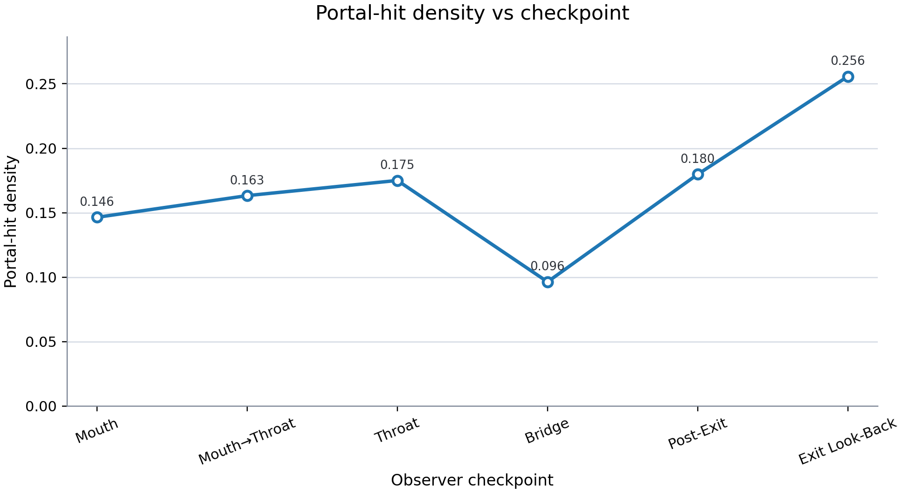

### Throat-Event Density

[throat_event_density_vs_checkpoint.png](../paper_001_causal_observer_ladders/figures/throat_event_density_vs_checkpoint.png)

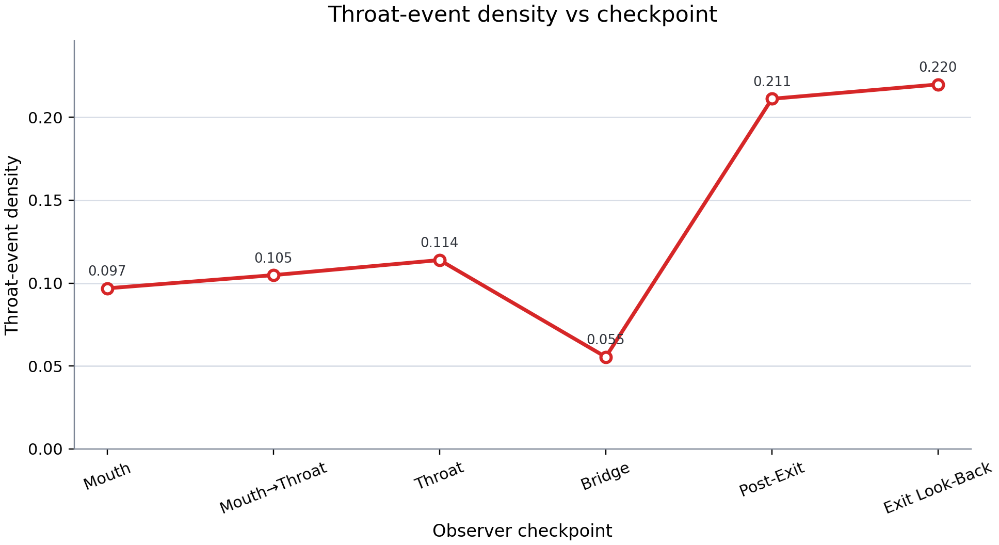

### Crossings Per Pixel

[crossings_per_pixel_vs_checkpoint.png](../paper_001_causal_observer_ladders/figures/crossings_per_pixel_vs_checkpoint.png)

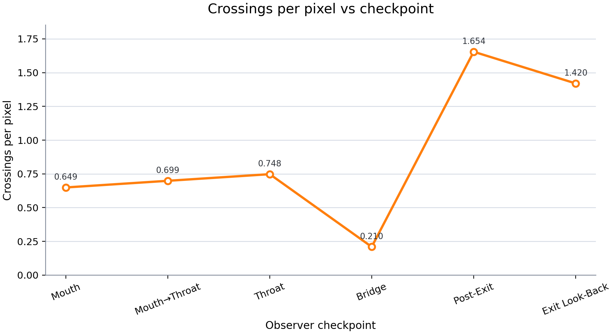

### Segments Per Crossing

[segments_per_crossing_vs_checkpoint.png](../paper_001_causal_observer_ladders/figures/segments_per_crossing_vs_checkpoint.png)

### Optical Path Length Mean

[opl_mean_vs_checkpoint.png](../paper_001_causal_observer_ladders/figures/opl_mean_vs_checkpoint.png)

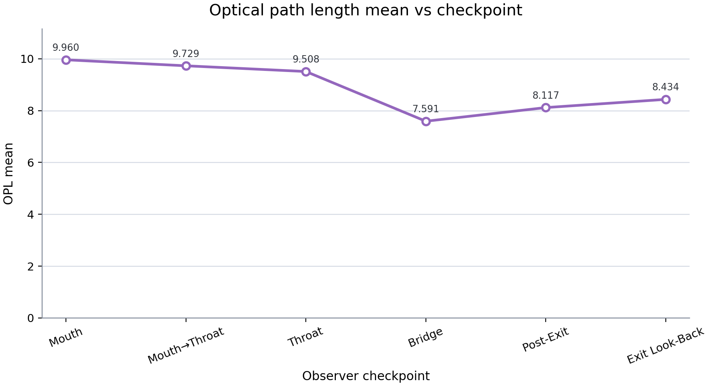

### Captions

[captions.md](../paper_001_causal_observer_ladders/figures/captions.md)

## Clustering Figures

### PCA Scatter

[cluster_pca_scatter.png](../paper_001_causal_observer_ladders/figures/cluster_pca_scatter.png)

### Dendrogram

[cluster_dendrogram.png](../paper_001_causal_observer_ladders/figures/cluster_dendrogram.png)

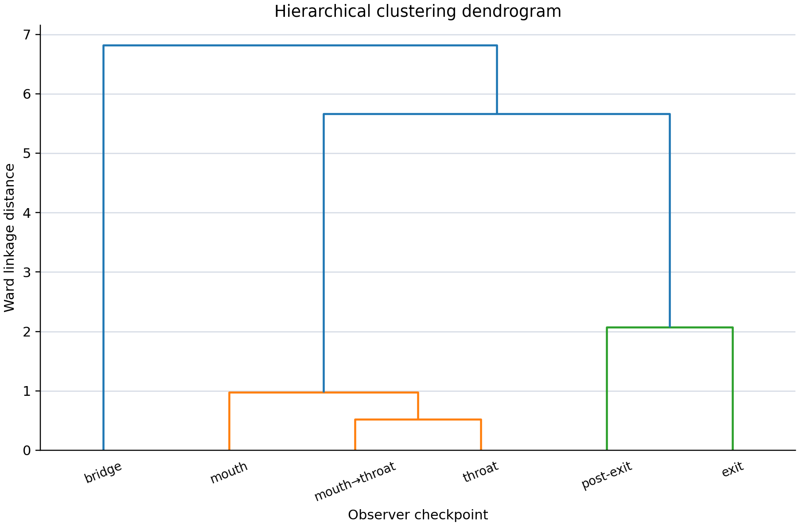

### Artifact-Only Regime Clustering

[regime_clustering.png](../paper_001_causal_observer_ladders/analysis/figures/regime_clustering.png)

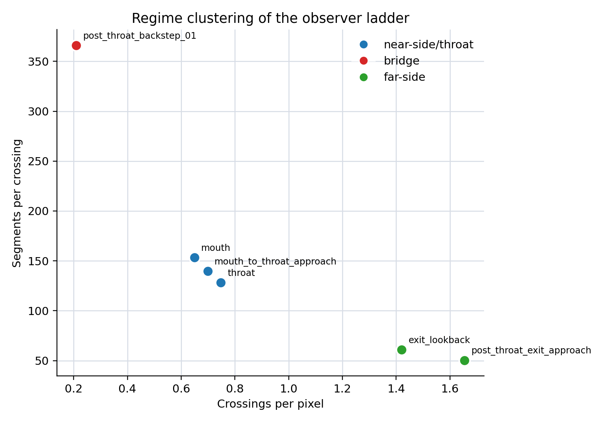

### Clustering Summaries

- [clustering_summary.md](../paper_001_causal_observer_ladders/clustering_summary.md)
- [regime_clustering.md](../paper_001_causal_observer_ladders/analysis/regime_clustering.md)
- [regime_clustering.json](../paper_001_causal_observer_ladders/analysis/regime_clustering.json)

## Anomaly Figures

### Bridge Anomaly Scores

[bridge_anomaly_scores.png](../paper_001_causal_observer_ladders/analysis/figures/bridge_anomaly_scores.png)

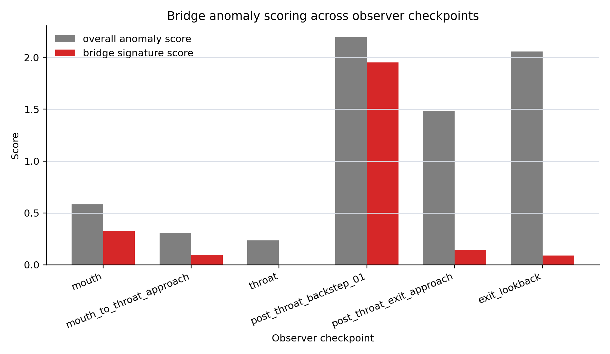

### Multi-Method Checkpoint Anomaly Scores

[checkpoint_anomaly_scores.png](../paper_001_causal_observer_ladders/analysis/anomaly_detection/figures/checkpoint_anomaly_scores.png)

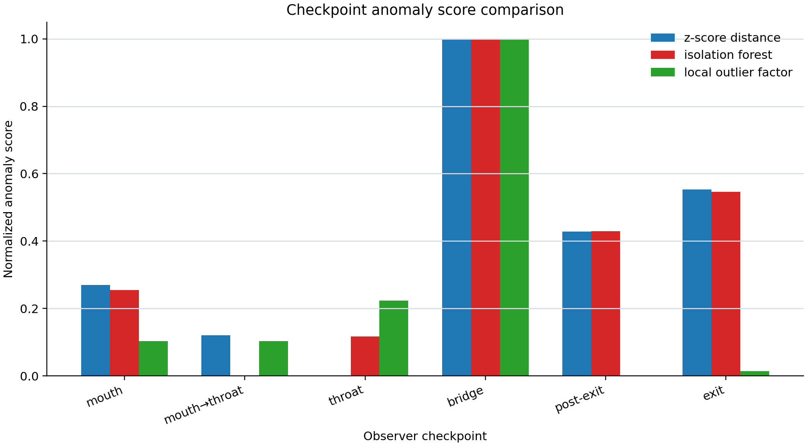

### Anomaly Summaries

- [bridge_anomaly_scoring.md](../paper_001_causal_observer_ladders/analysis/bridge_anomaly_scoring.md)
- [bridge_anomaly_scores.json](../paper_001_causal_observer_ladders/analysis/bridge_anomaly_scores.json)
- [anomaly_detection/summary.md](../paper_001_causal_observer_ladders/analysis/anomaly_detection/summary.md)
- [anomaly_detection/scores.json](../paper_001_causal_observer_ladders/analysis/anomaly_detection/scores.json)

## Periodicity Figures

### Sequence FFT

[sequence_fft.png](../paper_001_causal_observer_ladders/analysis/periodicity/figures/sequence_fft.png)

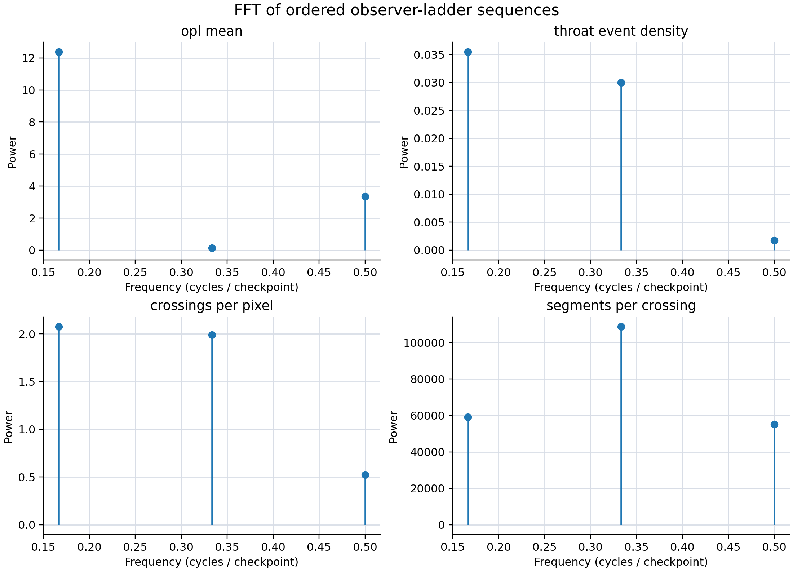

### Radial Profile Wavelets

[radial_profile_wavelets.png](../paper_001_causal_observer_ladders/analysis/periodicity/figures/radial_profile_wavelets.png)

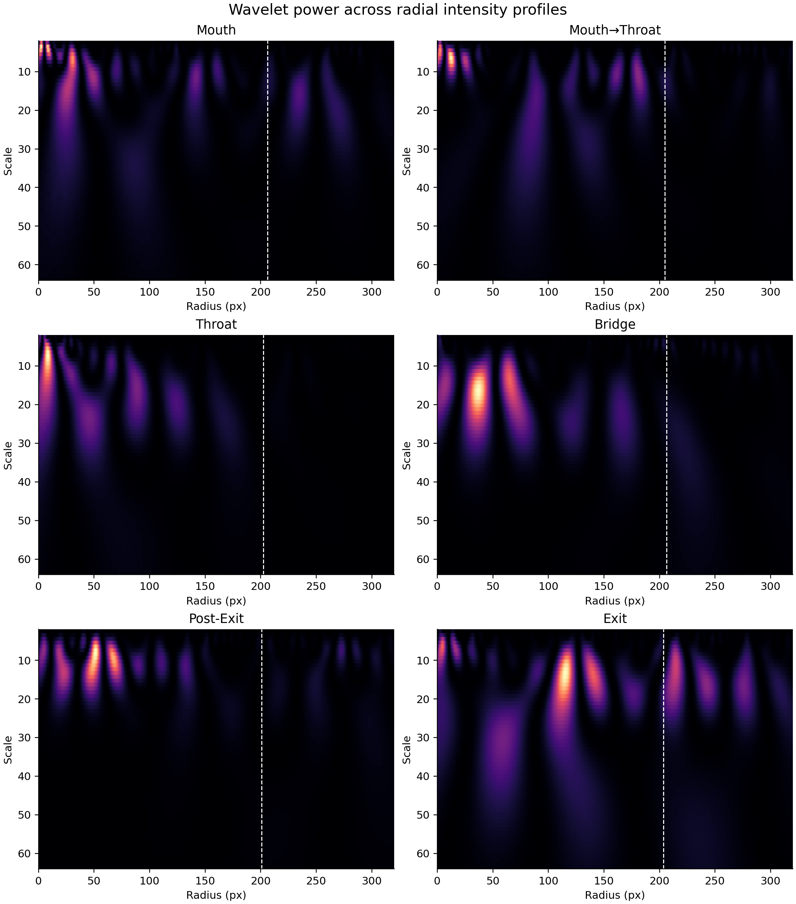

### Periodicity Summaries

- [periodicity/summary.md](../paper_001_causal_observer_ladders/analysis/periodicity/summary.md)
- [periodicity/periodicity_summary.json](../paper_001_causal_observer_ladders/analysis/periodicity/periodicity_summary.json)

## Morphology Figures

### Annotated Debug Morphology

[mouth_annotated.png](../paper_001_causal_observer_ladders/analysis/morphology/annotated/mouth_annotated.png)

[mouth_to_throat_approach_annotated.png](../paper_001_causal_observer_ladders/analysis/morphology/annotated/mouth_to_throat_approach_annotated.png)

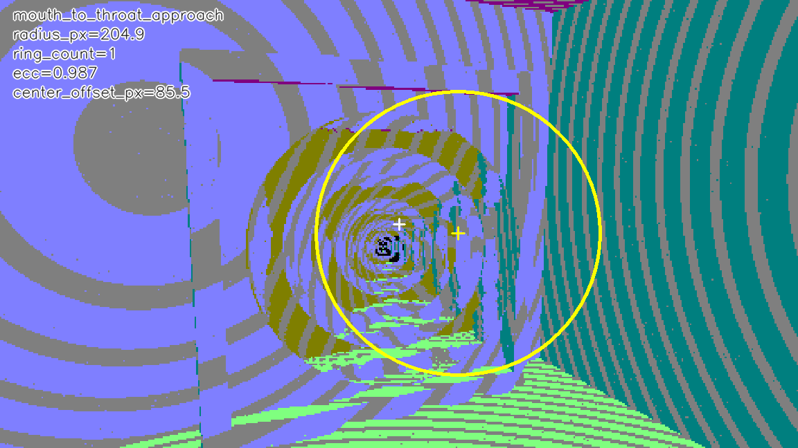

[throat_annotated.png](../paper_001_causal_observer_ladders/analysis/morphology/annotated/throat_annotated.png)

[post_throat_backstep_01_annotated.png](../paper_001_causal_observer_ladders/analysis/morphology/annotated/post_throat_backstep_01_annotated.png)

[post_throat_exit_approach_annotated.png](../paper_001_causal_observer_ladders/analysis/morphology/annotated/post_throat_exit_approach_annotated.png)

[exit_lookback_annotated.png](../paper_001_causal_observer_ladders/analysis/morphology/annotated/exit_lookback_annotated.png)

### Radial Intensity Profiles

[mouth_radial_profile.png](../paper_001_causal_observer_ladders/analysis/morphology/profiles/mouth_radial_profile.png)

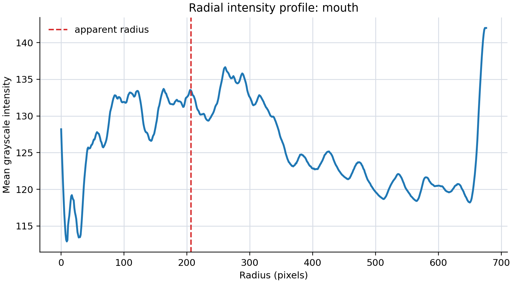

[mouth_to_throat_approach_radial_profile.png](../paper_001_causal_observer_ladders/analysis/morphology/profiles/mouth_to_throat_approach_radial_profile.png)

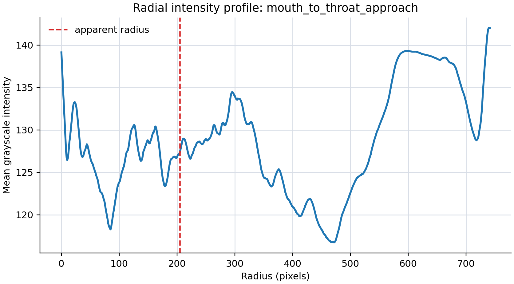

[throat_radial_profile.png](../paper_001_causal_observer_ladders/analysis/morphology/profiles/throat_radial_profile.png)

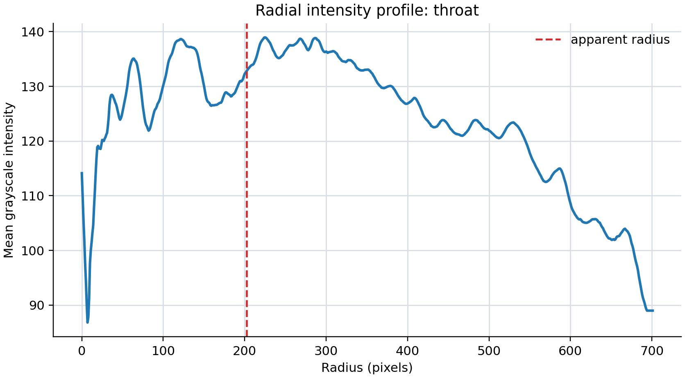

[post_throat_backstep_01_radial_profile.png](../paper_001_causal_observer_ladders/analysis/morphology/profiles/post_throat_backstep_01_radial_profile.png)

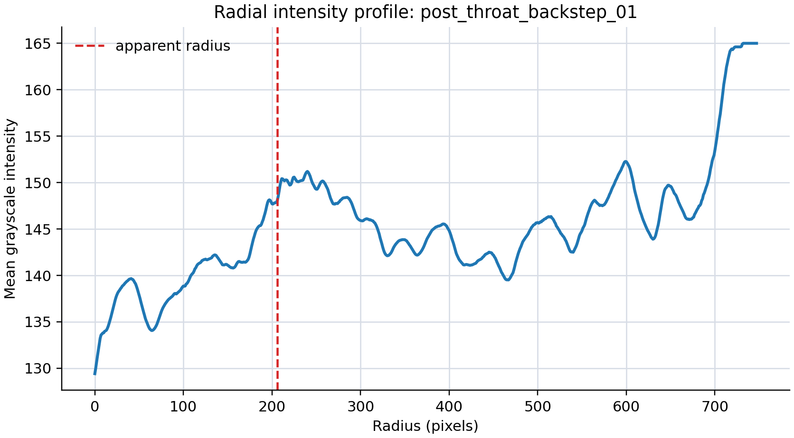

[post_throat_exit_approach_radial_profile.png](../paper_001_causal_observer_ladders/analysis/morphology/profiles/post_throat_exit_approach_radial_profile.png)

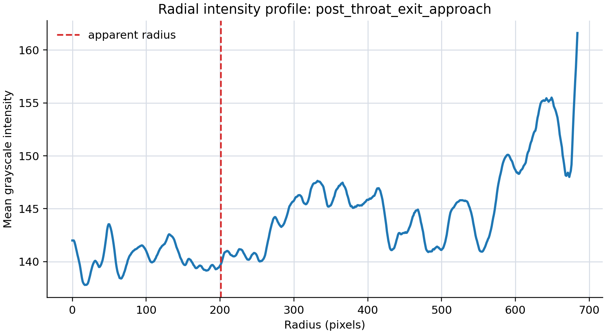

[exit_lookback_radial_profile.png](../paper_001_causal_observer_ladders/analysis/morphology/profiles/exit_lookback_radial_profile.png)

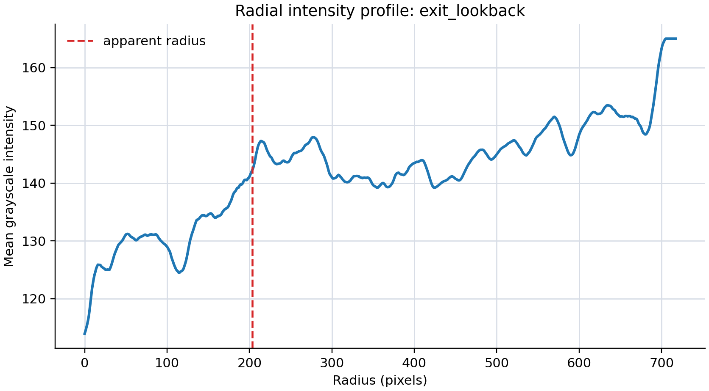

### Morphology Summaries

- [morphology/summary.md](../paper_001_causal_observer_ladders/analysis/morphology/summary.md)
- [morphology/morphology_summary.json](../paper_001_causal_observer_ladders/analysis/morphology/morphology_summary.json)

## Script Inventory

- [generate_figures.py](../paper_001_causal_observer_ladders/generate_figures.py)
- [cluster_observer_ladder.py](../paper_001_causal_observer_ladders/cluster_observer_ladder.py)
- [analysis/analyze_observer_ladder.py](../paper_001_causal_observer_ladders/analysis/analyze_observer_ladder.py)
- [analysis/analyze_checkpoint_anomalies.py](../paper_001_causal_observer_ladders/analysis/analyze_checkpoint_anomalies.py)
- [analysis/analyze_observer_periodicity.py](../paper_001_causal_observer_ladders/analysis/analyze_observer_periodicity.py)
- [analysis/analyze_wormhole_morphology.py](../paper_001_causal_observer_ladders/analysis/analyze_wormhole_morphology.py)

## Barebones LaTeX Companion

- [tex/main.tex](tex/main.tex)

