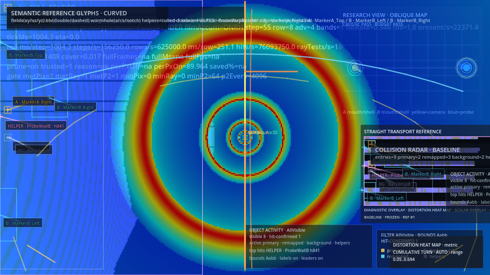
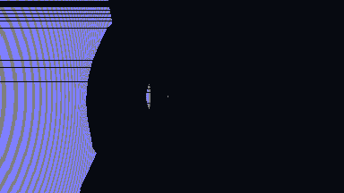
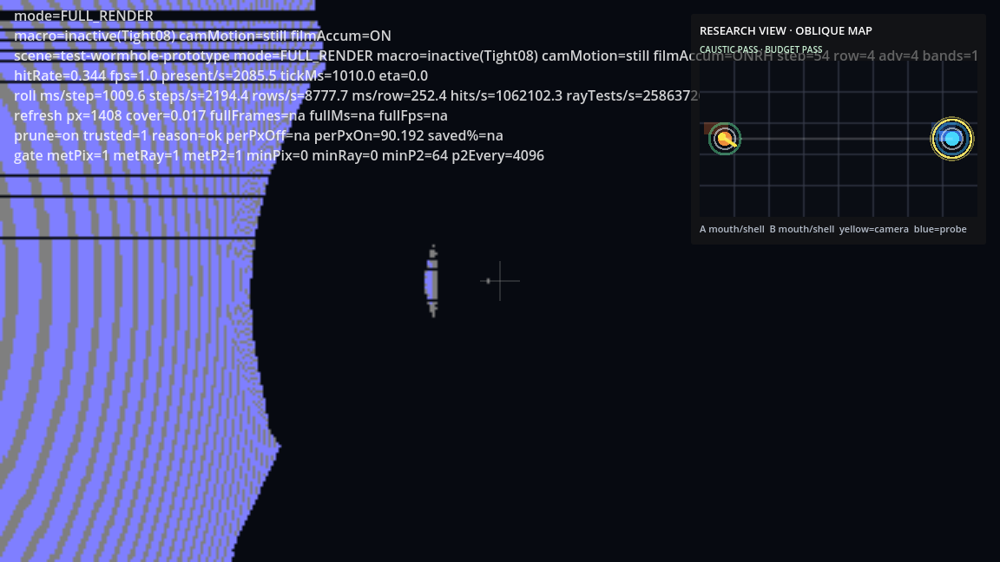
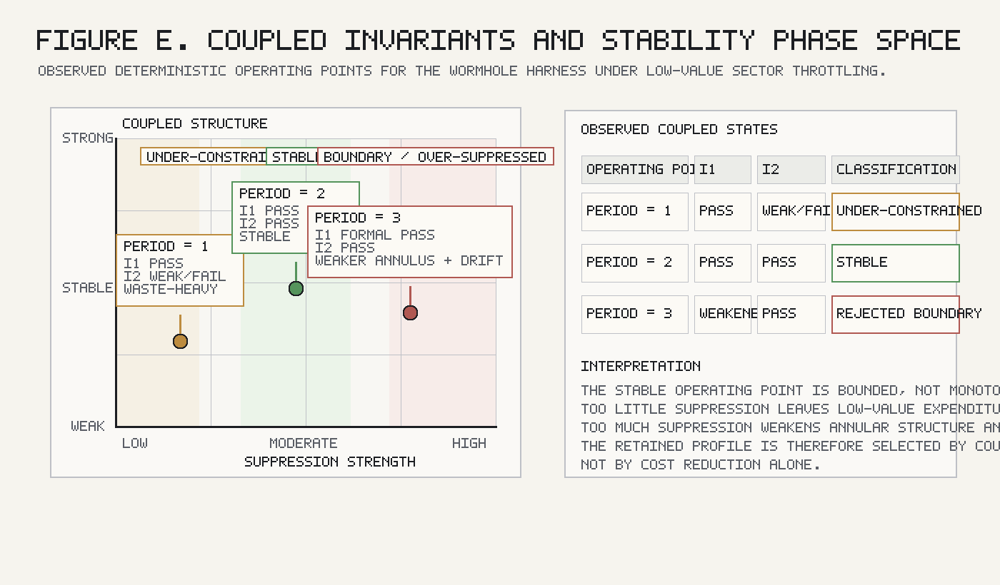

# Paper 003: Coupled Invariants and Stability Phase Space in Geometry-Aware Wormhole Transport

*Current wormhole DualRealityTransport capture showing the curved main view, straight transport reference panel, and diagnostic overlays.*

## Abstract

We study the wormhole renderer in `GD_xPRIMEray` not through a single invariant, but through the coupled action of two already-validated constraints: the proto-caustic annulus and the low-value sector budget. The central result is that these contracts define a bounded operational phase space rather than a single acceptable point. Within that space, a stable region exists in which annular optical structure is preserved while low-yield expenditure remains constrained; outside it, the system either wastes computation or suppresses structure too aggressively. Conventional rendering validation rarely describes behavior in these terms, because correctness and efficiency are usually tested separately rather than as interacting constraints on one transport process. The present note shows that deterministic wormhole transport admits a system-level description in which stable behavior is selected by the simultaneous satisfaction of coupled invariants.

## 1. Motivation

Papers 001 and 002 each established something necessary. The first showed that the wormhole harness contains a destination-side annulus whose density, continuity, and radial separation must be preserved if transport is to remain geometrically faithful. The second showed that there also exists a low-value outer-ring family whose query share can be bounded without harming the preserved annulus, at least within a modest operating range. Neither result, taken alone, is sufficient to describe the behavior of the system as a whole.

Real rendering systems do not operate under isolated conditions. They operate under multiple constraints whose interaction matters. A positive invariant can be satisfied while computation is still squandered elsewhere. A negative invariant can be satisfied while optical structure weakens. It is therefore no longer enough to ask whether one invariant passes. One must ask what kinds of behavior arise when both are imposed simultaneously.

This shift changes the conceptual frame. The problem is not merely one of tuning a parameter until an image appears acceptable. It is the problem of identifying the region of operational space in which coupled constraints jointly select a stable rendering regime. Outside that region, one expects under-constrained waste, over-suppression of meaningful structure, or broader instability in which geometric fidelity and computational discipline are both lost.

The present paper therefore moves from single-invariant thinking to system-level behavior. It treats the wormhole renderer as a constrained optical-computational system whose acceptable states form a bounded phase space. The question is no longer simply what must exist or what must be limited, but how the renderer behaves when both demands are enforced together.

<!--
Perspective Alignment Notes
- Penrose: geometry should define allowable states of the system, not merely decorate a computational procedure.
- Bandyopadhyay: stability should be read as coherent persistence across repeated runs, not as a lucky local success.
- Orch OR: observer-facing structure emerges from constrained selection among possible histories, but only where the constraints are measurable and falsifiable.
-->

## 2. Related Work

### 2.1 Stability and phase space in wormhole physics

The language of stable and unstable operating regions is native to wormhole physics.
**Morris and Thorne (1988)** showed that traversable wormholes require exotic matter
(violating the null energy condition) for stability, and that small perturbations to the
throat geometry can either be stabilized or lead to collapse depending on the operating
parameters.
**Visser (1995)** analyzed the phase space of wormhole configurations in detail,
identifying which combinations of shape function $b(r)$ and redshift function $\Phi(r)$
yield stable throats versus those that collapse or expand to infinity.
The coupled phase-space picture in the present paper is the rendering-domain analogue:
the two invariants $I_1$ and $I_2$ play the role of the throat stability conditions,
and the operating point at `period = 2` lies in the stable region just as a carefully
tuned wormhole geometry lies in the stable band of Visser's parameter space.

**Morris, Thorne, and Yurtsever (1988)** showed that the boundary of the stable region
is sharp — small violations of the weak energy condition lead to rapidly growing instabilities.
The rejected operating point at `period = 3` in xPRIMEray exhibits the same qualitative
behavior: it formally passes both contracts initially but reveals weakening metrics and
hit/write drift that predict further degradation — a soft boundary that signals departure
from the stable region before outright failure.

### 2.2 Coupled constraints in rendering and transport

Multiple coupled constraints on a rendering system appear in several contexts.
**Veach and Guibas (1995)** showed that optimal MIS must simultaneously satisfy
variance-reduction requirements for each sampling technique while maintaining unbiasedness
of the combined estimator — a coupled optimality condition rather than a single-metric
optimization.
**Chan, Psaltis, and Özel (2013)** implicitly face a coupled constraint in *GRay*:
geodesic accuracy must be maintained simultaneously with GPU memory budget and
integration step count per ray; trading one for the other without careful monitoring
produces either artifacts (accuracy loss) or timeout failures (budget exhaustion).

The novelty in the present paper is that the coupled constraints are *geometric* rather
than statistical: they derive from the portal-local focusing geometry of the wormhole
transport, not from a rendering estimator's variance budget.

### 2.3 Phase-space language in geometric optics and GR

The use of phase space to describe optical systems has a long history.
**Born and Wolf (1999)** show that the ray congruence in a GRIN medium forms a
Hamiltonian flow in the $(q, p)$ phase space where $q$ is position and $p = n\hat{x}$
is the optical momentum. Stability of a ray bundle corresponds to the Jacobian of
this flow remaining bounded — which is exactly what the proto-caustic invariant measures.

**Penrose (1965)** introduced trapped surfaces as a phase-space concept: a closed
spacelike 2-surface from which all null geodesics converge toward smaller area.
The xPRIMEray coupled system avoids the rendering analogue: the positive invariant
ensures that the annular concentration (proto-caustic) does not collapse, while the
negative invariant prevents the low-value outer ring from inflating into a
computational trapped surface where work accumulates without escape.

**Hawking and Ellis (1973)** develop the complete Penrose-diagram formalism for causal
boundaries; the phase-space diagram in Figure E maps each tested operating point to its
causal status relative to the coupled invariant boundary, in the same spirit as a
Penrose diagram maps spacetime regions to their causal status relative to the horizon.

---

## 3. Coupled System Definition

The coupled system is defined by two pre-existing invariants:

- `I1`: proto-caustic invariant
- `I2`: low-value sector budget

The first is the positive constraint introduced in Paper 001. It requires that the destination-side annulus at:

- `layer = 1`
- `radial_bin = 3`

continue to satisfy threshold conditions on:

- hit density
- hit continuity ratio
- positive-overlap continuity ratio
- radial gradient

The second is the negative constraint introduced in Paper 002. It requires that the designated low-value outer-ring family:

- `layer = 0`
- `radial_bin = 3`

remain below an allowed query-share bound derived from deterministic baseline measurement:

- `baseline_query_share = 0.4011`
- `max_query_share_scale = 0.9`
- `maximum_allowed_query_share = 0.361`

The coupled system condition is therefore simple:

- `I1` must pass
- `I2` must pass

Yet the consequences are richer than that short statement suggests. The invariants are not independent tests applied to unrelated regions. They constrain one wormhole transport process viewed from two complementary directions. `I1` protects a high-value annular concentration. `I2` prevents recurrent low-yield sectors from reclaiming too large a share of pass-2 expenditure. The acceptable state of the renderer is therefore not a scalar optimum, but a bounded region in which preservation and suppression remain compatible.

<!--
Perspective Alignment Notes
- Penrose: the coupled system should read as a geometry-defined admissible set.
- Bandyopadhyay: the system condition is meaningful because both invariants persist across repeated deterministic realizations.
- Orch OR: consistent histories are those that satisfy both preservation and bounded suppression, not those that merely satisfy one.
-->

## 3. Experimental Method

The experimental method reuses the deterministic wormhole harness established in the previous notes. Camera transform and input are fixed. The scene remains static. GRIN transport, remap logic, broadphase policy, and hit acceptance rules are unchanged. What varies is the operating point of the low-value throttle and the resulting behavior of the coupled invariant system.

The most informative practical sweep presently available is along throttle strength. In particular, the harness has already yielded a meaningful sequence across:

- `period = 1`
- `period = 2`
- `period = 3`

for the low-value family:

- `layer = 0`
- `radial_bin = 3`
- `theta bins = {13,14,15,0}`

The interpretation of these settings is direct. `period = 1` corresponds to the unthrottled or baseline case for that region. `period = 2` introduces the retained deterministic suppression. `period = 3` applies a stronger suppression that has already been observed to degrade the operating point.

For each run, the coupled system is evaluated by recording:

- proto-caustic invariant pass/fail
- low-value sector budget pass/fail
- key optical metrics
  - hit density
  - hit continuity
  - positive-overlap continuity
  - radial gradient
- key performance metrics
  - `pass2.query`
  - `pass2.physics`
  - `geom_hits`
  - `final_write_px`

The present note therefore treats the harness as a phase-space probe. Each operating point is mapped not only by timing and hit counts, but by whether it falls into a stable or unstable region of the coupled invariant system.

<!--
Perspective Alignment Notes
- Keep the language concrete and implementation-facing.
- The phase-space language must remain tied to actual sweepable harness parameters.
- Let the method read as disciplined reuse of existing deterministic infrastructure rather than as an abstract analogy.
-->

## 4. Results: Phase Space

The coupled system admits a useful phase-space description. At the present level of resolution, four logical regions may be defined:

- `stable`: `I1` passes and `I2` passes
- `over-suppressed`: `I2` passes and `I1` fails
- `under-constrained`: `I1` passes and `I2` fails
- `unstable`: both `I1` and `I2` fail

The current measured wormhole harness already identifies a nontrivial subset of this space.

### Figure A

Figure A remains the observer-facing reference image. It shows what the coupled system must continue to support: not merely any image, but one whose preserved annulus remains visible in the downstream structure of the render.

### Figure B

Figure B makes the system state explicit through the overlay and contract indicators. The viewer is no longer seeing a free-running render, but a point in a constrained operating space.

### Figure C

Figure C is where the coupled description becomes legible. It shows the annular structure that `I1` protects and, by implication, the portal-local geometry relative to which `I2` limits low-value expenditure. It therefore functions as the geometric backbone of the phase-space interpretation.

### Figure D

Figure D compactly presents the current coupled operating point by placing both contracts and the active throttle profile in the same frame as the performance metrics. This turns the quartet into a system-level report: image, explanation, structure, and coupled state.

### Figure E

Figure E makes the coupled logic explicit. It distinguishes the under-constrained reference point, the retained stable operating point, and the rejected stronger-throttle boundary. The figure is intentionally simple: it does not claim a fully sampled numerical phase diagram, only a faithful rendering of the observed stability structure already present in the deterministic harness data.

If one maps the observed throttle settings textually, the phase-space picture is already informative:

| Operating Point | `I1` Proto-Caustic | `I2` Low-Value Budget | Observed State |
|---|---|---|---|
| `period = 1` | pass | fail or weaker control of low-value share | under-constrained |
| `period = 2` | pass | pass | stable |
| `period = 3` | formally pass but weakened metrics and hit/write drift | pass | boundary toward over-suppression / rejected operating point |

This table is not yet a dense 2D numerical map, but it is already a genuine phase-space description. It identifies a stable region, a too-weak region, and a too-strong boundary.

<!--
Perspective Alignment Notes
- Penrose-style emphasis: the renderer occupies allowable or disallowed geometric-computational states.
- The figures should still feel like coordinated projections of one system.
- Keep the mapping concrete even when the phase-space language becomes more abstract.
-->

## 5. Key Observation

The key observation is that the retained operating point at `period = 2` lies in a stable region, whereas the stronger setting at `period = 3` does not.

At `period = 2`:

- the proto-caustic annulus remains preserved
- the low-value sector budget passes
- `pass2.query` and `pass2.physics` improve relative to the weaker operating point
- `geom_hits` and `final_write_px` remain stable

At `period = 3`:

- the low-value budget still passes
- the annulus metrics weaken
- `pass2.query` worsens
- `pass2.physics` worsens
- `geom_hits` and `final_write_px` drift downward

The significance of this comparison is not merely practical. It shows that the coupled system has a bounded stability region rather than a monotone trade-off. Too little suppression leaves the low-value family insufficiently constrained. Too much suppression injures the very structure the positive invariant was meant to preserve. Correct behavior is therefore not obtained by turning one knob until cost becomes small. It is selected by remaining within a constrained region in which the two invariants remain jointly compatible.

## 6. Discussion

The coupled invariant system behaves like a constrained dynamical system in the minimal sense relevant here. The renderer is not evolving in continuous physical time in the manner of a classical phase-flow model, but its admissible operating states are nonetheless shaped by interacting constraints that define a bounded region of stability. That is already enough to justify the phase-space language.

What matters most is that the invariants are not independent. The positive invariant is not simply a correctness ornament, and the negative invariant is not simply an efficiency add-on. Each changes the interpretation of the other. The annulus tells us where optical structure concentrates. The low-value budget tells us where recurrent expenditure must remain bounded. Together they define an allowable state rather than two separate checkboxes.

This also reframes optimization. A parameter change is not good merely because one metric improves. It is good only if it moves the system within, or deeper into, the stable coupled region. Likewise, a change is not acceptable merely because one contract still passes formally. If it drifts toward a boundary where structure weakens and hits decline, the phase-space view reveals that the system is leaving the stable region even before outright failure occurs.

There is a restrained interpretive consequence here. The stable region resembles a coherent attractor in the sense that repeated deterministic runs return to the same bounded operating point when the constraints and harness are held fixed. One should not overstate that analogy. Yet it is useful: the system is not wandering arbitrarily through parameter space. It is being selected into a constrained, reproducible regime by the interaction of geometric preservation and bounded suppression.

<!--
Perspective Alignment Notes
- Penrose: geometric constraints define allowable states of the system.
- Bandyopadhyay: the stable region resembles a coherent temporal attractor across repeated realizations.
- Orch OR: one may speak of consistent histories only insofar as the coupled constraints select them reproducibly and measurably.
-->

## 7. Conclusion

We defined the wormhole renderer as a coupled invariant system in which the proto-caustic annulus and the low-value sector budget must both be satisfied.  
We showed that the retained operating point lies in a stable bounded region, while stronger suppression moves the system toward structural degradation rather than deeper improvement.  
This matters because geometry-aware wormhole rendering can now be described not as parameter tuning, but as selection within a constrained operational phase space.

## References

| Key | Citation |
|-----|----------|
| [gordon1923] | Gordon, W. (1923). Zur Lichtfortpflanzung nach der Relativitätstheorie. *Annalen der Physik*, 377(22), 421–456. |
| [morris_thorne1988] | Morris, M.S. & Thorne, K.S. (1988). Wormholes in spacetime and their use for interstellar travel. *American Journal of Physics*, 56(5), 395–412. |
| [morris_thorne_yurtsever1988] | Morris, M.S., Thorne, K.S. & Yurtsever, U. (1988). Wormholes, time machines, and the weak energy condition. *Physical Review Letters*, 61(13), 1446–1449. |
| [visser1995] | Visser, M. (1995). *Lorentzian Wormholes: From Einstein to Hawking*. AIP Press. |
| [penrose1965] | Penrose, R. (1965). Gravitational collapse and space-time singularities. *Physical Review Letters*, 14(3), 57–59. |
| [penrose1969] | Penrose, R. (1969). Gravitational collapse: The role of general relativity. *Rivista del Nuovo Cimento*, 1, 252–276. |
| [hawking_ellis1973] | Hawking, S.W. & Ellis, G.F.R. (1973). *The Large Scale Structure of Space-Time*. Cambridge University Press. |
| [born_wolf1999] | Born, M. & Wolf, E. (1999). *Principles of Optics* (7th ed.). Cambridge University Press. |
| [chan2013] | Chan, C.-K., Psaltis, D. & Özel, F. (2013). GRay: A massively parallel GPU-based code for ray tracing in relativistic spacetimes. *Astrophysical Journal*, 777(1), 13. |
| [veach_guibas1995] | Veach, E. & Guibas, L.J. (1995). Optimally combining sampling techniques for Monte Carlo rendering. *ACM SIGGRAPH*, 419–428. |
| [james2015] | James, O., von Tunzelmann, E., Franklin, P. & Thorne, K.S. (2015). Gravitational lensing by spinning black holes in astrophysics, and in the movie *Interstellar*. *Classical and Quantum Gravity*, 32(6), 065001. |
| [eht2019] | Event Horizon Telescope Collaboration (2019). First M87 Event Horizon Telescope Results. I. *Astrophysical Journal Letters*, 875(1), L1. |
| [schneider1992] | Schneider, P., Ehlers, J. & Falco, E.E. (1992). *Gravitational Lenses*. Springer-Verlag. |

*Full BibTeX: [`../shared_bibliography.bib`](../shared_bibliography.bib)*

---

## Appendix A

Current sweep table from observed deterministic harness points:

| Throttle Region | Theta Bins | Period | `I1` Proto-Caustic | `I2` Budget | Notes |
|---|---|---:|---|---|---|
| `layer=0`, `radial_bin=3` | `{13,14,15,0}` | `1` | pass | weaker or not yet bounded | under-constrained reference |
| `layer=0`, `radial_bin=3` | `{13,14,15,0}` | `2` | pass | pass | current stable operating point |
| `layer=0`, `radial_bin=3` | `{13,14,15,0}` | `3` | degraded boundary behavior | pass | rejected due to weaker annulus metrics and hit/write drift |

Optional future phase-space expansion:

- add a second sweep axis from low-value budget scaling
- record explicit region labels in a dedicated phase-space artifact
- introduce Figure E as a 2D stability map once enough deterministic sweep points exist

<!--
Perspective Alignment Notes
- Appendix stays operational and comparative.
- No metaphysical language should enter the sweep table.
-->
