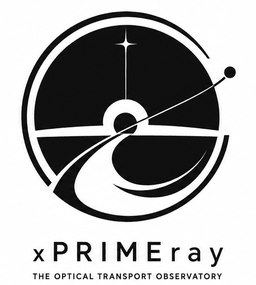
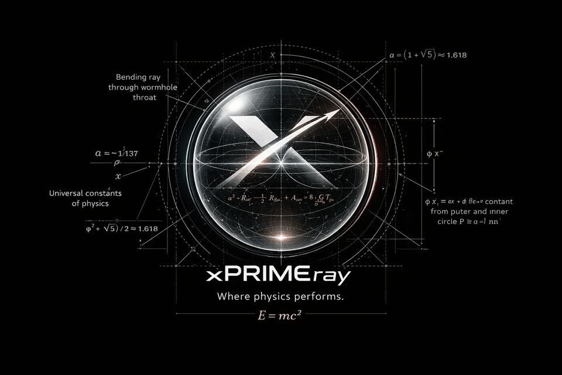

<p align="center">
  
</p>

# xPRIMEray

An experimental observatory for visualizing optical transport, curvature intuition, and observer-dependent geometry.

Built in Godot 4 C# — null-geodesic integrator, GRIN field renderer, wormhole topology, and a growing suite of transport diagnostics.

---

[Documentation](https://xprimeray.github.io/GD_xPRIMEray/) · [Architecture](Docs/architecture/overview.md) · [Research](Docs/Research/) · [Feature Index](Docs/FEATURE_INDEX.md)

---

## What It Does

xPRIMEray solves curved-ray transport through gradient-index (GRIN) media and Gordon effective metric fields — not faked with lens shaders or post-process distortion. Every render is validated against a hermetic fixture contract: 100% pixel classification, zero unresolved exits.

The engine is a curvature-inspired rendering platform and visual research tool. It finds hits, seams, high-curvature regions, unstable domains, and boundary-layer events from scene data, then reveals transport structure through an expanding library of overlay modes.

**Current status:** Phase 0 — 20+ production systems, 46 fixture scenes, 21 active overlay modes, Cathedral Probe diagnostic infrastructure operational.

## Phase 0 Visual Identity

<p align="center">
  
</p>

---

## Outputs & Artifact System

All experiment outputs, renders, and validation logs live in [`output/`](output/) — the active lab bench. It is not fully tracked by Git (4 GB+); only small metadata files (`.md`, `.json`, `.csv`, `.txt`) are committed. Raw renders, oracle dumps, and binary content are gitignored.

Curated, website-ready artifacts are staged in [`misterylabs_artifacts/`](misterylabs_artifacts/), which is fully tracked. To promote an output to the site:

```bash
./scripts/export_to_misterylabs.sh <output_folder_name> [--png <file>] [--csv <file>]
```

See [`misterylabs_artifacts/README.md`](misterylabs_artifacts/README.md) and [`misterylabs_artifacts/manifest.json`](misterylabs_artifacts/manifest.json) for the full artifact index and promotion workflow.

---

**License:** MIT  
**Citation templates:** [Docs/papers/shared_bibliography.bib](Docs/papers/shared_bibliography.bib)