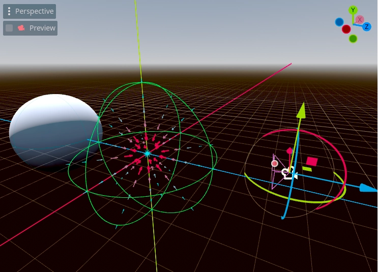
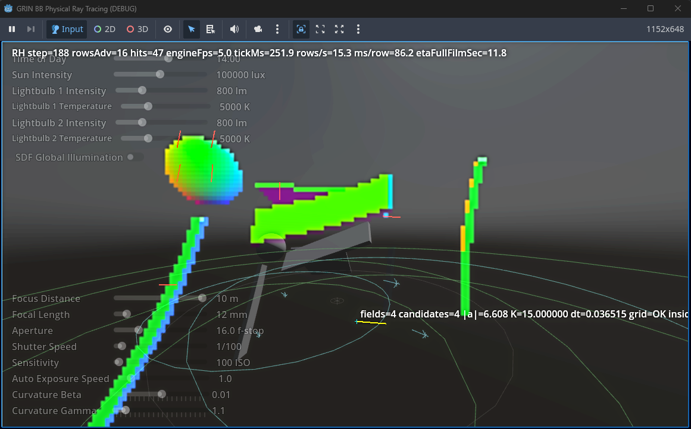
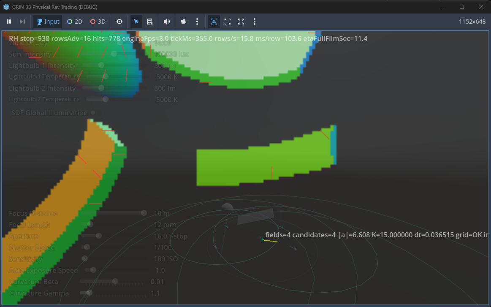
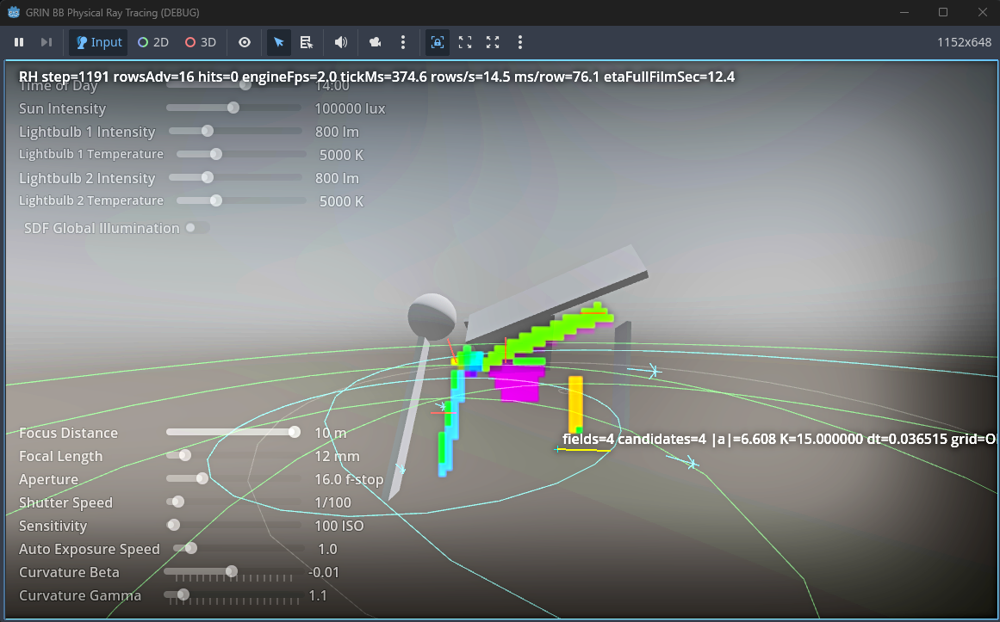

# GD_xPRIMEray: Curved Ray Transport Engine for GRIN Fields

**A research-grade ray propagation framework** for Godot, combining gradient-index (GRIN) optics with symbolic + numerical ray integration.  
Positioned as both a **scientific research toolkit** and an **open-source GPU/CPU optical transport engine**.

---

## Overview

GD_xPRIMEray is a hybrid symbolic-numeric ray transport system built on Godot Engine. It augments Godot’s renderer with **curved ray physics** — enabling simulation of graded refractive media, advanced optical phenomena, and non-Euclidean propagation domains.

Rather than tracing straight rays through space, GD_xPRIMEray integrates rays through fields defined by continuous curvature functions, enabling higher-fidelity modeling of refractive and metric-driven transport.

---

## Documentation Hub
https://aethertopologist.github.io/GD_xPRIMEray/

### Start here

- [System Architecture](architecture.md) — compact pipeline summary
- [Architecture Overview](architecture_overview.md) — renderer structure and subsystem boundaries
- [Architecture Review](architecture_review_ray_renderer.md) — deeper review of renderer behavior and architecture constraints
- [Code Map (Big 12)](code_map_big12.md) — contributor-facing code map
- [Validation Framework](validation.md) — validation modes and verification context
- [Boundary Layer Fixtures](Docs/BoundaryLayerFixtures.md) — BoundaryLayerVolume system with deterministic fixture-based validation (crossing policies, nested shell ordering, start-inside semantics)
- [Specification Index](SPEC_INDEX.md) — full spec map, current vs legacy, and support docs
- [Architecture Charter (Current)](_xPRIMEray_arch_charter_v3-ChatClaudeGrokCoherencePass2.md) — current working charter

### Physics and transport references

- [Metric Null Geodesic Parameter Map](metric_null_geodesic_param_map.md)
- [Next-Generation Metric Transport Roadmap](metric_transport_nextgen_roadmap.md)
- [BlackHole Fast Compare (GRIN vs Metric)](blackhole_fast_compare.md)
- [Property Surface](PropertySurface.md)
- [RenderStep Gate Hierarchy Snapshot](RenderStep_GateHierarchy.md)

- [Curved_Ray_Transport_Model_Review](Research/curved_ray_transport_model_review.md) derivative-aware stepping +  hamiltonian transport roadmap

## Wormhole Validation Snapshot

Each run produces a deterministic “figure quartet”:

- A: raw render  
- B: render + research overlay  
- C: portal-sector density map  
- D: invariant + performance summary  

These artifacts allow visual, geometric, and quantitative validation of wormhole rendering in a single snapshot.

See: [Docs/Research/wormhole_render_pipeline_validation.md](Docs/Research/wormhole_render_pipeline_validation.md)

### Current / revised specifications

- [SceneSnapshot Data Layout (Revised)](spec_scene_snapshot_data_layout_1.md)
- [Field System (GRIN Evaluation) — Revised](spec_field_system_grin_1.md)
- [FieldSource3D Canonical Params + Legacy Compatibility](spec_fieldsource3d_canonical_params_1.md)
- [Metric Models (GRIN vs Gordon / Transport Tier Roadmap) — Revised](spec_metric_models_grin_vs_gordon_1.md)
- [Field Extraction Rules (Godot → SceneSnapshot) — Revised](spec_field_extraction_rules_1.md)
- [Curved Ray Segment Integration — Revised](spec_curved_ray_chunks_1.md)
- [BVH Acceleration System — Revised](spec_bvh_acceleration_1.md)
- [Scheduler & Task Graph — Revised](spec_scheduler_task_graph_1.md)
- [Rendering Backends](spec_rendering_backends_1.md)
- [Telemetry, Debug, and Diagnostics](spec_telemetry_debug_1.md)
- [Ray Transport & Portability Interfaces](spec_ray_transport_interfaces_1.md)
- [Research Mode](spec_research_mode_1.md)
- [Wormhole Multi-Scene System](spec_wormhole_scene_graph_1.md)

### Legacy baseline specifications

These are still useful for historical context and design evolution comparison.

- [SceneSnapshot Data Layout (Legacy)](spec_scene_snapshot_data_layout.md)
- [Field System (GRIN Evaluation) — Legacy](spec_field_system_grin.md)
- [Metric Models (GRIN vs Gordon Metric / Gravity Mode) — Legacy](spec_metric_models_grin_vs_gordon.md)
- [Field Extraction Rules (Legacy)](spec_field_extraction_rules.md)
- [Curved Ray Chunk Integration (Legacy)](spec_curved_ray_chunks.md)
- [BVH Acceleration System (Legacy)](spec_bvh_acceleration.md)
- [Scheduler & Task Graph (Legacy)](spec_scheduler_task_graph.md)

### Calibration roadmap patch logs

- [C1.0 g.1 — Parse/export canonical signature fields](CalibRoadmap/PatchLogs/C1_0_g_1.md)
- [C1.7 g.X — AutoCal weak-signal FieldHeavy delta-aware stopgap](CalibRoadmap/PatchLogs/C1_7_g_X.md)

### Archive

- [_arch_charter_MASTER_v0-Chat52](./_Archive/_arch_charter_MASTER_v0-Chat52.md)
- [_arch_charter_MASTER_v1-Alt-RESEARCHMODE](./_Archive/_arch_charter_MASTER_v1-Alt-RESEARCHMODE.md)
- [_arch_charter_MASTER_v1-Alt-otherUpdated](./_Archive/_arch_charter_MASTER_v1-Alt-otherUpdated.md)
- [_arch_charter_MASTER_v1-Baseline-Gravity](./_Archive/_arch_charter_MASTER_v1-Baseline-Gravity.md)
- [_arch_charter_MASTER_v2-Chat52](./_Archive/_arch_charter_MASTER_v2-Chat52.md)
- [_xPRIMEray_arch_charter_MASTER_v3-ChatClaudeCoherencePass1](./_Archive/_xPRIMEray_arch_charter_MASTER_v3-ChatClaudeCoherencePass1.md)
- [_xPRIMEray_arch_charter_v2-Claude45](./_Archive/_xPRIMEray_arch_charter_v2-Claude45.md)
- [_xPRIMEray_arch_charter_v2-Claude46](./_Archive/_xPRIMEray_arch_charter_v2-Claude46.md)

---

## Notes

- The MkDocs configuration should set `docs_dir: Docs` so GitHub Actions builds from the correct capitalized folder.
- The current navigation treats `_1` spec files as the active revised versions, while the non-`_1` files are retained as legacy baselines.
- The current `index.md` intentionally avoids linking to non-existent assets like `icon.webp` or missing screenshot paths.

---

## 📄 License & Citation

Licensed under MIT — recommended for both academic and creative use.

If used in academic work, please cite accordingly.

