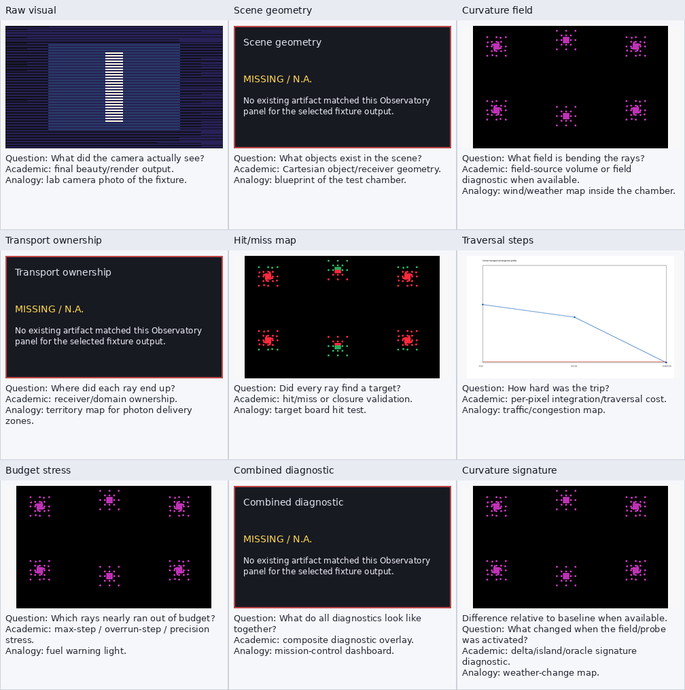

# cathedral_probe Observatory Report

Mapped to existing first-pass corner/reference probe outputs; no literal cathedral_probe run folder was discovered.

## Source

- study: `first_pass_traversal_comparison`
- source_dir: `/home/bb/code/godot_xPRIMEray/output/first_pass_traversal_comparison/20260503T171942Z/step_0.015/row`
- selection: latest step_0.015 row probe cell; no literal cathedral_probe output discovered

## Panel Availability

| # | panel | status | artifact |
|---:|---|---|---|
| 1 | Raw visual | available | `domain_resolver_stress__traversal_row__baseline_prune_off__scheduler-baseline__targetms-1000__stride-1__runid-1.png` |
| 2 | Scene geometry | missing | `` |
| 3 | Curvature field | available | `corner_required_precision_map.png` |
| 4 | Transport ownership | missing | `` |
| 5 | Hit/miss map | available | `corner_collider_flip_map.png` |
| 6 | Traversal steps | available | `corner_convergence_profile.png` |
| 7 | Budget stress | available | `corner_required_precision_map.png` |
| 8 | Combined diagnostic | missing | `` |
| 9 | Curvature signature | available | `corner_required_precision_map.png` |
