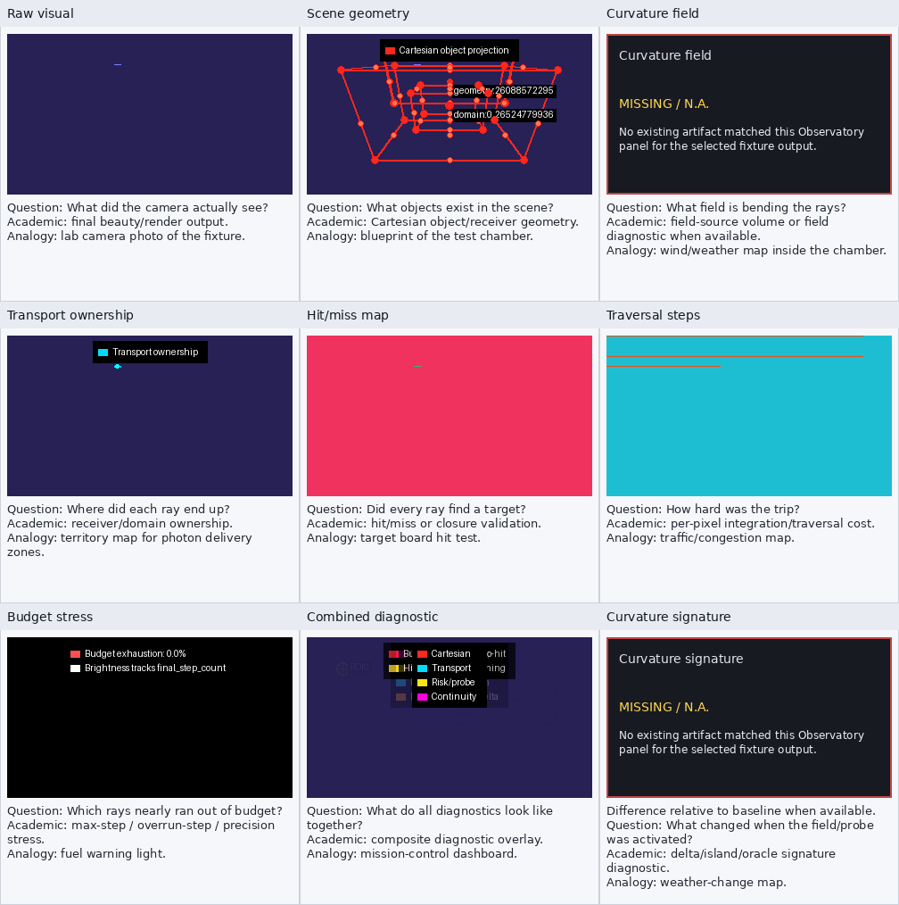

# curved_minimal Observatory Report

Canonical curved-minimal/backdrop ladder output. Proves field-sensitive traversal and transport diagnostics on a compact curved scene.

## Source

- study: `curved_field_validation_ladder`
- source_dir: `/home/bb/code/godot_xPRIMEray/output/curved_field_validation_ladder/20260509T160715Z/curved/steps/step_0.015`
- selection: latest curved/steps/step_0.015 cell

## Panel Availability

| # | panel | status | artifact |
|---:|---|---|---|
| 1 | Raw visual | available | `layer0_beauty.png` |
| 2 | Scene geometry | available | `layer1_cartesian_wireframe.png` |
| 3 | Curvature field | missing | `` |
| 4 | Transport ownership | available | `layer2_transport_ownership.png` |
| 5 | Hit/miss map | available | `generated_hit_miss_map.png` |
| 6 | Traversal steps | available | `generated_traversal_step_heatmap.png` |
| 7 | Budget stress | available | `budget_exhaustion_heatmap.png` |
| 8 | Combined diagnostic | available | `combined_diagnostic_overlay.png` |
| 9 | Curvature signature | missing | `` |

## Hit Metrics

- evaluated rays/pixels: `704`
- hit count: `8`
- miss count: `696`
- hit percent: `1.136364`
- average traversal steps: `502.0`
- max traversal steps: `502`
