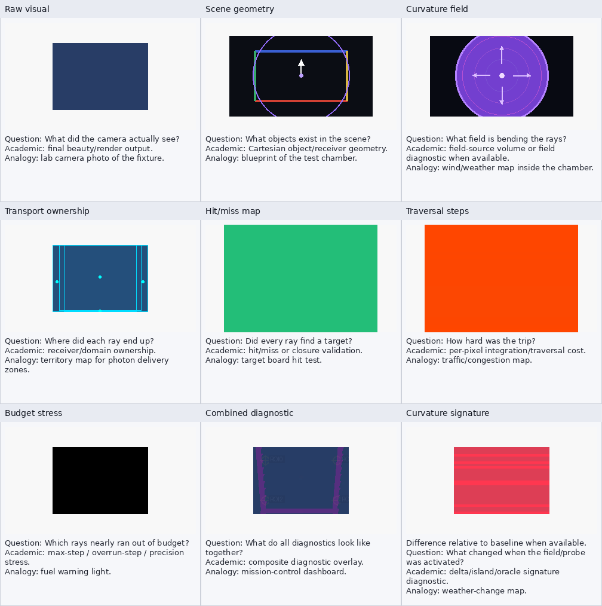

# hermetic_curved_room Observatory Report

Sealed-room closure and curvature FPS fixture. Proves every evaluated ray can hit a receiver under a curvature ramp.

## Source

- study: `curvature_fps_benchmark`
- source_dir: `/home/bb/code/godot_xPRIMEray/output/curvature_fps_benchmark/20260606T195525Z/cells/curvature_100/row`
- selection: latest curvature_fps_benchmark 100% cell

## Panel Availability

| # | panel | status | artifact |
|---:|---|---|---|
| 1 | Raw visual | available | `layer0_beauty.png` |
| 2 | Scene geometry | available | `cartesian_scene_geometry.png` |
| 3 | Curvature field | available | `curvature_field_view.png` |
| 4 | Transport ownership | available | `layer2_transport_ownership.png` |
| 5 | Hit/miss map | available | `generated_hit_miss_map.png` |
| 6 | Traversal steps | available | `generated_traversal_step_heatmap.png` |
| 7 | Budget stress | available | `budget_exhaustion_heatmap.png` |
| 8 | Combined diagnostic | available | `combined_diagnostic_overlay.png` |
| 9 | Curvature signature | available | `curved_vs_straight_difference.png` |

## Hit Metrics

- evaluated rays/pixels: `17920`
- hit count: `17920`
- miss count: `0`
- hit percent: `100.0`
- average traversal steps: `271.25`
- max traversal steps: `273`
