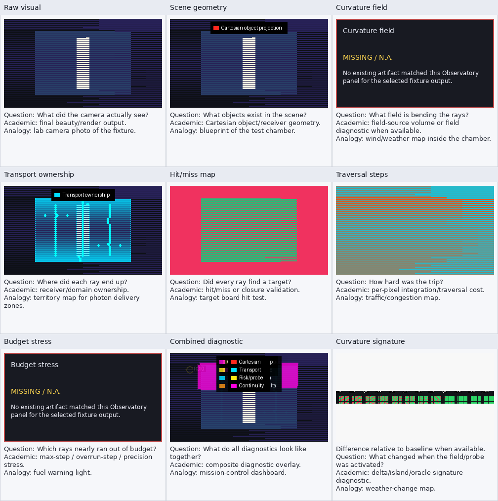

# object_island Observatory Report

ReferenceTransportOracle unresolved-island output. Reports island/convergence diagnostics around ambiguous or unresolved transport regions. This is reference integration, not ground truth.

## Source

- study: `reference_transport_oracle_unresolved_island`
- source_dir: `/home/bb/code/godot_xPRIMEray/output/reference_transport_oracle_unresolved_island/20260506T035920Z/cells/unresolved_island`
- selection: latest unresolved_island cell

## Panel Availability

| # | panel | status | artifact |
|---:|---|---|---|
| 1 | Raw visual | available | `layer0_beauty.png` |
| 2 | Scene geometry | available | `layer1_cartesian_wireframe.png` |
| 3 | Curvature field | missing | `` |
| 4 | Transport ownership | available | `layer2_transport_ownership.png` |
| 5 | Hit/miss map | available | `generated_hit_miss_map.png` |
| 6 | Traversal steps | available | `generated_traversal_step_heatmap.png` |
| 7 | Budget stress | missing | `` |
| 8 | Combined diagnostic | available | `combined_diagnostic_overlay.png` |
| 9 | Curvature signature | available | `island_convergence_ladder.png` |

## Hit Metrics

- evaluated rays/pixels: `37792`
- hit count: `18539`
- miss count: `19253`
- hit percent: `49.055356`
- average traversal steps: `382.135478`
- max traversal steps: `700`
