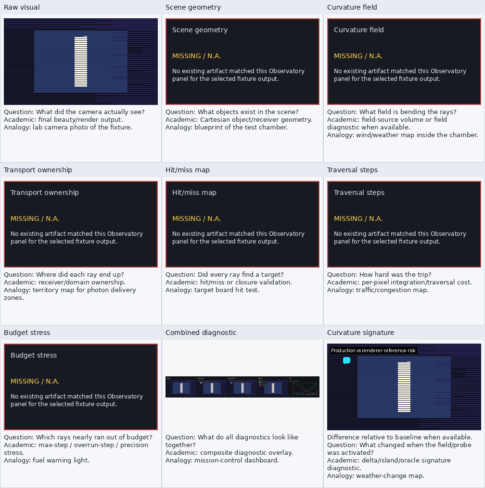

# oracle_closure Observatory Report

**EXPERIMENTAL - internal only:** Oracle means reference integration, not ground truth. This artifact is not a public closure gate.

ReferenceTransportOracle/closure comparison output. Reports passive reference-integration diagnostics without feeding renderer decisions.

## Source

- study: `reference_transport_oracle_roi_sweep`
- source_dir: `/home/bb/code/godot_xPRIMEray/output/reference_transport_oracle_roi_sweep/20260505T034858Z/cells/row_stride_1`
- selection: latest reference oracle ROI row_stride_1 cell, or curved oracle fallback

## Panel Availability

| # | panel | status | artifact |
|---:|---|---|---|
| 1 | Raw visual | available | `domain_resolver_stress__reference_transport_oracle_row_stride_1__baseline_prune_off__scheduler-baseline__targetms-1000__stride-1__runid-1.png` |
| 2 | Scene geometry | missing | `` |
| 3 | Curvature field | missing | `` |
| 4 | Transport ownership | missing | `` |
| 5 | Hit/miss map | missing | `` |
| 6 | Traversal steps | missing | `` |
| 7 | Budget stress | missing | `` |
| 8 | Combined diagnostic | available | `parent_trajectory_contact_sheet.png` |
| 9 | Curvature signature | available | `production_vs_oracle_diff.png` |
